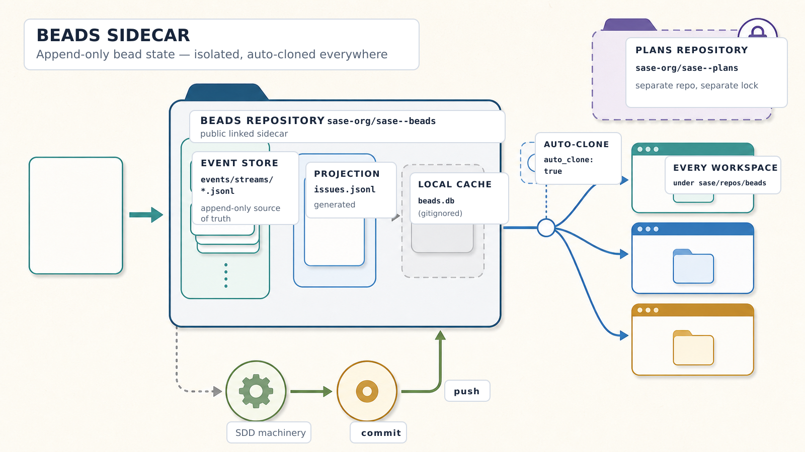

# SASE Beads

This public sidecar repository stores durable bead state for its SASE-managed source repository. SASE automatically
clones it into each workspace at `sase/repos/beads`, keeping work tracking available to humans and agents without
sharing the plans repository's history or write lock.

## Directory Layout

| Path | Purpose |
| --- | --- |
| `README.md` | This generated guide. |
| `assets/beads-directory-map.png` | The generated directory-map infographic used by this README. |
| `.gitignore` | Excludes the local `beads.db`, `beads.db-shm`, and `beads.db-wal` SQLite cache files. |
| `config.json` | Bead store configuration. |
| `metadata.json` | Bead store metadata. |
| `issues.jsonl` | Generated compatibility projection of current bead state. |
| `events/manifest.json` | Manifest for the canonical event store. |
| `events/streams/*.jsonl` | Canonical append-only bead event streams. |
| `pages/` | Generated Markdown pages for every bead lineage. |

`events/**` is the append-only source of truth. `issues.jsonl` is generated only as a compatibility projection, while
`beads.db*` is a gitignored local SQLite cache and never durable shared state.

## Published Pages

Generated bead pages live under `pages/<root>/`. A root bead uses `pages/<root>/README.md`; descendants use
`pages/<root>/<bead-id>.md`. The root is the text before the first `.` in the bead ID, so `sase-ai.9` belongs to
`pages/sase-ai/sase-ai.9.md`.

Each page is rebuilt from durable bead state plus repository history. Pages link to related beads, the linked plan, the
agents that worked the bead, and commits associated through `SASE_BEAD=` commit-footer tags or historical subject-line
parentheticals.

## Commands

- `sase bead list` lists current work.
- `sase bead ready` shows open work with no active blockers.
- `sase bead show <id>` displays one bead and its relationships.
- `sase bead history <id>` replays the bead's canonical event history.
- `sase bead pages refresh` previews regenerated bead pages; add `--write` to update and commit them.
- `sase bead pages url <id>` prints a bead's hosted page URL when the sidecar remote and branch resolve locally.
- `sase bead work <target> [<target> ...]` launches plan, epic, or task targets in order.
- `sase repo path beads` prints this clone's root.
