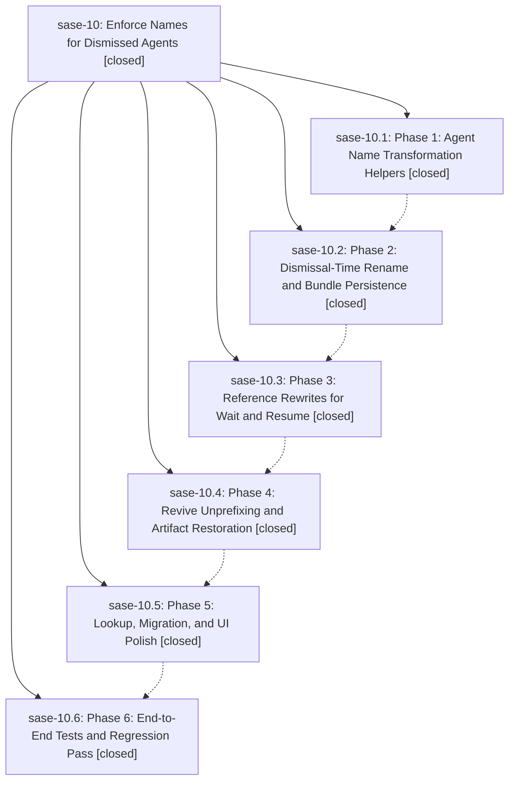

# Bead: sase-10 — Enforce Names for Dismissed Agents

[Bead Pages](../README.md) / sase-10

**Status:** ✓ closed · **Resolution:** (unrecorded) · **Type:** plan · **Tier:** epic
**Owner:** `bryanbugyi34@gmail.com`
**Created:** 2026-04-28 01:34:17 UTC · **Closed:** 2026-04-28 02:47:55 UTC
**Plan:** [202604/dismissed\_agent\_name\_prefix.md](https://github.com/sase-org/sase--plans/blob/main/202604/dismissed_agent_name_prefix.md)

## Phases

| Bead | Title | Status | Size | Agents | Commits |
|---|---|---|---|---:|---:|
| [sase-10.1](sase-10.1.md) | Phase 1: Agent Name Transformation Helpers | ✓ closed | small | 0 | 1 |
| [sase-10.2](sase-10.2.md) | Phase 2: Dismissal-Time Rename and Bundle Persistence | ✓ closed | small | 0 | 1 |
| [sase-10.3](sase-10.3.md) | Phase 3: Reference Rewrites for Wait and Resume | ✓ closed | small | 0 | 1 |
| [sase-10.4](sase-10.4.md) | Phase 4: Revive Unprefixing and Artifact Restoration | ✓ closed | small | 0 | 1 |
| [sase-10.5](sase-10.5.md) | Phase 5: Lookup, Migration, and UI Polish | ✓ closed | small | 0 | 1 |
| [sase-10.6](sase-10.6.md) | Phase 6: End-to-End Tests and Regression Pass | ✓ closed | small | 0 | 1 |

## Lineage

## Commits

| Commit | Subject | Bead | Committed (UTC) |
|---|---|---|---|
| [`b0b59a6`](https://github.com/sase-org/sase/commit/b0b59a6d2e409ffc52f52b5fd9683fa5887db2a1) | feat(agent/names): add dismissed-name lifecycle helpers (sase-10.1) | [sase-10.1](sase-10.1.md) | 2026-04-28 01:44:42 |
| [`c06edf9`](https://github.com/sase-org/sase/commit/c06edf9fff36b5970fe633c5a1630f01fb86b4eb) | feat(ace): rename dismissed agents with YYmmdd prefix and persist into bundles (sase-10.2) | [sase-10.2](sase-10.2.md) | 2026-04-28 02:02:07 |
| [`765963a`](https://github.com/sase-org/sase/commit/765963ac7fd67adb6ef7ef9231e872f6d4678cd7) | feat(ace): rewrite wait/resume references on dismissal rename (sase-10.3) | [sase-10.3](sase-10.3.md) | 2026-04-28 02:18:32 |
| [`1757aff`](https://github.com/sase-org/sase/commit/1757aff1c1a975e40367367b6fc9e2d57dd13e34) | feat(ace): strip dismissal prefix and rewrite references on revive (sase-10.4) | [sase-10.4](sase-10.4.md) | 2026-04-28 02:29:46 |
| [`e0ea2ca`](https://github.com/sase-org/sase/commit/e0ea2caef1c68f95acac21c1ebdaa7cf010aac6b) | feat(ace): make dismissed-name lookup reliable and repair old bundles (sase-10.5) | [sase-10.5](sase-10.5.md) | 2026-04-28 02:38:09 |
| [`a720e19`](https://github.com/sase-org/sase/commit/a720e195386e201523c325312fa13f923e7b1ce2) | test(ace): end-to-end coverage for dismissed-agent name lifecycle (sase-10.6) | [sase-10.6](sase-10.6.md) | 2026-04-28 02:44:54 |
