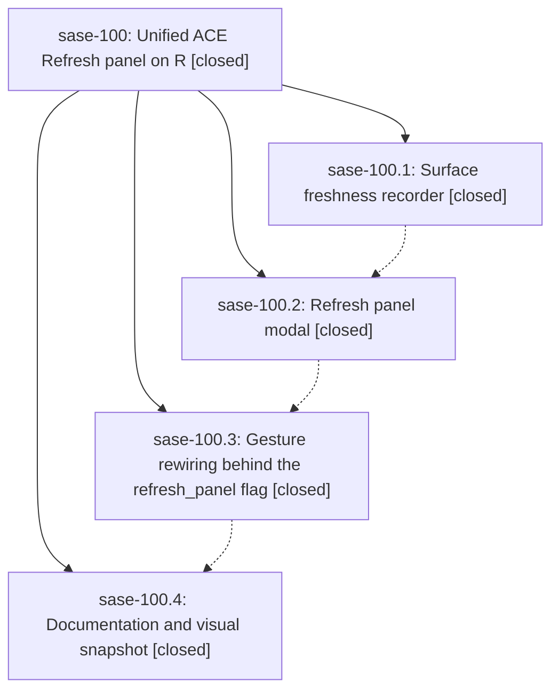

# Bead: sase-100 — Unified ACE Refresh panel on R

[Bead Pages](../README.md) / sase-100

**Status:** ✓ closed · **Resolution:** done · **Type:** ▸ plan · **Tier:** epic
**Owner:** `bryanbugyi34@gmail.com` · **Created by:** `bbugyi200.athena.0kb` · **Assignee:** `sase-100.land`
**Created:** 2026-09-12 14:56:17 EDT · **Closed:** 2026-09-13 15:51:29 EDT
**Plan:** [202609/refresh\_panel.md](https://github.com/sase-org/sase--plans/blob/main/202609/refresh_panel.md)

<!-- sase:links:start -->

## Links

| Relation | Artifact | Why |
| --- | --- | --- |
| implemented-by | [plan:202609/refresh_panel.md][1] | derived from the plan's `bead_id:` frontmatter field |

[1]: https://github.com/sase-org/sase--plans/blob/main/202609/refresh_panel.md

<!-- sase:links:end -->

## Description

One `R` gesture opens a Refresh panel that replaces both the immediate tab refresh and the `,y` full-history refresh, adds a provider usage-window refresh and an everything sweep, shows each option's real freshness, and keeps the old gestures reachable behind a sunset flag until the panel has soaked.

## Notes

[2026-09-13T14:13:26Z · sase-zu.land] LOAD-TIERING INTEGRATION OWNERSHIP from sase-zu landing at 654335d555: your new Refresh panel correctly routes Full history through manual_full_history, but its freshness stamps are set at request time and automatic full-history applies are not stamped. The sase-zu remaining-work plan will integrate successful query-specific history completion with this surface so failed/stale work does not claim refreshed history; preserve R and ,y routing and the refresh_panel flag. No separate task is being filed for this integration seam.

[2026-09-13T19:51:29Z · sase-100.land] LANDING AUDIT: Reviewed sase-100, all four child beads and every note, the full linked refresh_panel plan, the four epic commits 442b5ec41, bad80a932, a12a1abdf, and ecfde919c, and the current freshness, auto-refresh, modal, dispatch, keybinding/help, feature-flag, documentation, and visual source. The implemented behavior matches every phase contract: real in-session surface ages; worker-loaded usage status; all chooser aliases and unavailable handling; R and comma-y routing in both sunset-flag states; off-tab full history; off-thread usage; forced everything sweep; docs and two visual goldens. Focused verification passed 54 tests, the two PNG snapshot tests passed and were visually inspected, and sase bead epic-symbols sase-100 reported no entries.

INTEGRATION: Audited every commit since the first epic commit, excluding the four epic commits. The relevant concurrent agent-query series was 2e08f0842, 5beda061f, 1cd445ae4, and d698f92e0. The final commit d698f92e0 explicitly integrated Refresh freshness with query-keyed history: manual requests no longer stamp at request time, and successful complete-history applies stamp agents_full_history, including automatic full-history completion. Its regression proves a request alone leaves freshness unset and a complete apply stamps it. Current source preserves the R/comma-y flag routing and no later commit adds a duplicate or conflicting refresh route. The final phase also incorporated intervening ACE presentation drift into current docs and goldens.

FOLLOW-UP DISPOSITION: sase-100.2 note 1, hidden-clone git identity, was fixed inside sase-100.4 by tests/sdd/conftest.py and therefore declined as no remaining follow-up. sase-100.3 note 1, two stale managed_tmp_reap exact-counter tests, reproduced deterministically on current HEAD and is caused by active epic sase-zn.9 phase 2 commit 70b018b91; evidence was attached to sase-zn.9 as DISCOVERED ISSUE note 2, so no duplicate task was created. sase-100.4 note 1, apollo test-cost budget failure, is an exact duplicate of ready task sase-xc and the proposing phase already supplied its independent +1 evidence, so no duplicate or repeat reporter entry was added. sase-100.4 note 2 proposed two flake-baseline nodes: both pass in isolation now; nested-monitor runtime is already fixed by df465e063 and closed sase-wu, while the SHA prefix node has only dirty-tree historical failures and no trustworthy fix commit. Both were routed with exact record evidence to active flake/baseline epic sase-j7 as DISCOVERED ISSUE note 69; no unsupported fixed-at declaration or duplicate task was made. sase-100.4 note 3, Plugins Updates one-row scrollbar reflow, had no task or causal active epic and became ready small bug sase-10b. No unresolved issue was caused by sase-100, so no remaining-work plan was needed. The epic has no parent bead.

## Phases

| Bead | Title | Status | Size | Created | Agents | Commits |
|---|---|---|---|---|---:|---:|
| [sase-100.1](sase-100.1.md) | Surface freshness recorder | ✓ closed | small | 2026-09-12 | 1 | 1 |
| [sase-100.2](sase-100.2.md) | Refresh panel modal | ✓ closed | medium | 2026-09-12 | 1 | 1 |
| [sase-100.3](sase-100.3.md) | Gesture rewiring behind the refresh\_panel flag | ✓ closed | medium | 2026-09-12 | 1 | 1 |
| [sase-100.4](sase-100.4.md) | Documentation and visual snapshot | ✓ closed | small | 2026-09-12 | 1 | 1 |

## Lineage

## Agents

| Agent | Bead | Commits |
|---|---|---:|
| [bbugyi200.apollo.sase-100.1](https://github.com/sase-org/sase--agents/blob/main/agents/bbugyi200.apollo.sase-100.1/README.md) | [sase-100.1](sase-100.1.md) | 1 |
| [bbugyi200.apollo.sase-100.2](https://github.com/sase-org/sase--agents/blob/main/agents/bbugyi200.apollo.sase-100.2/README.md) | [sase-100.2](sase-100.2.md) | 1 |
| [bbugyi200.apollo.sase-100.3](https://github.com/sase-org/sase--agents/blob/main/families/bbugyi200.apollo.sase-100.3.md) | [sase-100.3](sase-100.3.md) | 1 |
| [bbugyi200.apollo.sase-100.4](https://github.com/sase-org/sase--agents/blob/main/families/bbugyi200.apollo.sase-100.4.md) | [sase-100.4](sase-100.4.md) | 1 |
| [bbugyi200.apollo.sase-100.land](https://github.com/sase-org/sase--agents/blob/main/agents/bbugyi200.apollo.sase-100.land/README.md) | [sase-100](README.md) | 1 |

## Commits

| Repo | Commit | Subject | Bead | Committed |
|---|---|---|---|---|
| sase | [`442b5ec`](https://github.com/sase-org/sase/commit/442b5ec41f56649ac5db8cebe52230343d5d8597) | feat(refresh): record ACE surface freshness | [sase-100.1](sase-100.1.md) | 2026-09-12 18:56:14 EDT |
| sase | [`bad80a9`](https://github.com/sase-org/sase/commit/bad80a93248c2217a4c83ab259cd3789abc62422) | feat(ace): add RefreshPanelModal single-key chooser | [sase-100.2](sase-100.2.md) | 2026-09-13 05:46:42 EDT |
| sase | [`a12a1ab`](https://github.com/sase-org/sase/commit/a12a1abdf6b4183b2e1cdef66afe656cb5889258) | feat(ace): wire R and ,y through the Refresh panel | [sase-100.3](sase-100.3.md) | 2026-09-13 06:51:33 EDT |
| sase | [`ecfde91`](https://github.com/sase-org/sase/commit/ecfde919c5ba2a751c3d2a6c4f5c717cdda09c85) | docs(ace): document Refresh panel and refresh visual goldens | [sase-100.4](sase-100.4.md) | 2026-09-13 15:24:14 EDT |
| sase--plans | [`sase--plans@ff454c8`](https://github.com/sase-org/sase--plans/commit/ff454c80ac927d34d93fd98fe6e134c962766e0c) | docs(plans): mark refresh panel epic done | [sase-100](README.md) | 2026-09-13 15:55:59 EDT |
