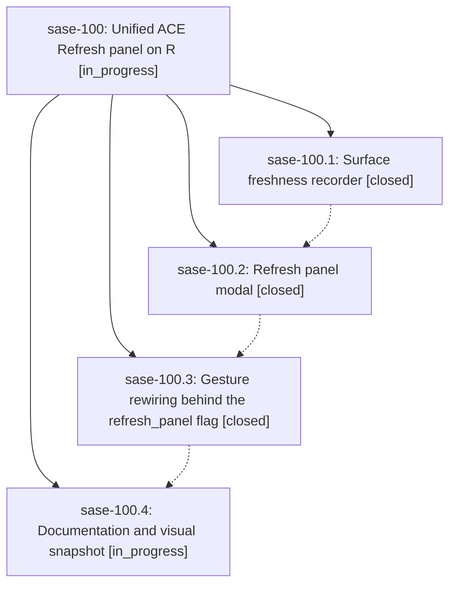

# Bead: sase-100 — Unified ACE Refresh panel on R

[Bead Pages](../README.md) / sase-100

**Status:** ◐ in_progress · **Type:** ▸ plan · **Tier:** epic
**Owner:** `bryanbugyi34@gmail.com` · **Created by:** `bbugyi200.athena.0kb` · **Assignee:** `sase-100.land`
**Created:** 2026-09-12 14:56:17 EDT
**Plan:** [202609/refresh\_panel.md](https://github.com/sase-org/sase--plans/blob/main/202609/refresh_panel.md)

<!-- sase:links:start -->

## Links

| Relation | Artifact | Why |
| --- | --- | --- |
| implemented-by | [plan:202609/refresh_panel.md][1] | derived from the plan's `bead_id:` frontmatter field |

[1]: https://github.com/sase-org/sase--plans/blob/main/202609/refresh_panel.md

<!-- sase:links:end -->

## Description

One `R` gesture opens a Refresh panel that replaces both the immediate tab refresh and the `,y` full-history refresh, adds a provider usage-window refresh and an everything sweep, shows each option's real freshness, and keeps the old gestures reachable behind a sunset flag until the panel has soaked.

## Phases

| Bead | Title | Status | Size | Created | Agents | Commits |
|---|---|---|---|---|---:|---:|
| [sase-100.1](sase-100.1.md) | Surface freshness recorder | ✓ closed | small | 2026-09-12 | 1 | 1 |
| [sase-100.2](sase-100.2.md) | Refresh panel modal | ✓ closed | medium | 2026-09-12 | 1 | 1 |
| [sase-100.3](sase-100.3.md) | Gesture rewiring behind the refresh\_panel flag | ✓ closed | medium | 2026-09-12 | 1 | 1 |
| [sase-100.4](sase-100.4.md) | Documentation and visual snapshot | ◐ in_progress | small | 2026-09-12 | 1 | 0 |

## Lineage

## Agents

| Agent | Bead | Commits |
|---|---|---:|
| [bbugyi200.apollo.sase-100.1](https://github.com/sase-org/sase--agents/blob/main/agents/bbugyi200.apollo.sase-100.1/README.md) | [sase-100.1](sase-100.1.md) | 1 |
| [bbugyi200.apollo.sase-100.2](https://github.com/sase-org/sase--agents/blob/main/agents/bbugyi200.apollo.sase-100.2/README.md) | [sase-100.2](sase-100.2.md) | 1 |
| [bbugyi200.apollo.sase-100.3](https://github.com/sase-org/sase--agents/blob/main/families/bbugyi200.apollo.sase-100.3.md) | [sase-100.3](sase-100.3.md) | 1 |
| [bbugyi200.apollo.sase-100.4](https://github.com/sase-org/sase--agents/blob/main/agents/bbugyi200.apollo.sase-100.4/README.md) | [sase-100.4](sase-100.4.md) | 0 |
| [bbugyi200.apollo.sase-100.land](https://github.com/sase-org/sase--agents/blob/main/agents/bbugyi200.apollo.sase-100.land/README.md) | [sase-100](README.md) | 0 |

## Commits

| Repo | Commit | Subject | Bead | Committed |
|---|---|---|---|---|
| sase | [`442b5ec`](https://github.com/sase-org/sase/commit/442b5ec41f56649ac5db8cebe52230343d5d8597) | feat(refresh): record ACE surface freshness | [sase-100.1](sase-100.1.md) | 2026-09-12 18:56:14 EDT |
| sase | [`bad80a9`](https://github.com/sase-org/sase/commit/bad80a93248c2217a4c83ab259cd3789abc62422) | feat(ace): add RefreshPanelModal single-key chooser | [sase-100.2](sase-100.2.md) | 2026-09-13 05:46:42 EDT |
| sase | [`a12a1ab`](https://github.com/sase-org/sase/commit/a12a1abdf6b4183b2e1cdef66afe656cb5889258) | feat(ace): wire R and ,y through the Refresh panel | [sase-100.3](sase-100.3.md) | 2026-09-13 06:51:33 EDT |
