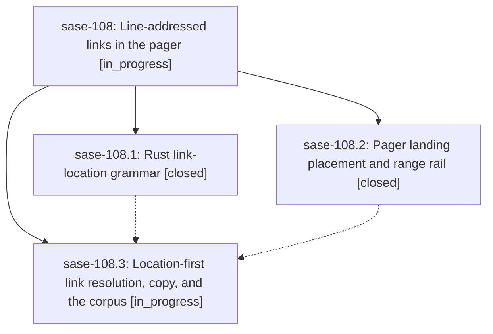

# Bead: sase-108 — Line-addressed links in the pager

[Bead Pages](../README.md) / sase-108

**Status:** ◐ in_progress · **Type:** ▸ plan · **Tier:** epic
**Owner:** `bryanbugyi34@gmail.com` · **Created by:** [bbugyi200.athena.1o](https://github.com/sase-org/sase--agents/blob/main/families/bbugyi200.athena.1o.md) · **Assignee:** `sase-108.land`
**Created:** 2026-09-13 10:09:10 EDT
**Plan:** [202609/pager\_line\_addressed\_links.md](https://github.com/sase-org/sase--plans/blob/main/202609/pager_line_addressed_links.md)

## Description

Every pager link that carries a line location (plain paths, Markdown destinations, and typed artifact refs, in colon `:12` / `:12:5` / `:12-40` or GitHub `#L12` / `#L12-L40` / `#L12C5` form) follows without an error and lands on that line. The referenced line or range is marked with an accent rail in the gutter, and copy (`y`) and edit (`E`) carry the same location.

## Phases

| Bead | Title | Status | Size | Created | Agents | Commits |
|---|---|---|---|---|---:|---:|
| [sase-108.1](sase-108.1.md) | Rust link-location grammar | ✓ closed | medium | 2026-09-13 | 1 | 0 |
| [sase-108.2](sase-108.2.md) | Pager landing placement and range rail | ✓ closed | medium | 2026-09-13 | 1 | 0 |
| [sase-108.3](sase-108.3.md) | Location-first link resolution, copy, and the corpus | ◐ in_progress | medium | 2026-09-13 | 1 | 0 |

## Lineage

## Agents

| Agent | Bead | Commits |
|---|---|---:|
| [bbugyi200.athena.sase-108.1](https://github.com/sase-org/sase--agents/blob/main/agents/bbugyi200.athena.sase-108.1/README.md) | [sase-108.1](sase-108.1.md) | 0 |
| [bbugyi200.athena.sase-108.2](https://github.com/sase-org/sase--agents/blob/main/agents/bbugyi200.athena.sase-108.2/README.md) | [sase-108.2](sase-108.2.md) | 0 |
| [bbugyi200.athena.sase-108.3](https://github.com/sase-org/sase--agents/blob/main/agents/bbugyi200.athena.sase-108.3/README.md) | [sase-108.3](sase-108.3.md) | 0 |
| [bbugyi200.athena.sase-108.land](https://github.com/sase-org/sase--agents/blob/main/agents/bbugyi200.athena.sase-108.land/README.md) | [sase-108](README.md) | 0 |
