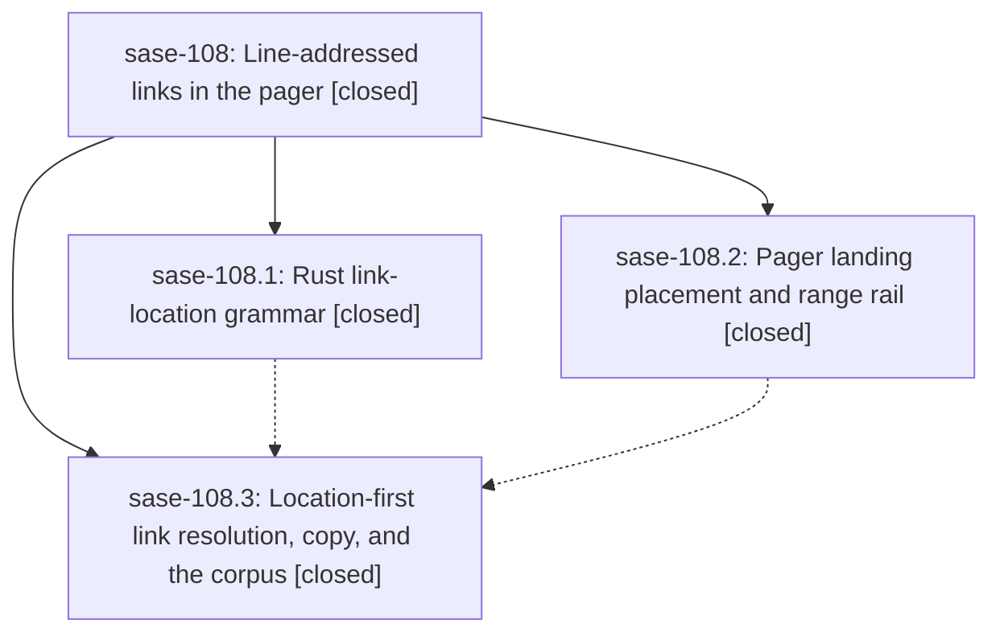

# Bead: sase-108 — Line-addressed links in the pager

[Bead Pages](../README.md) / sase-108

**Status:** ✓ closed · **Resolution:** done · **Type:** ▸ plan · **Tier:** epic
**Owner:** `bryanbugyi34@gmail.com` · **Created by:** [bbugyi200.athena.1o](https://github.com/sase-org/sase--agents/blob/main/families/bbugyi200.athena.1o.md) · **Assignee:** `sase-108.land`
**Created:** 2026-09-13 10:09:10 EDT · **Closed:** 2026-09-13 12:47:27 EDT
**Plan:** [202609/pager\_line\_addressed\_links.md](https://github.com/sase-org/sase--plans/blob/main/202609/pager_line_addressed_links.md)

## Description

Every pager link that carries a line location (plain paths, Markdown destinations, and typed artifact refs, in colon `:12` / `:12:5` / `:12-40` or GitHub `#L12` / `#L12-L40` / `#L12C5` form) follows without an error and lands on that line. The referenced line or range is marked with an accent rail in the gutter, and copy (`y`) and edit (`E`) carry the same location.

## Notes

[2026-09-13T16:47:27Z · sase-108.land] Landed after verification. STEP 1: All 3 phases are closed and checked against the plan and code. sase-108.1 is sase-core 17947a0: location.rs split_link_location with the colon and #L grammar and every not-a-location guard, parse_fragment accepting L12-40/L12C5, a widened document-scan suffix, and the artifact_ref_split_link_location plus schema-version bindings. sase-108.2 is 0e48a25277: LineMark, an accent gutter rail over inclusive ranges including wrapped rows, reading_scroll_y shared by the semicolon goto and link landing, a past-EOF information toast, the mark carried through trail back/forward, crumb suffix, and help row, plus railed PNG goldens. sase-108.3 is f49d41fa33: core pin fast-forwarded ba651fe5 to 17947a05 (origin/master tip, verified in sase-core); a Python adapter with a schema check; apply_link_location wired into resolve_link (base-first, with a whole-ref retry for typed refs), resolve_file_path_link, copy_text_for_target (abs:line[:col]), and the ACE LinkIndex fast path; the duplicate Python line grammar retired (_split_line_suffix and friends, and the line branch of _resolve_fragments); _PAGER_FILE_PATH_PATTERN widened; validate_sase_core_rs required bindings updated; and corpus, contract, pilot (plan:...:12-14 rail), copy, and link-index tests added. All child notes were addressed. The sase-108.2 symvision DISCOVERED ISSUE (apply_resume_adoption) is already fixed on master, where the helper is now private. Verification on master f49d41fa33: focused pytest (tests/pager, tests/artifact_refs, view_files pager screen, file_path_hints, validate_sase_core_rs tools) 584 passed; just test-visual tests/pager/visual 28 passed; just lint exit 0 with symvision clean. STEP 2: 6 commits landed after the epic started (63e16c0fd2 prompt-panel _file_path_hints, which the later f49d41fa33 already builds on; dbde395f25; db6fd25182; e5f902ddd6, whose LinkIndex cache cap is compatible with the targets_by_ref fast path; 84a3ea2dd6; eea8af0421). None duplicates or conflicts with the epic, and none needs to adopt split_link_location. The only other colon-suffix matcher is ACE's _prompt_jump_target.py, an explicit plan non-goal. No integration changes were needed. STEP 3 follow-ups: (a) sase-108.1 gateway fleet tests: reproduced at sase-core 17947a0. fleet_mutate_refuses_terminal_missing_capability_and_bridge_failure fails deterministically; both fleet_launch receipt tests fail 2/2 in full crate runs and pass in isolation. The epic did not cause this (suspect sase-core 84f9776). Filed as ci task sase-10a (related to sase-zz) and marked ready. (b) sase-108.3 continuation_decide_resume_adoption core-binding skew: the binding has never existed in sase-core history. It was required by 897147eac2 (sase-zl.13.11.3) before this epic began, and the epic's pin ratchet was a fast-forward, so the epic did not cause it. It was already recorded as a DISCOVERED ISSUE on active epic sase-zl.13.11; I appended corroboration there (tests/monitor 10 failed/294 passed) and declined a separate task. epic-symbols: none. No parent bead.

## Phases

| Bead | Title | Status | Size | Created | Agents | Commits |
|---|---|---|---|---|---:|---:|
| [sase-108.1](sase-108.1.md) | Rust link-location grammar | ✓ closed | medium | 2026-09-13 | 1 | 1 |
| [sase-108.2](sase-108.2.md) | Pager landing placement and range rail | ✓ closed | medium | 2026-09-13 | 1 | 1 |
| [sase-108.3](sase-108.3.md) | Location-first link resolution, copy, and the corpus | ✓ closed | medium | 2026-09-13 | 1 | 1 |

## Lineage

## Agents

| Agent | Bead | Commits |
|---|---|---:|
| [bbugyi200.athena.sase-108.1](https://github.com/sase-org/sase--agents/blob/main/agents/bbugyi200.athena.sase-108.1/README.md) | [sase-108.1](sase-108.1.md) | 1 |
| [bbugyi200.athena.sase-108.2](https://github.com/sase-org/sase--agents/blob/main/agents/bbugyi200.athena.sase-108.2/README.md) | [sase-108.2](sase-108.2.md) | 1 |
| [bbugyi200.athena.sase-108.3](https://github.com/sase-org/sase--agents/blob/main/agents/bbugyi200.athena.sase-108.3/README.md) | [sase-108.3](sase-108.3.md) | 1 |
| [bbugyi200.athena.sase-108.land](https://github.com/sase-org/sase--agents/blob/main/agents/bbugyi200.athena.sase-108.land/README.md) | [sase-108](README.md) | 1 |

## Commits

| Repo | Commit | Subject | Bead | Committed |
|---|---|---|---|---|
| sase | [`0e48a25`](https://github.com/sase-org/sase/commit/0e48a25277ca710b68e6855de464e70141dd4a86) | feat(pager): rail landed line ranges at a shared reading position | [sase-108.2](sase-108.2.md) | 2026-09-13 11:07:11 EDT |
| sase-core | [`sase-core@17947a0`](https://github.com/sase-org/sase-core/commit/17947a05ffd6aea9555a8498f42da0777229b8ea) | feat(artifact-ref): add the one link-location grammar | [sase-108.1](sase-108.1.md) | 2026-09-13 11:11:32 EDT |
| sase | [`f49d41f`](https://github.com/sase-org/sase/commit/f49d41fa33bf5965dde5200fc5e8ff5b647ea144) | feat(pager): resolve line-addressed links through core | [sase-108.3](sase-108.3.md) | 2026-09-13 12:23:51 EDT |
| sase--plans | [`sase--plans@ad0be53`](https://github.com/sase-org/sase--plans/commit/ad0be53994ab3584d66ced72a37a3aa4d608388f) | chore(plans): mark pager\_line\_addressed\_links plan done after sase-108 landing | [sase-108](README.md) | 2026-09-13 12:49:33 EDT |
