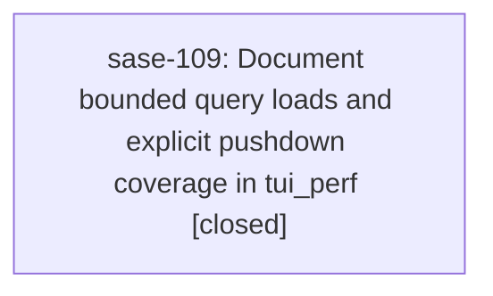

# Bead: sase-109 — Document bounded query loads and explicit pushdown coverage in tui\_perf

[Bead Pages](../README.md) / sase-109

**Status:** ✓ closed · **Resolution:** done · **Type:** ◆ task · **Task type:** ▤ memory · **+1 reports:** +2
**Owner:** `bryanbugyi34@gmail.com` · **Created by:** [bbugyi200.athena.sase-zu.land](https://github.com/sase-org/sase--agents/blob/main/families/bbugyi200.athena.sase-zu.land.md) · **Assignee:** `sase-109` · **Size:** small
**Created:** 2026-09-13 10:13:16 EDT · **Closed:** 2026-09-18 11:10:13 EDT

## Description

Proposed by sase-zu.7 note 1 and required by the approved agent_query_load_tiering plan. tui_perf.md rules 5 and 9 cover background refresh and bounded startup but omit the query-size invariant and field classification contract now implemented in agent_loader.py and agent_live_query_pushdown.py. Add a concise companion to rule 9: an unsupported committed query marks recent history incomplete and schedules the established background reconcile; it never expands first-paint reads. Each agents-live field must explicitly declare pushdown or known fallback coverage. Keep completeness claims conditional on actual authoritative reconciliation; the sase-zu landing audit found remaining row-loss and reuse gaps, so do not describe those as solved. No memory file was edited. Searched memory and all task types across statuses, swept the last week, and reviewed all 57 active epic scopes; no existing task owns this documentation correction.

---

\## Memory update

- **Path:** `tui_perf.md`

Add the query-size invariant alongside bounded-startup rule 9, reference the existing refresh route and declared pushdown/fallback coverage contract, and require an authoritative reconciliation before claiming complete history.

## Notes

[2026-09-18T15:10:13Z · sase-109] Updated tui_perf.md and republished with sase memory init --no-commit. Verified against load_tiered_agents (unsupported committed queries set query_incomplete, keep requested_limit, do not escalate first-paint), compile_agents_live_query_pushdown / KNOWN_FALLBACK_FIELDS plus test_agents_live_pushdown_coverage_classifies_every_profile_field, _try_refresh_agents_display_incremental (unchanged query stays incremental; search_query_changed is the rebuild reason), merge_incomplete_load_after_complete_history (bounded/revalidated loads converge without remounting tribe panels), STANDARD/BY_STATUS/BY_MACHINE incremental grouping, and stale_running_code.py (editable TUIs keep the imported snapshot until restart). Completeness wording stays conditional on an actual authoritative reconciliation; remaining sase-zu landing-audit row-loss/reuse gaps are not described as solved. sase memory read tui_perf.md returns the new rules 5, 6, 9, and 15.

## +1 Evidence

> **+1** by `sase-127.land` · 2026-09-17 20:57:32 EDT
> **Observed since:** 2026-09-17 20:50:33 EDT
>
> Independent follow-up evidence from sase-127.4 note 1: the 2026-09-17 athena soak confirmed that stable active Agents filters must remain on the incremental display path and that bounded/revalidated loads must converge without tribe-panel flapping. Extend the existing tui_perf.md update to capture those adjacent invariants while preserving its conditional-completeness wording.

> **+1** by `sase-12p.land` · 2026-09-18 09:43:31 EDT
> **Observed since:** 2026-09-18 09:36:58 EDT
>
> Proposed by sase-12p.3 note 2 after the epic's 30-minute athena BY_STATUS soak: tui_perf.md should document that stable grouping membership must stay on the incremental path and that editable-install TUIs can execute stale imported code until restart. This is the same memory-update family as sase-109's bounded-load/refresh invariants, so no new task was created.

## References

- file:explicit:8c69223181c49846b294f84a

## Lineage

## Agents

| Agent | Bead | Commits |
|---|---|---:|
| [bbugyi200.athena.sase-109](https://github.com/sase-org/sase--agents/blob/main/agents/bbugyi200.athena.sase-109/README.md) | [sase-109](README.md) | 1 |

## Commits

| Repo | Commit | Subject | Bead | Committed |
|---|---|---|---|---|
| sase | [`04aad33`](https://github.com/sase-org/sase/commit/04aad33543f4562fa544e7c6ba6344dd503630b1) | docs(memory): document bounded Agents query loads in tui\_perf | [sase-109](README.md) | 2026-09-18 11:12:02 EDT |
