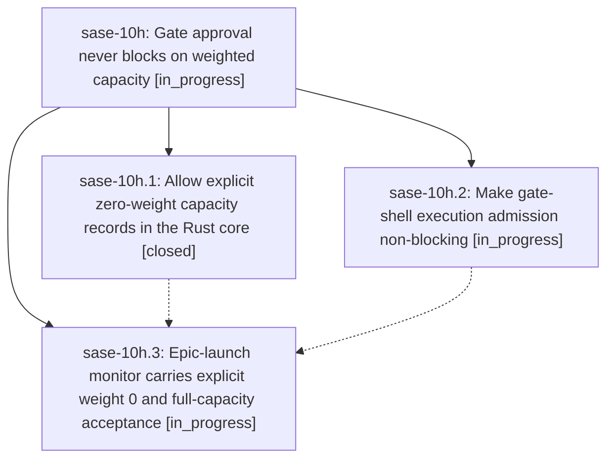

# Bead: sase-10h — Gate approval never blocks on weighted capacity

[Bead Pages](../README.md) / sase-10h

**Status:** ◐ in_progress · **Type:** ▸ plan · **Tier:** epic
**Owner:** `bryanbugyi34@gmail.com` · **Created by:** [bbugyi200.athena.fa](https://github.com/sase-org/sase--agents/blob/main/families/bbugyi200.athena.fa.md) · **Assignee:** `sase-10h.land`
**Created:** 2026-09-13 19:13:24 EDT
**Plan:** [202609/gate\_admission\_never\_blocks\_approval.md](https://github.com/sase-org/sase--plans/blob/main/202609/gate_admission_never_blocks_approval.md)

## Description

Answering a tale/epic plan gate on a machine at full weighted runner capacity completes promptly: the coder agent launches and parks as QUEUED, and the epic-launch monitor starts immediately with an explicit queue weight of 0.

## Phases

| Bead | Title | Status | Size | Created | Agents | Commits |
|---|---|---|---|---|---:|---:|
| [sase-10h.1](sase-10h.1.md) | Allow explicit zero-weight capacity records in the Rust core | ✓ closed | medium | 2026-09-13 | 1 | 1 |
| [sase-10h.2](sase-10h.2.md) | Make gate-shell execution admission non-blocking | ◐ in_progress | medium | 2026-09-13 | 1 | 0 |
| [sase-10h.3](sase-10h.3.md) | Epic-launch monitor carries explicit weight 0 and full-capacity acceptance | ◐ in_progress | medium | 2026-09-13 | 1 | 0 |

## Lineage

## Agents

| Agent | Bead | Commits |
|---|---|---:|
| [bbugyi200.athena.sase-10h.1](https://github.com/sase-org/sase--agents/blob/main/agents/bbugyi200.athena.sase-10h.1/README.md) | [sase-10h.1](sase-10h.1.md) | 1 |
| [bbugyi200.athena.sase-10h.2](https://github.com/sase-org/sase--agents/blob/main/agents/bbugyi200.athena.sase-10h.2/README.md) | [sase-10h.2](sase-10h.2.md) | 0 |
| [bbugyi200.athena.sase-10h.3](https://github.com/sase-org/sase--agents/blob/main/agents/bbugyi200.athena.sase-10h.3/README.md) | [sase-10h.3](sase-10h.3.md) | 0 |
| [bbugyi200.athena.sase-10h.land](https://github.com/sase-org/sase--agents/blob/main/agents/bbugyi200.athena.sase-10h.land/README.md) | [sase-10h](README.md) | 0 |

## Commits

| Repo | Commit | Subject | Bead | Committed |
|---|---|---|---|---|
| sase-core | [`sase-core@e3e926f`](https://github.com/sase-org/sase-core/commit/e3e926f7f544aa6698f4493ded815d4a3c3c3ff2) | feat(runner\_capacity): accept explicit zero-weight capacity records | [sase-10h.1](sase-10h.1.md) | 2026-09-13 19:49:26 EDT |
