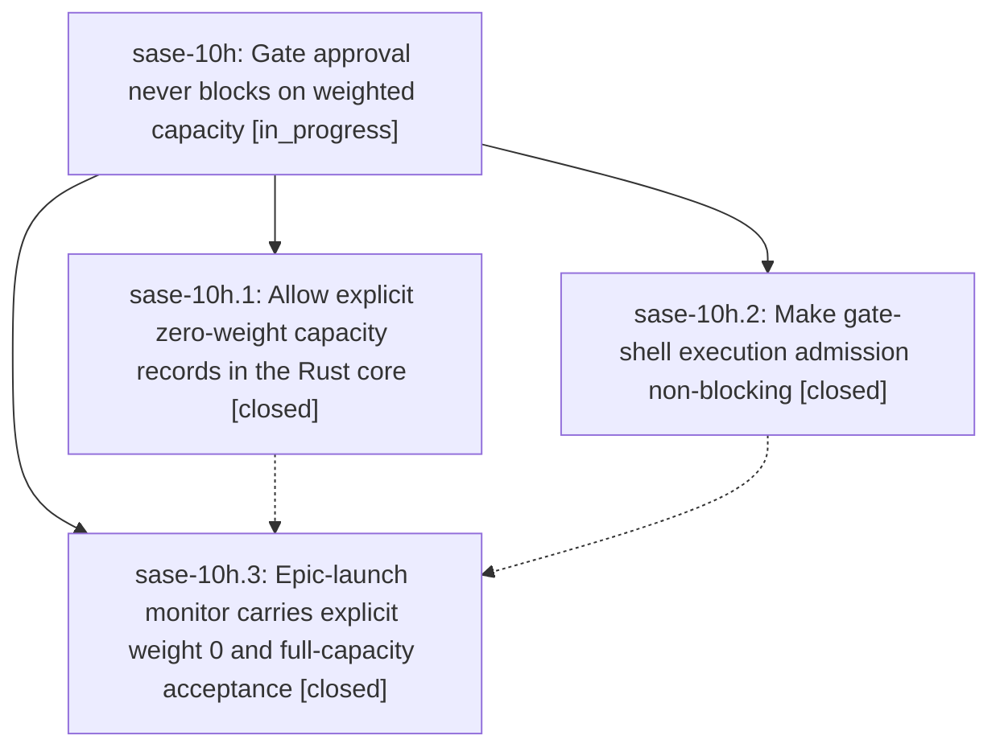

# Bead: sase-10h — Gate approval never blocks on weighted capacity

[Bead Pages](../README.md) / sase-10h

**Status:** ◐ in_progress · **Type:** ▸ plan · **Tier:** epic
**Owner:** `bryanbugyi34@gmail.com` · **Created by:** [bbugyi200.athena.fa](https://github.com/sase-org/sase--agents/blob/main/families/bbugyi200.athena.fa.md) · **Assignee:** `sase-10h.land`
**Created:** 2026-09-13 19:13:24 EDT
**Plan:** [202609/gate\_admission\_never\_blocks\_approval.md](https://github.com/sase-org/sase--plans/blob/main/202609/gate_admission_never_blocks_approval.md)

## Description

Answering a tale/epic plan gate on a machine at full weighted runner capacity completes promptly: the coder agent launches and parks as QUEUED, and the epic-launch monitor starts immediately with an explicit queue weight of 0.

## Notes

[2026-09-14T11:13:41Z · sase-10h.land] LANDING AUDIT (2026-09-14): Verified child notes, source, and history. Phase 1 is present in sase-core commit e3e926f (explicit zero record weights remain non-occupying/non-reusable; queue directives remain positive) and its focused Rust tests remain in tree. Phase 2 is present in SASE commit 78570c0611; later wait-slot split 66a46b8cc3 and durable gate-decision work c8152f4978 preserve the one-shot non-parking callback and gate answer coverage. Phase 3 was incorrectly closed: no sase-10h.3 commit exists, and the current StartMonitorRequest/start_epic_launch_monitor/create_monitor_member path still only inherits the planner weight. Later monitor/test refactors c12285ffd4, 8894213c95, and fc9a8317c5 define the current integration points. Prepared and validated a medium tale containing only the missing phase-3 implementation and drift integration. PROPOSED FOLLOW-UP outcomes from sase-10h.1: declined all three as resolved by later core commits. cargo fmt --all -- --check now passes (d0ec62c later touched retention.rs); a86cd9e raised provider-priority LOCK_TIMEOUT from 250ms to 1s and the reported concurrency test passed within cargo test --workspace; a86cd9e/d0ec62c rewrote the fleet test setup and the formerly deterministic gateway test passed focused and in the full workspace suite. Full cargo test --workspace passed, including 2697 sase_core tests and 164 sase_gateway tests. No task bead was warranted.

## Phases

| Bead | Title | Status | Size | Created | Agents | Commits |
|---|---|---|---|---|---:|---:|
| [sase-10h.1](sase-10h.1.md) | Allow explicit zero-weight capacity records in the Rust core | ✓ closed | medium | 2026-09-13 | 1 | 1 |
| [sase-10h.2](sase-10h.2.md) | Make gate-shell execution admission non-blocking | ✓ closed | medium | 2026-09-13 | 1 | 1 |
| [sase-10h.3](sase-10h.3.md) | Epic-launch monitor carries explicit weight 0 and full-capacity acceptance | ✓ closed | medium | 2026-09-13 | 1 | 0 |

## Lineage

## Agents

| Agent | Bead | Commits |
|---|---|---:|
| [bbugyi200.athena.sase-10h.1](https://github.com/sase-org/sase--agents/blob/main/agents/bbugyi200.athena.sase-10h.1/README.md) | [sase-10h.1](sase-10h.1.md) | 1 |
| [bbugyi200.athena.sase-10h.2](https://github.com/sase-org/sase--agents/blob/main/agents/bbugyi200.athena.sase-10h.2/README.md) | [sase-10h.2](sase-10h.2.md) | 1 |
| [bbugyi200.athena.sase-10h.3](https://github.com/sase-org/sase--agents/blob/main/families/bbugyi200.athena.sase-10h.3.md) | [sase-10h.3](sase-10h.3.md) | 0 |
| [bbugyi200.athena.sase-10h.land](https://github.com/sase-org/sase--agents/blob/main/families/bbugyi200.athena.sase-10h.land.md) | [sase-10h](README.md) | 2 |

## Commits

| Repo | Commit | Subject | Bead | Committed |
|---|---|---|---|---|
| sase-core | [`sase-core@e3e926f`](https://github.com/sase-org/sase-core/commit/e3e926f7f544aa6698f4493ded815d4a3c3c3ff2) | feat(runner\_capacity): accept explicit zero-weight capacity records | [sase-10h.1](sase-10h.1.md) | 2026-09-13 19:49:26 EDT |
| sase | [`78570c0`](https://github.com/sase-org/sase/commit/78570c06110f05075acf44ac3d1cc847ee0caa1d) | fix(gate-shell): do not block gate execution on runner capacity | [sase-10h.2](sase-10h.2.md) | 2026-09-13 20:00:35 EDT |
| sase | [`8bd8fb8`](https://github.com/sase-org/sase/commit/8bd8fb891dd95d776dd06a712864de23d48d4c34) | fix(monitor): preserve explicit zero queue weight through capacity and fleet projections | [sase-10h](README.md) | 2026-09-14 07:56:24 EDT |
| sase-core | [`sase-core@3f1ca28`](https://github.com/sase-org/sase-core/commit/3f1ca286e53b7e702c92f8a9662dcd77c3777e9d) | fix(fleet\_contract): accept explicit zero queue weight in scan and validation | [sase-10h](README.md) | 2026-09-14 07:59:30 EDT |
