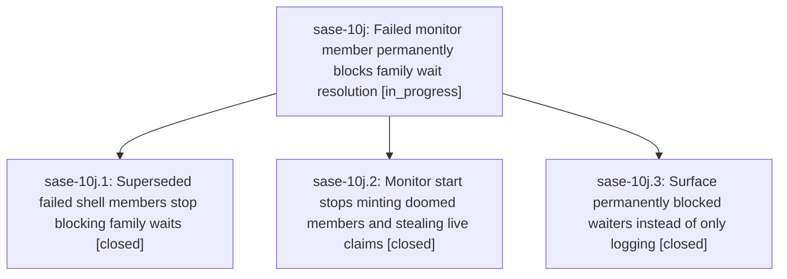

# Bead: sase-10j — Failed monitor member permanently blocks family wait resolution

[Bead Pages](../README.md) / sase-10j

**Status:** ◐ in_progress · **Type:** ▸ plan · **Tier:** epic
**Owner:** `bryanbugyi34@gmail.com` · **Created by:** `bbugyi200.kellys_mbp.0i.f0` · **Assignee:** `sase-10j.land`
**Created:** 2026-09-13 21:53:03 EDT
**Plan:** [202609/failed\_monitor\_blocks\_family\_wait.md](https://github.com/sase-org/sase--plans/blob/main/202609/failed_monitor_blocks_family_wait.md)

## Description

A family wait resolves once a lane recovers from a failed shell member via a same-kind retry, monitor starts stop minting doomed family members or stealing live workspace claims, and permanently blocked waiters surface as notifications.

## Phases

| Bead | Title | Status | Size | Created | Agents | Commits |
|---|---|---|---|---|---:|---:|
| [sase-10j.1](sase-10j.1.md) | Superseded failed shell members stop blocking family waits | ✓ closed | medium | 2026-09-13 | 1 | 1 |
| [sase-10j.2](sase-10j.2.md) | Monitor start stops minting doomed members and stealing live claims | ✓ closed | medium | 2026-09-13 | 1 | 1 |
| [sase-10j.3](sase-10j.3.md) | Surface permanently blocked waiters instead of only logging | ✓ closed | small | 2026-09-13 | 1 | 1 |

## Lineage

## Agents

| Agent | Bead | Commits |
|---|---|---:|
| [bbugyi200.apollo.sase-10j.2](https://github.com/sase-org/sase--agents/blob/main/agents/bbugyi200.apollo.sase-10j.2/README.md) | [sase-10j.2](sase-10j.2.md) | 1 |
| [bbugyi200.apollo.sase-10j.3](https://github.com/sase-org/sase--agents/blob/main/agents/bbugyi200.apollo.sase-10j.3/README.md) | [sase-10j.3](sase-10j.3.md) | 1 |
| [bbugyi200.apollo.sase-10j.land](https://github.com/sase-org/sase--agents/blob/main/agents/bbugyi200.apollo.sase-10j.land/README.md) | [sase-10j](README.md) | 0 |
| [bbugyi200.kellys\_mbp.sase-10j.1](https://github.com/sase-org/sase--agents/blob/main/agents/bbugyi200.kellys_mbp.sase-10j.1/README.md) | [sase-10j.1](sase-10j.1.md) | 1 |

## Commits

| Repo | Commit | Subject | Bead | Committed |
|---|---|---|---|---|
| sase | [`3d74d69`](https://github.com/sase-org/sase/commit/3d74d690a2f55474ea8c297da9db67d9dca4f744) | fix(wait-dependency): stop superseded failed shell members from blocking family waits | [sase-10j.1](sase-10j.1.md) | 2026-09-13 23:56:29 EDT |
| sase | [`cb1076e`](https://github.com/sase-org/sase/commit/cb1076e85515292d2fc420825d4909d1b0b878ac) | fix(wait): notify terminally blocked waiters | [sase-10j.3](sase-10j.3.md) | 2026-09-14 08:36:46 EDT |
| sase | [`b604806`](https://github.com/sase-org/sase/commit/b6048061be5d2ce02dc582a7e63a31527fe93f30) | fix(monitor): preflight monitor workspace claims | [sase-10j.2](sase-10j.2.md) | 2026-09-14 15:50:56 EDT |
