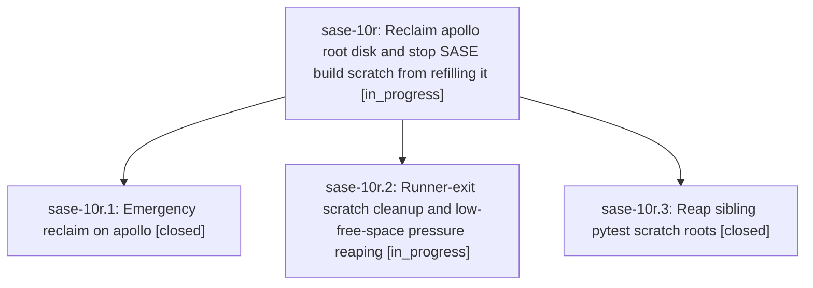

# Bead: sase-10r — Reclaim apollo root disk and stop SASE build scratch from refilling it

[Bead Pages](../README.md) / sase-10r

**Status:** ◐ in_progress · **Type:** ▸ plan · **Tier:** epic
**Owner:** `bryanbugyi34@gmail.com` · **Created by:** [bbugyi200.kellys\_mbp.0l](https://github.com/sase-org/sase--agents/blob/main/families/bbugyi200.kellys_mbp.0l.md) · **Assignee:** `sase-10r.land`
**Created:** 2026-09-14 06:56:20 EDT
**Plan:** [202609/apollo\_disk\_reclaim\_1.md](https://github.com/sase-org/sase--plans/blob/main/202609/apollo_disk_reclaim_1.md)

## Description

apollo's root filesystem regains roughly 100G of free space without disturbing running agents, and per-launch cargo targets plus per-checkout pytest scratch are reclaimed automatically so the disk does not refill.

## Phases

| Bead | Title | Status | Size | Created | Agents | Commits |
|---|---|---|---|---|---:|---:|
| [sase-10r.1](sase-10r.1.md) | Emergency reclaim on apollo | ✓ closed | small | 2026-09-14 | 1 | 0 |
| [sase-10r.2](sase-10r.2.md) | Runner-exit scratch cleanup and low-free-space pressure reaping | ◐ in_progress | medium | 2026-09-14 | 1 | 0 |
| [sase-10r.3](sase-10r.3.md) | Reap sibling pytest scratch roots | ✓ closed | small | 2026-09-14 | 1 | 1 |

## Lineage

## Agents

| Agent | Bead | Commits |
|---|---|---:|
| [bbugyi200.kellys\_mbp.sase-10r.1](https://github.com/sase-org/sase--agents/blob/main/agents/bbugyi200.kellys_mbp.sase-10r.1/README.md) | [sase-10r.1](sase-10r.1.md) | 0 |
| [bbugyi200.kellys\_mbp.sase-10r.2](https://github.com/sase-org/sase--agents/blob/main/agents/bbugyi200.kellys_mbp.sase-10r.2/README.md) | [sase-10r.2](sase-10r.2.md) | 0 |
| [bbugyi200.kellys\_mbp.sase-10r.3](https://github.com/sase-org/sase--agents/blob/main/agents/bbugyi200.kellys_mbp.sase-10r.3/README.md) | [sase-10r.3](sase-10r.3.md) | 1 |
| [bbugyi200.kellys\_mbp.sase-10r.land](https://github.com/sase-org/sase--agents/blob/main/agents/bbugyi200.kellys_mbp.sase-10r.land/README.md) | [sase-10r](README.md) | 0 |

## Commits

| Repo | Commit | Subject | Bead | Committed |
|---|---|---|---|---|
| sase | [`df5fbba`](https://github.com/sase-org/sase/commit/df5fbbaccf07646c34dfcf75eb3bd74f30ef4d71) | fix(test): reap sibling pytest scratch roots | [sase-10r.3](sase-10r.3.md) | 2026-09-14 07:56:13 EDT |
