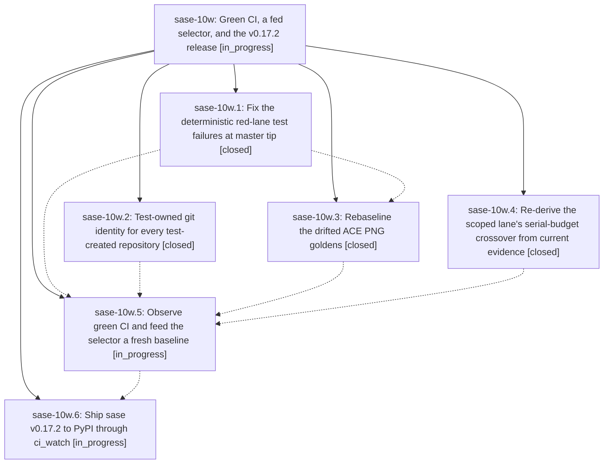

# Bead: sase-10w — Green CI, a fed selector, and the v0.17.2 release

[Bead Pages](../README.md) / sase-10w

**Status:** ◐ in_progress · **Type:** ▸ plan · **Tier:** epic
**Owner:** `bryanbugyi34@gmail.com` · **Created by:** [bbugyi200.athena.0kh](https://github.com/sase-org/sase--agents/blob/main/families/bbugyi200.athena.0kh.md) · **Assignee:** `sase-10w.land`
**Created:** 2026-09-14 09:06:44 EDT
**Plan:** [202609/green\_ci\_fast\_lane\_v0\_17\_2.md](https://github.com/sase-org/sase--plans/blob/main/202609/green_ci_fast_lane_v0_17_2.md)

## Description

Master Gate and Full CI pass on the master tip, the diff-scoped test lane stops escalating on stale coverage baselines so `just check` gets fast again, and sase v0.17.2 reaches PyPI through the ci_watch-owned release path.

## Phases

| Bead | Title | Status | Size | Created | Agents | Commits |
|---|---|---|---|---|---:|---:|
| [sase-10w.1](sase-10w.1.md) | Fix the deterministic red-lane test failures at master tip | ✓ closed | medium | 2026-09-14 | 1 | 1 |
| [sase-10w.2](sase-10w.2.md) | Test-owned git identity for every test-created repository | ✓ closed | medium | 2026-09-14 | 1 | 1 |
| [sase-10w.3](sase-10w.3.md) | Rebaseline the drifted ACE PNG goldens | ✓ closed | medium | 2026-09-14 | 1 | 1 |
| [sase-10w.4](sase-10w.4.md) | Re-derive the scoped lane's serial-budget crossover from current evidence | ✓ closed | small | 2026-09-14 | 1 | 1 |
| [sase-10w.5](sase-10w.5.md) | Observe green CI and feed the selector a fresh baseline | ◐ in_progress | medium | 2026-09-14 | 1 | 0 |
| [sase-10w.6](sase-10w.6.md) | Ship sase v0.17.2 to PyPI through ci\_watch | ◐ in_progress | small | 2026-09-14 | 1 | 0 |

## Lineage

## Agents

| Agent | Bead | Commits |
|---|---|---:|
| [bbugyi200.athena.sase-10w.1](https://github.com/sase-org/sase--agents/blob/main/agents/bbugyi200.athena.sase-10w.1/README.md) | [sase-10w.1](sase-10w.1.md) | 1 |
| [bbugyi200.athena.sase-10w.2](https://github.com/sase-org/sase--agents/blob/main/agents/bbugyi200.athena.sase-10w.2/README.md) | [sase-10w.2](sase-10w.2.md) | 1 |
| [bbugyi200.athena.sase-10w.3](https://github.com/sase-org/sase--agents/blob/main/agents/bbugyi200.athena.sase-10w.3/README.md) | [sase-10w.3](sase-10w.3.md) | 1 |
| [bbugyi200.athena.sase-10w.4](https://github.com/sase-org/sase--agents/blob/main/agents/bbugyi200.athena.sase-10w.4/README.md) | [sase-10w.4](sase-10w.4.md) | 1 |
| [bbugyi200.athena.sase-10w.5](https://github.com/sase-org/sase--agents/blob/main/agents/bbugyi200.athena.sase-10w.5/README.md) | [sase-10w.5](sase-10w.5.md) | 0 |
| [bbugyi200.athena.sase-10w.6](https://github.com/sase-org/sase--agents/blob/main/agents/bbugyi200.athena.sase-10w.6/README.md) | [sase-10w.6](sase-10w.6.md) | 0 |
| [bbugyi200.athena.sase-10w.land](https://github.com/sase-org/sase--agents/blob/main/agents/bbugyi200.athena.sase-10w.land/README.md) | [sase-10w](README.md) | 0 |

## Commits

| Repo | Commit | Subject | Bead | Committed |
|---|---|---|---|---|
| sase | [`5024571`](https://github.com/sase-org/sase/commit/5024571a3254393d56c2c9d5cf45fac996d18128) | fix(monitor): repair store\_lane and monitor \_\_init\_\_ imports | [sase-10w.1](sase-10w.1.md) | 2026-09-14 09:28:11 EDT |
| sase | [`526df13`](https://github.com/sase-org/sase/commit/526df13e48b81e8128b37552e76233e362d75775) | fix(scope): recalibrate scoped lane budget | [sase-10w.4](sase-10w.4.md) | 2026-09-14 10:14:34 EDT |
| sase | [`d0a849d`](https://github.com/sase-org/sase/commit/d0a849df74be36f030ec392f30e159b54a65cb36) | test(ace): rebaseline drifted ACE PNG goldens and fix shell-label squeeze truncation | [sase-10w.3](sase-10w.3.md) | 2026-09-14 11:15:49 EDT |
| sase | [`cc91c0a`](https://github.com/sase-org/sase/commit/cc91c0aa435c225402a4598dc6adf998ef257510) | test: make git identity hermetic in tests | [sase-10w.2](sase-10w.2.md) | 2026-09-14 11:18:09 EDT |
