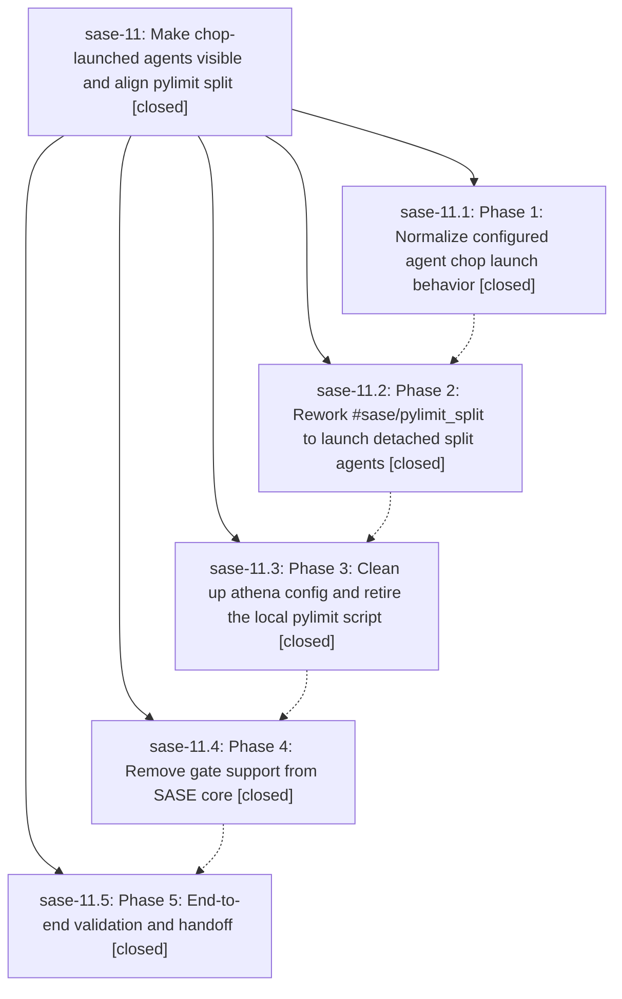

# Bead: sase-11 — Make chop-launched agents visible and align pylimit split

[Bead Pages](../README.md) / sase-11

**Status:** ✓ closed · **Resolution:** (unrecorded) · **Type:** plan · **Tier:** epic
**Owner:** `bryanbugyi34@gmail.com`
**Created:** 2026-04-28 14:45:49 UTC · **Closed:** 2026-04-28 15:25:46 UTC
**Plan:** [202604/chop\_agent\_visibility\_and\_pylimit\_split.md](https://github.com/sase-org/sase--plans/blob/main/202604/chop_agent_visibility_and_pylimit_split.md)

## Phases

| Bead | Title | Status | Size | Agents | Commits |
|---|---|---|---|---:|---:|
| [sase-11.1](sase-11.1.md) | Phase 1: Normalize configured agent chop launch behavior | ✓ closed | small | 0 | 1 |
| [sase-11.2](sase-11.2.md) | Phase 2: Rework #sase/pylimit\_split to launch detached split agents | ✓ closed | small | 0 | 1 |
| [sase-11.3](sase-11.3.md) | Phase 3: Clean up athena config and retire the local pylimit script | ✓ closed | small | 0 | 0 |
| [sase-11.4](sase-11.4.md) | Phase 4: Remove gate support from SASE core | ✓ closed | small | 0 | 1 |
| [sase-11.5](sase-11.5.md) | Phase 5: End-to-end validation and handoff | ✓ closed | small | 0 | 1 |

## Lineage

## Commits

| Commit | Subject | Bead | Committed (UTC) |
|---|---|---|---|
| [`d140b43`](https://github.com/sase-org/sase/commit/d140b43a70992775304afc577f5ab30b2d13498e) | feat(axe): make configured agent chops visible by default (sase-11.1) | [sase-11.1](sase-11.1.md) | 2026-04-28 14:57:03 |
| [`25bf05d`](https://github.com/sase-org/sase/commit/25bf05d00c0fff3a3a3e9525bcb32c97f3b731ec) | feat(xprompt): launch pylimit split agents via detached %wait chain (sase-11.2) | [sase-11.2](sase-11.2.md) | 2026-04-28 15:08:46 |
| [`0d1f490`](https://github.com/sase-org/sase/commit/0d1f4909ebaea06e37ccc553c4188e61ad1aab2f) | feat(axe): remove gate support from chop config (sase-11.4) | [sase-11.4](sase-11.4.md) | 2026-04-28 15:17:40 |
| [`0a8cfcb`](https://github.com/sase-org/sase/commit/0a8cfcb642a25dca56e3b25ead1fae7ba965e2c0) | chore: close bead sase-11.5 (sase-11.5) | [sase-11.5](sase-11.5.md) | 2026-04-28 15:22:42 |
