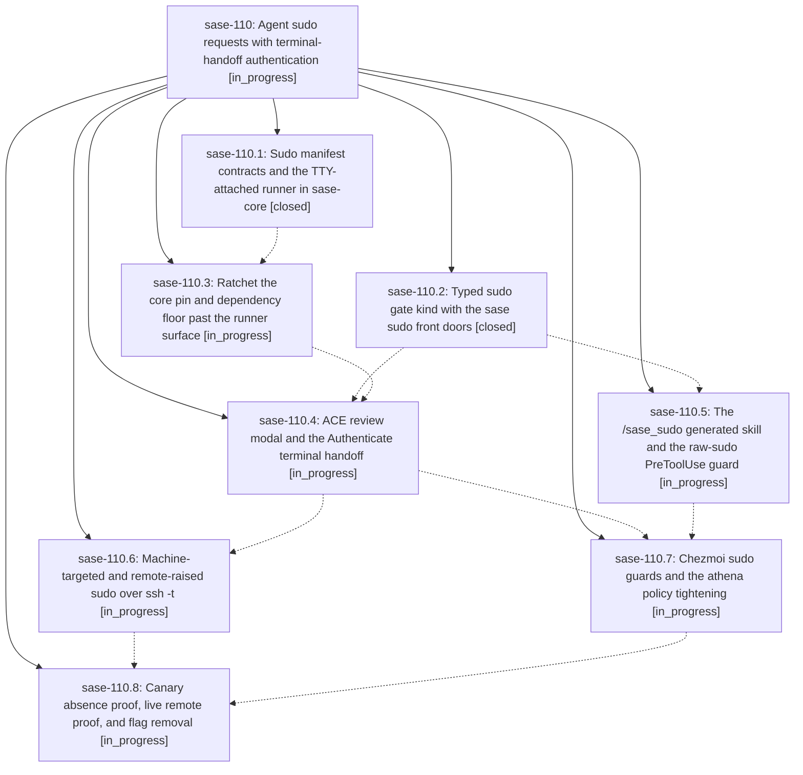

# Bead: sase-110 — Agent sudo requests with terminal-handoff authentication

[Bead Pages](../README.md) / sase-110

**Status:** ◐ in_progress · **Type:** ▸ plan · **Tier:** epic
**Owner:** `bryanbugyi34@gmail.com` · **Created by:** [bbugyi200.athena.0kl](https://github.com/sase-org/sase--agents/blob/main/families/bbugyi200.athena.0kl.md) · **Assignee:** `sase-110.land`
**Created:** 2026-09-14 11:33:13 EDT
**Plan:** [202609/agent\_sudo\_requests.md](https://github.com/sase-org/sase--plans/blob/main/202609/agent_sudo_requests.md)

## Description

An agent on any machine can request that Bryan authenticate an exact, reviewed batch of sudo commands; authentication happens only on a real TTY handed to sudo/PAM (never through SASE), execution flows through an unprivileged hash-verified runner locally or over ssh -t remotely, a follow-up agent receives a structured ledger, and athena's NOPASSWD sudo policy is tightened so the reviewed approval becomes a real privilege boundary.

## Phases

| Bead | Title | Status | Size | Created | Agents | Commits |
|---|---|---|---|---|---:|---:|
| [sase-110.1](sase-110.1.md) | Sudo manifest contracts and the TTY-attached runner in sase-core | ✓ closed | large | 2026-09-14 | 1 | 1 |
| [sase-110.2](sase-110.2.md) | Typed sudo gate kind with the sase sudo front doors | ✓ closed | large | 2026-09-14 | 1 | 0 |
| [sase-110.3](sase-110.3.md) | Ratchet the core pin and dependency floor past the runner surface | ◐ in_progress | small | 2026-09-14 | 1 | 0 |
| [sase-110.4](sase-110.4.md) | ACE review modal and the Authenticate terminal handoff | ◐ in_progress | large | 2026-09-14 | 1 | 0 |
| [sase-110.5](sase-110.5.md) | The /sase\_sudo generated skill and the raw-sudo PreToolUse guard | ◐ in_progress | medium | 2026-09-14 | 1 | 0 |
| [sase-110.6](sase-110.6.md) | Machine-targeted and remote-raised sudo over ssh -t | ◐ in_progress | large | 2026-09-14 | 1 | 0 |
| [sase-110.7](sase-110.7.md) | Chezmoi sudo guards and the athena policy tightening | ◐ in_progress | medium | 2026-09-14 | 1 | 0 |
| [sase-110.8](sase-110.8.md) | Canary absence proof, live remote proof, and flag removal | ◐ in_progress | large | 2026-09-14 | 1 | 0 |

## Lineage

## Agents

| Agent | Bead | Commits |
|---|---|---:|
| [bbugyi200.athena.sase-110.1](https://github.com/sase-org/sase--agents/blob/main/families/bbugyi200.athena.sase-110.1.md) | [sase-110.1](sase-110.1.md) | 1 |
| [bbugyi200.athena.sase-110.2](https://github.com/sase-org/sase--agents/blob/main/families/bbugyi200.athena.sase-110.2.md) | [sase-110.2](sase-110.2.md) | 0 |
| [bbugyi200.athena.sase-110.3](https://github.com/sase-org/sase--agents/blob/main/agents/bbugyi200.athena.sase-110.3/README.md) | [sase-110.3](sase-110.3.md) | 0 |
| [bbugyi200.athena.sase-110.4](https://github.com/sase-org/sase--agents/blob/main/agents/bbugyi200.athena.sase-110.4/README.md) | [sase-110.4](sase-110.4.md) | 0 |
| [bbugyi200.athena.sase-110.5](https://github.com/sase-org/sase--agents/blob/main/agents/bbugyi200.athena.sase-110.5/README.md) | [sase-110.5](sase-110.5.md) | 0 |
| [bbugyi200.athena.sase-110.6](https://github.com/sase-org/sase--agents/blob/main/agents/bbugyi200.athena.sase-110.6/README.md) | [sase-110.6](sase-110.6.md) | 0 |
| [bbugyi200.athena.sase-110.7](https://github.com/sase-org/sase--agents/blob/main/agents/bbugyi200.athena.sase-110.7/README.md) | [sase-110.7](sase-110.7.md) | 0 |
| [bbugyi200.athena.sase-110.8](https://github.com/sase-org/sase--agents/blob/main/agents/bbugyi200.athena.sase-110.8/README.md) | [sase-110.8](sase-110.8.md) | 0 |
| [bbugyi200.athena.sase-110.land](https://github.com/sase-org/sase--agents/blob/main/agents/bbugyi200.athena.sase-110.land/README.md) | [sase-110](README.md) | 0 |

## Commits

| Repo | Commit | Subject | Bead | Committed |
|---|---|---|---|---|
| sase-core | [`sase-core@ab68522`](https://github.com/sase-org/sase-core/commit/ab68522ac465d11544d48d6881ad1ea0c9f372d3) | feat(sudo): add reviewed sudo runner contracts | [sase-110.1](sase-110.1.md) | 2026-09-14 12:47:27 EDT |
