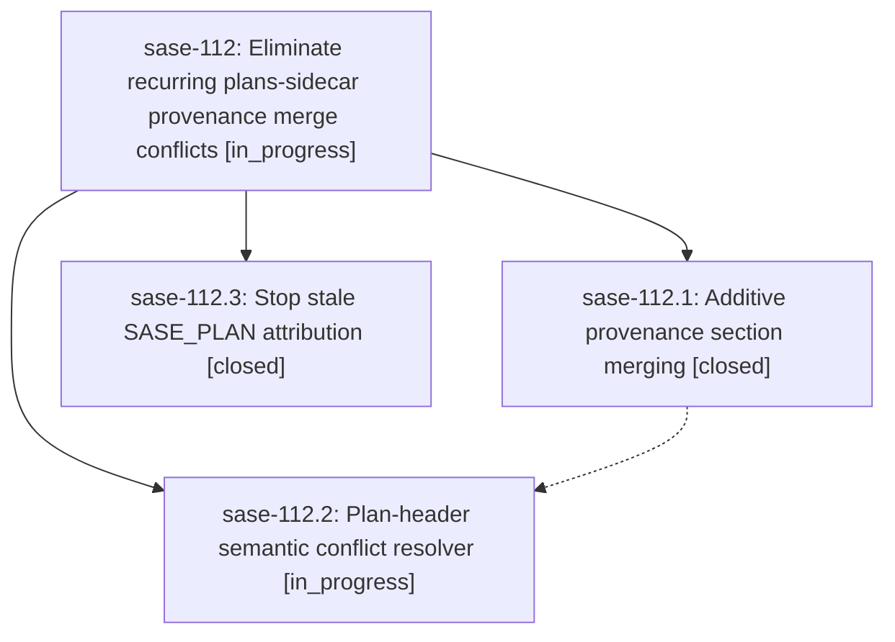

# Bead: sase-112 — Eliminate recurring plans-sidecar provenance merge conflicts

[Bead Pages](../README.md) / sase-112

**Status:** ◐ in_progress · **Type:** ▸ plan · **Tier:** epic
**Owner:** `bryanbugyi34@gmail.com` · **Created by:** [bbugyi200.athena.0kt](https://github.com/sase-org/sase--agents/blob/main/families/bbugyi200.athena.0kt.md) · **Assignee:** `sase-112.land`
**Created:** 2026-09-14 14:03:46 EDT
**Plan:** [202609/provenance\_refresh\_conflicts.md](https://github.com/sase-org/sase--plans/blob/main/202609/provenance_refresh_conflicts.md)

## Description

Concurrent plan provenance refreshes from different repos and machines converge additively instead of fighting, the sync rebase auto-resolves the recurring AGENTS/COMMITS conflict class, and finished plans stop being stamped onto unrelated commits — so plans-sidecar merge conflicts no longer require manual resolution.

## Phases

| Bead | Title | Status | Size | Created | Agents | Commits |
|---|---|---|---|---|---:|---:|
| [sase-112.1](sase-112.1.md) | Additive provenance section merging | ✓ closed | medium | 2026-09-14 | 1 | 1 |
| [sase-112.2](sase-112.2.md) | Plan-header semantic conflict resolver | ◐ in_progress | medium | 2026-09-14 | 1 | 0 |
| [sase-112.3](sase-112.3.md) | Stop stale SASE\_PLAN attribution | ✓ closed | medium | 2026-09-14 | 1 | 1 |

## Lineage

## Agents

| Agent | Bead | Commits |
|---|---|---:|
| [bbugyi200.athena.sase-112.1](https://github.com/sase-org/sase--agents/blob/main/agents/bbugyi200.athena.sase-112.1/README.md) | [sase-112.1](sase-112.1.md) | 1 |
| [bbugyi200.athena.sase-112.2](https://github.com/sase-org/sase--agents/blob/main/agents/bbugyi200.athena.sase-112.2/README.md) | [sase-112.2](sase-112.2.md) | 0 |
| [bbugyi200.athena.sase-112.3](https://github.com/sase-org/sase--agents/blob/main/agents/bbugyi200.athena.sase-112.3/README.md) | [sase-112.3](sase-112.3.md) | 1 |
| [bbugyi200.athena.sase-112.land](https://github.com/sase-org/sase--agents/blob/main/agents/bbugyi200.athena.sase-112.land/README.md) | [sase-112](README.md) | 0 |

## Commits

| Repo | Commit | Subject | Bead | Committed |
|---|---|---|---|---|
| sase | [`f692235`](https://github.com/sase-org/sase/commit/f692235fc3c0fe2161bc1ef5e92699b9d567d89f) | fix(sdd): merge plan provenance entries additively | [sase-112.1](sase-112.1.md) | 2026-09-14 14:32:00 EDT |
| sase | [`2e0dd5e`](https://github.com/sase-org/sase/commit/2e0dd5ee46fe4b8ef583e2c6a2c901c3652a8685) | fix(commit): stop stale plan attribution | [sase-112.3](sase-112.3.md) | 2026-09-14 14:42:21 EDT |
