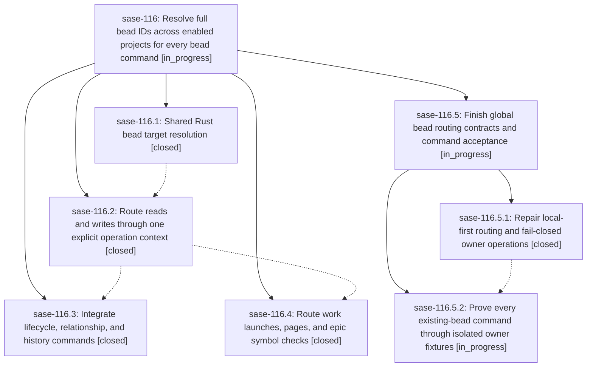

# Bead: sase-116 — Resolve full bead IDs across enabled projects for every bead command

[Bead Pages](../README.md) / sase-116

**Status:** ◐ in_progress · **Type:** ▸ plan · **Tier:** epic
**Owner:** `bryanbugyi34@gmail.com` · **Created by:** [bbugyi200.athena.0l4](https://github.com/sase-org/sase--agents/blob/main/families/bbugyi200.athena.0l4.md) · **Assignee:** `sase-116.land`
**Created:** 2026-09-15 09:03:30 EDT
**Plan:** [202609/global\_bead\_id\_resolution.md](https://github.com/sase-org/sase--plans/blob/main/202609/global_bead_id_resolution.md)

## Description

Every existing-bead argument to sase bead resolves a full ID independently of the caller's directory and executes against the owning project's correct store and context.

## Phases

| Bead | Title | Status | Size | Created | Agents | Commits |
|---|---|---|---|---|---:|---:|
| [sase-116.1](sase-116.1.md) | Shared Rust bead target resolution | ✓ closed | medium | 2026-09-15 | 1 | 2 |
| [sase-116.2](sase-116.2.md) | Route reads and writes through one explicit operation context | ✓ closed | medium | 2026-09-15 | 1 | 1 |
| [sase-116.3](sase-116.3.md) | Integrate lifecycle, relationship, and history commands | ✓ closed | medium | 2026-09-15 | 1 | 1 |
| [sase-116.4](sase-116.4.md) | Route work launches, pages, and epic symbol checks | ✓ closed | medium | 2026-09-15 | 1 | 1 |

## Lineage

## Agents

| Agent | Bead | Commits |
|---|---|---:|
| [bbugyi200.athena.sase-116.1](https://github.com/sase-org/sase--agents/blob/main/agents/bbugyi200.athena.sase-116.1/README.md) | [sase-116.1](sase-116.1.md) | 2 |
| [bbugyi200.athena.sase-116.2](https://github.com/sase-org/sase--agents/blob/main/agents/bbugyi200.athena.sase-116.2/README.md) | [sase-116.2](sase-116.2.md) | 1 |
| [bbugyi200.athena.sase-116.3](https://github.com/sase-org/sase--agents/blob/main/agents/bbugyi200.athena.sase-116.3/README.md) | [sase-116.3](sase-116.3.md) | 1 |
| [bbugyi200.athena.sase-116.4](https://github.com/sase-org/sase--agents/blob/main/agents/bbugyi200.athena.sase-116.4/README.md) | [sase-116.4](sase-116.4.md) | 1 |
| [bbugyi200.athena.sase-116.5.1](https://github.com/sase-org/sase--agents/blob/main/agents/bbugyi200.athena.sase-116.5.1/README.md) | [sase-116.5.1](sase-116.5.1.md) | 1 |
| [bbugyi200.athena.sase-116.5.2](https://github.com/sase-org/sase--agents/blob/main/agents/bbugyi200.athena.sase-116.5.2/README.md) | [sase-116.5.2](sase-116.5.2.md) | 0 |
| [bbugyi200.athena.sase-116.5.land](https://github.com/sase-org/sase--agents/blob/main/agents/bbugyi200.athena.sase-116.5.land/README.md) | [sase-116.5](sase-116.5.md) | 0 |
| [bbugyi200.athena.sase-116.land](https://github.com/sase-org/sase--agents/blob/main/families/bbugyi200.athena.sase-116.land.md) | [sase-116](README.md) | 0 |

## Commits

| Repo | Commit | Subject | Bead | Committed |
|---|---|---|---|---|
| sase | [`df87d68`](https://github.com/sase-org/sase/commit/df87d68dcbc6628e21bd4a4c75f8eb994cbf37ea) | feat(bead): route show targets through shared resolver | [sase-116.1](sase-116.1.md) | 2026-09-15 10:38:53 EDT |
| sase-core | [`sase-core@dd64c84`](https://github.com/sase-org/sase-core/commit/dd64c845aff247a9a74d00d50eac15a1ea827824) | feat(bead): add target routing policy | [sase-116.1](sase-116.1.md) | 2026-09-15 10:41:12 EDT |
| sase | [`dbe3cd4`](https://github.com/sase-org/sase/commit/dbe3cd4bcea0991d1a561be9465594173ef27c04) | feat(bead): route operations through explicit contexts | [sase-116.2](sase-116.2.md) | 2026-09-15 11:57:33 EDT |
| sase | [`0d5afc7`](https://github.com/sase-org/sase/commit/0d5afc77397d96e56fcf6d301da8f47cef1f0ba4) | feat(beads): route command targets by owner | [sase-116.3](sase-116.3.md) | 2026-09-15 13:05:14 EDT |
| sase | [`1954d0f`](https://github.com/sase-org/sase/commit/1954d0f1eb95f7c502f77ed8e419c40d1c76e464) | feat(beads): route full-id work contexts | [sase-116.4](sase-116.4.md) | 2026-09-15 13:20:56 EDT |
| sase | [`3f40e79`](https://github.com/sase-org/sase/commit/3f40e79dd0fa409c4cc946282fde39a04a46f338) | fix(beads): repair routed owner operations | [sase-116.5.1](sase-116.5.1.md) | 2026-09-15 14:36:28 EDT |
