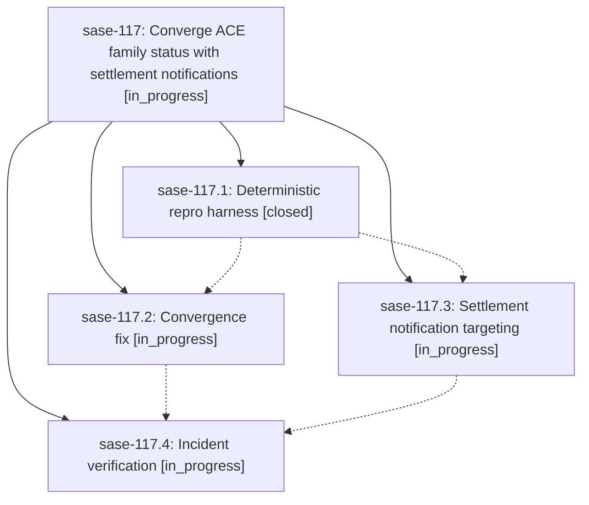

# Bead: sase-117 — Converge ACE family status with settlement notifications

[Bead Pages](../README.md) / sase-117

**Status:** ◐ in_progress · **Type:** ▸ plan · **Tier:** epic
**Owner:** `bryanbugyi34@gmail.com` · **Created by:** [bbugyi200.athena.0l7](https://github.com/sase-org/sase--agents/blob/main/families/bbugyi200.athena.0l7.md) · **Assignee:** `sase-117.land`
**Created:** 2026-09-15 09:49:37 EDT
**Plan:** [202609/ace\_family\_status\_convergence.md](https://github.com/sase-org/sase--plans/blob/main/202609/ace_family_status_convergence.md)

## Description

When a family shell settles (e.g. an epic-launch monitor flips EPIC APPROVED to EPIC CREATED), the ACE agents tree converges to the new status within one auto-refresh tick of the settlement notification, through every load path, with no new TUI performance cost.

## Phases

| Bead | Title | Status | Size | Created | Agents | Commits |
|---|---|---|---|---|---:|---:|
| [sase-117.1](sase-117.1.md) | Deterministic repro harness | ✓ closed | medium | 2026-09-15 | 1 | 1 |
| [sase-117.2](sase-117.2.md) | Convergence fix | ◐ in_progress | medium | 2026-09-15 | 1 | 0 |
| [sase-117.3](sase-117.3.md) | Settlement notification targeting | ◐ in_progress | medium | 2026-09-15 | 1 | 0 |
| [sase-117.4](sase-117.4.md) | Incident verification | ◐ in_progress | small | 2026-09-15 | 1 | 0 |

## Lineage

## Agents

| Agent | Bead | Commits |
|---|---|---:|
| [bbugyi200.athena.sase-117.1](https://github.com/sase-org/sase--agents/blob/main/agents/bbugyi200.athena.sase-117.1/README.md) | [sase-117.1](sase-117.1.md) | 1 |
| [bbugyi200.athena.sase-117.2](https://github.com/sase-org/sase--agents/blob/main/agents/bbugyi200.athena.sase-117.2/README.md) | [sase-117.2](sase-117.2.md) | 0 |
| [bbugyi200.athena.sase-117.3](https://github.com/sase-org/sase--agents/blob/main/agents/bbugyi200.athena.sase-117.3/README.md) | [sase-117.3](sase-117.3.md) | 0 |
| [bbugyi200.athena.sase-117.4](https://github.com/sase-org/sase--agents/blob/main/agents/bbugyi200.athena.sase-117.4/README.md) | [sase-117.4](sase-117.4.md) | 0 |
| [bbugyi200.athena.sase-117.land](https://github.com/sase-org/sase--agents/blob/main/agents/bbugyi200.athena.sase-117.land/README.md) | [sase-117](README.md) | 0 |

## Commits

| Repo | Commit | Subject | Bead | Committed |
|---|---|---|---|---|
| sase | [`f690e67`](https://github.com/sase-org/sase/commit/f690e6765a12b6fce283f405ed11633a5f0f80a2) | test(ace): add family status convergence repro | [sase-117.1](sase-117.1.md) | 2026-09-15 11:11:58 EDT |
