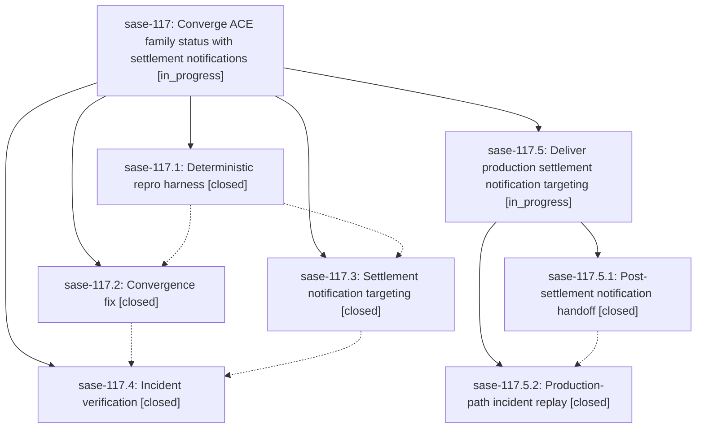

# Bead: sase-117 — Converge ACE family status with settlement notifications

[Bead Pages](../README.md) / sase-117

**Status:** ◐ in_progress · **Type:** ▸ plan · **Tier:** epic
**Owner:** `bryanbugyi34@gmail.com` · **Created by:** [bbugyi200.athena.0l7](https://github.com/sase-org/sase--agents/blob/main/families/bbugyi200.athena.0l7.md) · **Assignee:** `sase-117.land`
**Created:** 2026-09-15 09:49:37 EDT
**Plan:** [202609/ace\_family\_status\_convergence.md](https://github.com/sase-org/sase--plans/blob/main/202609/ace_family_status_convergence.md)

## Description

When a family shell settles (e.g. an epic-launch monitor flips EPIC APPROVED to EPIC CREATED), the ACE agents tree converges to the new status within one auto-refresh tick of the settlement notification, through every load path, with no new TUI performance cost.

## Notes

[2026-09-15T17:07:41Z · sase-117.land] LANDING AUDIT: All four child beads and their notes were reviewed; no PROPOSED FOLLOW-UP entries were present. Commits f690e6765a, 4e98613a1f, 0efad90a2c, and 21c18cc34b and the current loader, merge/apply, token, notification, epic-launch, and monitor-settlement paths were inspected. Focused convergence, notification-polling, and epic-launch handoff tests pass (30 passed) after just install. Remaining epic-caused gap: production finish_epic_launch emits before monitor terminal settlement and its action_data identifies only the planner/root timestamp, so exact notification targeting schedules only the root; the passing notification-only test constructs a post-settlement monitor-settlement shape that production never emits. A direct production-shape probe resolved [root], while the synthetic shape resolved [monitor, gate, root]. Six non-epic commits since f690e6765a were reviewed; none overlap these call paths, and Phase 4 already incorporated the sudo CLI snapshot drift. epic-symbols reports none. Planning only the remaining post-settlement notification handoff and production replay as a child epic.

## Phases

| Bead | Title | Status | Size | Created | Agents | Commits |
|---|---|---|---|---|---:|---:|
| [sase-117.1](sase-117.1.md) | Deterministic repro harness | ✓ closed | medium | 2026-09-15 | 1 | 1 |
| [sase-117.2](sase-117.2.md) | Convergence fix | ✓ closed | medium | 2026-09-15 | 1 | 1 |
| [sase-117.3](sase-117.3.md) | Settlement notification targeting | ✓ closed | medium | 2026-09-15 | 1 | 1 |
| [sase-117.4](sase-117.4.md) | Incident verification | ✓ closed | small | 2026-09-15 | 1 | 1 |

## Lineage

## Agents

| Agent | Bead | Commits |
|---|---|---:|
| [bbugyi200.athena.sase-117.1](https://github.com/sase-org/sase--agents/blob/main/agents/bbugyi200.athena.sase-117.1/README.md) | [sase-117.1](sase-117.1.md) | 1 |
| [bbugyi200.athena.sase-117.2](https://github.com/sase-org/sase--agents/blob/main/agents/bbugyi200.athena.sase-117.2/README.md) | [sase-117.2](sase-117.2.md) | 1 |
| [bbugyi200.athena.sase-117.3](https://github.com/sase-org/sase--agents/blob/main/agents/bbugyi200.athena.sase-117.3/README.md) | [sase-117.3](sase-117.3.md) | 1 |
| [bbugyi200.athena.sase-117.4](https://github.com/sase-org/sase--agents/blob/main/agents/bbugyi200.athena.sase-117.4/README.md) | [sase-117.4](sase-117.4.md) | 1 |
| [bbugyi200.athena.sase-117.5.1](https://github.com/sase-org/sase--agents/blob/main/agents/bbugyi200.athena.sase-117.5.1/README.md) | [sase-117.5.1](sase-117.5.1.md) | 1 |
| [bbugyi200.athena.sase-117.5.2](https://github.com/sase-org/sase--agents/blob/main/agents/bbugyi200.athena.sase-117.5.2/README.md) | [sase-117.5.2](sase-117.5.2.md) | 1 |
| [bbugyi200.athena.sase-117.5.land](https://github.com/sase-org/sase--agents/blob/main/agents/bbugyi200.athena.sase-117.5.land/README.md) | [sase-117.5](sase-117.5.md) | 0 |
| [bbugyi200.athena.sase-117.land](https://github.com/sase-org/sase--agents/blob/main/families/bbugyi200.athena.sase-117.land.md) | [sase-117](README.md) | 0 |

## Commits

| Repo | Commit | Subject | Bead | Committed |
|---|---|---|---|---|
| sase | [`f690e67`](https://github.com/sase-org/sase/commit/f690e6765a12b6fce283f405ed11633a5f0f80a2) | test(ace): add family status convergence repro | [sase-117.1](sase-117.1.md) | 2026-09-15 11:11:58 EDT |
| sase | [`4e98613`](https://github.com/sase-org/sase/commit/4e98613a1fbbde4e14a9d28ef738b74786c7454e) | fix(ace): target settlement notification refreshes | [sase-117.3](sase-117.3.md) | 2026-09-15 11:57:57 EDT |
| sase | [`0efad90`](https://github.com/sase-org/sase/commit/0efad90a2c1c4d5b7fb63d7f2e42188a061d47a8) | fix(ace): converge family status refresh | [sase-117.2](sase-117.2.md) | 2026-09-15 12:11:40 EDT |
| sase | [`21c18cc`](https://github.com/sase-org/sase/commit/21c18cc34bda871773519abfb14982dec2826e87) | test(completion): refresh CLI snapshot | [sase-117.4](sase-117.4.md) | 2026-09-15 12:52:38 EDT |
| sase | [`dcfb1c1`](https://github.com/sase-org/sase/commit/dcfb1c1db7b475cf216bae671856cdbc9d5d2943) | fix(monitor): defer epic launch completion until settlement | [sase-117.5.1](sase-117.5.1.md) | 2026-09-15 14:02:50 EDT |
| sase | [`9afd1bb`](https://github.com/sase-org/sase/commit/9afd1bb0020419b53919fb694ae05dfe187a2f2b) | fix(tui): target production settlement completions | [sase-117.5.2](sase-117.5.2.md) | 2026-09-15 14:41:47 EDT |
