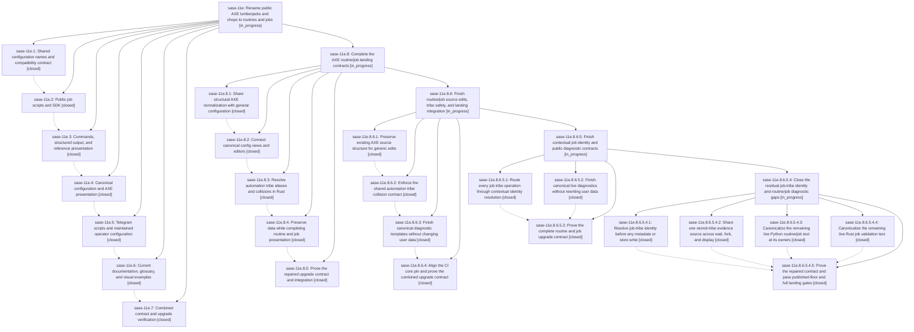

# Bead: sase-11e — Rename public AXE lumberjacks and chops to routines and jobs

[Bead Pages](../README.md) / sase-11e

**Status:** ◐ in_progress · **Type:** ▸ plan · **Tier:** epic · **↺ Reopened:** ↺1
**Owner:** `bryanbugyi34@gmail.com` · **Created by:** [bbugyi200.athena.0l8.r0](https://github.com/sase-org/sase--agents/blob/main/families/bbugyi200.athena.0l8.r0.md) · **Assignee:** `sase-11e.land`
**Created:** 2026-09-15 15:18:40 EDT
**Plan:** [202609/axe\_routines\_jobs.md](https://github.com/sase-org/sase--plans/blob/main/202609/axe_routines_jobs.md)

## Previously Closed

> ↺ Closed 2026-09-15T19:31:42Z · canceled
>
> Decided to go with the name Batch instead of Routine.
>
> Reopened 2026-09-15T19:41:04Z by a status update

<!-- sase:links:start -->

## Links

| Relation | Artifact | Why |
| --- | --- | --- |
| implemented-by | [plan:202609/axe_routines_jobs.md][1] | derived from the plan's `bead_id:` frontmatter field |

[1]: https://github.com/sase-org/sase--plans/blob/main/202609/axe_routines_jobs.md

<!-- sase:links:end -->

## Description

Make routines and jobs the consistent public AXE vocabulary while preserving scheduling behavior and existing runtime identities.

## Notes

[2026-09-15T19:41:13Z · bryanbugyi34@gmail.com] I changed my mind on this. Routine still works better since it implies recurrence.

[2026-09-16T05:02:37Z · sase-11e.land] LANDING AUDIT 2026-09-16 at SASE a7029f02c8: read the epic note, all notes on all seven closed phases, the linked plan, epic commits in SASE/core/Telegram/chezmoi, and intervening non-epic commit paths. The repeated owner note selecting Routine is reflected in the implementation. Landing is incomplete: general config merge/inventory/show/edit still bypass the Rust AXE alias projection; a legacy default interval 5 plus canonical user interval 19 yields two general inventory trees instead of the runtime value 19. Python job tribe aliasing silently selects independently configured job display metadata for stored chop, with no collision diagnostic. Public status recursively substitutes user names, IDs and paths (chop-watch and /tmp/lumberjacks/chop-watch.log become job-watch and /tmp/routines/job-watch.log); doctor rewrites an actual /tmp/sase_chop_test executable path. Core/editor diagnostic templates still leak old terminology. Planning only these remaining contracts and combined acceptance as a child epic with parent_bead sase-11e. 107 focused AXE config/status/doctor/SDK/runner, retention, and object-sharing tests passed. PROPOSED FOLLOW-UP outcomes: phase 4 note 2 wire alignment is resolved by 6c76f29d75/6fca91cdc7 and phase 5 retention wire v3; no new task. Phase 4 note 3 tribe collisions remain epic work and enter the child plan. Phase 5 note 2 missing busted was reproduced with chezmoi just check and just test-nvim, exit 127; recorded small CI task sase-11m, evidence file:explicit:604a46eb5672a96d747773f2. Evidence attachment separately reproduced existing sase-10y and received corroboration. Intervening retention safety, queue/hold, xprompt, cache and timeout changes reviewed; preserve preview-only deletion and new admission semantics. Rechecked sase-github, sase-nvim and sase-research-artifacts with no new routine/job integration matches. No epic-symbol entries. No epic close or plan done update performed; full combined check-full and remaining acceptance belong after repairs.

## Phases

| Bead | Title | Status | Size | Created | Agents | Commits |
|---|---|---|---|---|---:|---:|
| [sase-11e.1](sase-11e.1.md) | Shared configuration names and compatibility contract | ✓ closed | medium | 2026-09-15 | 1 | 2 |
| [sase-11e.2](sase-11e.2.md) | Public job scripts and SDK | ✓ closed | medium | 2026-09-15 | 1 | 1 |
| [sase-11e.3](sase-11e.3.md) | Commands, structured output, and reference presentation | ✓ closed | medium | 2026-09-15 | 1 | 2 |
| [sase-11e.4](sase-11e.4.md) | Canonical configuration and AXE presentation | ✓ closed | medium | 2026-09-15 | 1 | 1 |
| [sase-11e.5](sase-11e.5.md) | Telegram scripts and maintained operator configuration | ✓ closed | medium | 2026-09-15 | 1 | 1 |
| [sase-11e.6](sase-11e.6.md) | Current documentation, glossary, and visual examples | ✓ closed | medium | 2026-09-15 | 1 | 1 |
| [sase-11e.7](sase-11e.7.md) | Combined contract and upgrade verification | ✓ closed | medium | 2026-09-15 | 1 | 1 |

## Lineage

## Agents

| Agent | Bead | Commits |
|---|---|---:|
| [bbugyi200.athena.sase-11e.1](https://github.com/sase-org/sase--agents/blob/main/agents/bbugyi200.athena.sase-11e.1/README.md) | [sase-11e.1](sase-11e.1.md) | 2 |
| [bbugyi200.athena.sase-11e.2](https://github.com/sase-org/sase--agents/blob/main/agents/bbugyi200.athena.sase-11e.2/README.md) | [sase-11e.2](sase-11e.2.md) | 1 |
| [bbugyi200.athena.sase-11e.3](https://github.com/sase-org/sase--agents/blob/main/agents/bbugyi200.athena.sase-11e.3/README.md) | [sase-11e.3](sase-11e.3.md) | 2 |
| [bbugyi200.athena.sase-11e.4](https://github.com/sase-org/sase--agents/blob/main/agents/bbugyi200.athena.sase-11e.4/README.md) | [sase-11e.4](sase-11e.4.md) | 1 |
| [bbugyi200.athena.sase-11e.5](https://github.com/sase-org/sase--agents/blob/main/agents/bbugyi200.athena.sase-11e.5/README.md) | [sase-11e.5](sase-11e.5.md) | 1 |
| [bbugyi200.athena.sase-11e.6](https://github.com/sase-org/sase--agents/blob/main/agents/bbugyi200.athena.sase-11e.6/README.md) | [sase-11e.6](sase-11e.6.md) | 1 |
| [bbugyi200.athena.sase-11e.7](https://github.com/sase-org/sase--agents/blob/main/agents/bbugyi200.athena.sase-11e.7/README.md) | [sase-11e.7](sase-11e.7.md) | 1 |
| [bbugyi200.athena.sase-11e.8.1](https://github.com/sase-org/sase--agents/blob/main/agents/bbugyi200.athena.sase-11e.8.1/README.md) | [sase-11e.8.1](sase-11e.8.1.md) | 1 |
| [bbugyi200.athena.sase-11e.8.2](https://github.com/sase-org/sase--agents/blob/main/agents/bbugyi200.athena.sase-11e.8.2/README.md) | [sase-11e.8.2](sase-11e.8.2.md) | 1 |
| [bbugyi200.athena.sase-11e.8.3](https://github.com/sase-org/sase--agents/blob/main/agents/bbugyi200.athena.sase-11e.8.3/README.md) | [sase-11e.8.3](sase-11e.8.3.md) | 2 |
| [bbugyi200.athena.sase-11e.8.4](https://github.com/sase-org/sase--agents/blob/main/agents/bbugyi200.athena.sase-11e.8.4/README.md) | [sase-11e.8.4](sase-11e.8.4.md) | 2 |
| [bbugyi200.athena.sase-11e.8.5](https://github.com/sase-org/sase--agents/blob/main/families/bbugyi200.athena.sase-11e.8.5.md) | [sase-11e.8.5](sase-11e.8.5.md) | 1 |
| [bbugyi200.athena.sase-11e.8.6.1](https://github.com/sase-org/sase--agents/blob/main/agents/bbugyi200.athena.sase-11e.8.6.1/README.md) | [sase-11e.8.6.1](sase-11e.8.6.1.md) | 2 |
| [bbugyi200.athena.sase-11e.8.6.2](https://github.com/sase-org/sase--agents/blob/main/agents/bbugyi200.athena.sase-11e.8.6.2/README.md) | [sase-11e.8.6.2](sase-11e.8.6.2.md) | 2 |
| [bbugyi200.athena.sase-11e.8.6.3](https://github.com/sase-org/sase--agents/blob/main/agents/bbugyi200.athena.sase-11e.8.6.3/README.md) | [sase-11e.8.6.3](sase-11e.8.6.3.md) | 2 |
| [bbugyi200.athena.sase-11e.8.6.4](https://github.com/sase-org/sase--agents/blob/main/agents/bbugyi200.athena.sase-11e.8.6.4/README.md) | [sase-11e.8.6.4](sase-11e.8.6.4.md) | 1 |
| [bbugyi200.athena.sase-11e.8.6.5.1](https://github.com/sase-org/sase--agents/blob/main/agents/bbugyi200.athena.sase-11e.8.6.5.1/README.md) | [sase-11e.8.6.5.1](sase-11e.8.6.5.1.md) | 1 |
| [bbugyi200.athena.sase-11e.8.6.5.2](https://github.com/sase-org/sase--agents/blob/main/agents/bbugyi200.athena.sase-11e.8.6.5.2/README.md) | [sase-11e.8.6.5.2](sase-11e.8.6.5.2.md) | 1 |
| [bbugyi200.athena.sase-11e.8.6.5.3](https://github.com/sase-org/sase--agents/blob/main/agents/bbugyi200.athena.sase-11e.8.6.5.3/README.md) | [sase-11e.8.6.5.3](sase-11e.8.6.5.3.md) | 1 |
| [bbugyi200.athena.sase-11e.8.6.5.4.1](https://github.com/sase-org/sase--agents/blob/main/agents/bbugyi200.athena.sase-11e.8.6.5.4.1/README.md) | [sase-11e.8.6.5.4.1](sase-11e.8.6.5.4.1.md) | 1 |
| [bbugyi200.athena.sase-11e.8.6.5.4.2](https://github.com/sase-org/sase--agents/blob/main/families/bbugyi200.athena.sase-11e.8.6.5.4.2.md) | [sase-11e.8.6.5.4.2](sase-11e.8.6.5.4.2.md) | 1 |
| [bbugyi200.athena.sase-11e.8.6.5.4.3](https://github.com/sase-org/sase--agents/blob/main/agents/bbugyi200.athena.sase-11e.8.6.5.4.3/README.md) | [sase-11e.8.6.5.4.3](sase-11e.8.6.5.4.3.md) | 1 |
| [bbugyi200.athena.sase-11e.8.6.5.4.4](https://github.com/sase-org/sase--agents/blob/main/agents/bbugyi200.athena.sase-11e.8.6.5.4.4/README.md) | [sase-11e.8.6.5.4.4](sase-11e.8.6.5.4.4.md) | 1 |
| [bbugyi200.athena.sase-11e.8.6.5.4.5](https://github.com/sase-org/sase--agents/blob/main/families/bbugyi200.athena.sase-11e.8.6.5.4.5.md) | [sase-11e.8.6.5.4.5](sase-11e.8.6.5.4.5.md) | 1 |
| [bbugyi200.athena.sase-11e.8.6.5.4.land](https://github.com/sase-org/sase--agents/blob/main/families/bbugyi200.athena.sase-11e.8.6.5.4.land.md) | [sase-11e.8.6.5.4](sase-11e.8.6.5.4.md) | 2 |
| [bbugyi200.athena.sase-11e.8.6.5.land](https://github.com/sase-org/sase--agents/blob/main/families/bbugyi200.athena.sase-11e.8.6.5.land.md) | [sase-11e.8.6.5](sase-11e.8.6.5.md) | 0 |
| [bbugyi200.athena.sase-11e.8.6.land](https://github.com/sase-org/sase--agents/blob/main/families/bbugyi200.athena.sase-11e.8.6.land.md) | [sase-11e.8.6](sase-11e.8.6.md) | 0 |
| [bbugyi200.athena.sase-11e.8.land](https://github.com/sase-org/sase--agents/blob/main/families/bbugyi200.athena.sase-11e.8.land.md) | [sase-11e.8](sase-11e.8.md) | 0 |
| [bbugyi200.athena.sase-11e.land](https://github.com/sase-org/sase--agents/blob/main/families/bbugyi200.athena.sase-11e.land.md) | [sase-11e](README.md) | 0 |

## Commits

| Repo | Commit | Subject | Bead | Committed |
|---|---|---|---|---|
| sase | [`e41f651`](https://github.com/sase-org/sase/commit/e41f651eb9fd6479d105c618d24e0a89db972991) | feat(axe): add routine/job config contract | [sase-11e.1](sase-11e.1.md) | 2026-09-15 17:22:53 EDT |
| sase-core | [`sase-core@a68ee7d`](https://github.com/sase-org/sase-core/commit/a68ee7ddaccad67330e9d1561ff9a64fab1d0990) | feat(axe): normalize routine/job config names | [sase-11e.1](sase-11e.1.md) | 2026-09-15 17:25:36 EDT |
| sase | [`f421051`](https://github.com/sase-org/sase/commit/f421051fdda8318c119b2201225337efd3f3398d) | feat(axe): add public job authoring aliases | [sase-11e.2](sase-11e.2.md) | 2026-09-15 18:15:15 EDT |
| sase | [`d2d3094`](https://github.com/sase-org/sase/commit/d2d30944dce4c0dc0f10e78d9e568ea758630765) | feat(axe): publish job and routine cli contract | [sase-11e.3](sase-11e.3.md) | 2026-09-15 20:13:59 EDT |
| sase-core | [`sase-core@6be757c`](https://github.com/sase-org/sase-core/commit/6be757c19565003c75d61efdf89cb7764adeec6b) | feat(artifact-ref): add job alias for chop refs | [sase-11e.3](sase-11e.3.md) | 2026-09-15 20:16:09 EDT |
| sase | [`53ba460`](https://github.com/sase-org/sase/commit/53ba46064937d53c3c3c9902542aadf5fe3831bb) | feat(axe): publish routine and job presentation | [sase-11e.4](sase-11e.4.md) | 2026-09-15 21:31:54 EDT |
| sase | [`45a2244`](https://github.com/sase-org/sase/commit/45a2244ad10d7375fd34d25771e4f98926ab1e33) | feat(axe): support telegram job entrypoint migration | [sase-11e.5](sase-11e.5.md) | 2026-09-15 23:00:54 EDT |
| sase | [`9f01691`](https://github.com/sase-org/sase/commit/9f01691ce063fc94dcdd580ccbf13b147c3aa815) | docs(axe): update routine job terminology | [sase-11e.6](sase-11e.6.md) | 2026-09-15 23:39:44 EDT |
| sase | [`a7029f0`](https://github.com/sase-org/sase/commit/a7029f02c8e75508097ec558c52a1efd8b207a06) | fix(axe): finish routine job acceptance cleanup | [sase-11e.7](sase-11e.7.md) | 2026-09-16 00:41:42 EDT |
| sase-core | [`sase-core@d4b301f`](https://github.com/sase-org/sase-core/commit/d4b301f0d910979255ddc99551c602bc76bc4dbb) | feat(config): share axe config normalization | [sase-11e.8.1](sase-11e.8.1.md) | 2026-09-16 01:31:18 EDT |
| sase | [`297e612`](https://github.com/sase-org/sase/commit/297e6122b0411f7b7f3a7caa0c461c4fbc856f21) | feat(config): wire AXE routine job contract consumers | [sase-11e.8.2](sase-11e.8.2.md) | 2026-09-16 02:31:57 EDT |
| sase | [`e4700fd`](https://github.com/sase-org/sase/commit/e4700fd747fae7a048835cc086a92b516606dc05) | feat(agent-tribes): route job alias behavior through core | [sase-11e.8.3](sase-11e.8.3.md) | 2026-09-16 03:45:02 EDT |
| sase-core | [`sase-core@ad13940`](https://github.com/sase-org/sase-core/commit/ad13940a3e1e658a1e17827e3ad3320d78561554) | feat(agent-tribes): add job alias core bindings | [sase-11e.8.3](sase-11e.8.3.md) | 2026-09-16 03:47:23 EDT |
| sase | [`c5527a0`](https://github.com/sase-org/sase/commit/c5527a0e62fda19e8edd83ee6cb8a2cf1be0be4f) | fix(axe): preserve public output payload values | [sase-11e.8.4](sase-11e.8.4.md) | 2026-09-16 04:33:09 EDT |
| sase-core | [`sase-core@fe1a17b`](https://github.com/sase-org/sase-core/commit/fe1a17bc486ac3474c3b1ae5e10427525cb39f1c) | feat(axe): add public status projection | [sase-11e.8.4](sase-11e.8.4.md) | 2026-09-16 04:35:31 EDT |
| sase | [`db48ae5`](https://github.com/sase-org/sase/commit/db48ae56dfb5b5ae955182e84bf36ef057d37db1) | test(axe): update routine job acceptance goldens | [sase-11e.8.5](sase-11e.8.5.md) | 2026-09-16 05:46:25 EDT |
| sase | [`7d2cac7`](https://github.com/sase-org/sase/commit/7d2cac73b6d82432de0415dae1a43b3022c8bcaf) | fix(config): preserve axe source edit paths | [sase-11e.8.6.1](sase-11e.8.6.1.md) | 2026-09-16 06:41:18 EDT |
| sase-core | [`sase-core@35430d9`](https://github.com/sase-org/sase-core/commit/35430d9fae777c42085923e5a6f069dbb29683a0) | fix(config): preserve axe source edit paths | [sase-11e.8.6.1](sase-11e.8.6.1.md) | 2026-09-16 06:43:42 EDT |
| sase | [`edde28a`](https://github.com/sase-org/sase/commit/edde28a8dd4bd4aec063dcdea9786deb3f2d46f6) | feat(agent-tribes): enforce provenance-aware tribe resolution | [sase-11e.8.6.2](sase-11e.8.6.2.md) | 2026-09-16 07:45:27 EDT |
| sase-core | [`sase-core@d0f9cf8`](https://github.com/sase-org/sase-core/commit/d0f9cf85256c21a954a6561d8919841408c45800) | feat(agent-tribes): add context-aware identity resolution | [sase-11e.8.6.2](sase-11e.8.6.2.md) | 2026-09-16 07:47:51 EDT |
| sase | [`5620b5b`](https://github.com/sase-org/sase/commit/5620b5b2de52984309466881975dfed2d4108990) | fix(axe): render public routine diagnostics | [sase-11e.8.6.3](sase-11e.8.6.3.md) | 2026-09-16 08:46:07 EDT |
| sase-core | [`sase-core@51c7c38`](https://github.com/sase-org/sase-core/commit/51c7c38d6d1192fad0a3c807cc233b7ccdcb1acf) | fix(axe): canonicalize routine diagnostic templates | [sase-11e.8.6.3](sase-11e.8.6.3.md) | 2026-09-16 08:48:42 EDT |
| sase | [`8c9d047`](https://github.com/sase-org/sase/commit/8c9d04759bb441d99211d0be1f4afb7698032012) | test(axe): verify routine job core upgrade contract | [sase-11e.8.6.4](sase-11e.8.6.4.md) | 2026-09-16 09:26:39 EDT |
| sase | [`66e20c1`](https://github.com/sase-org/sase/commit/66e20c1c24bba470af1699d15c56ec8dd7c1f350) | fix(axe): canonicalize public job diagnostics | [sase-11e.8.6.5.2](sase-11e.8.6.5.2.md) | 2026-09-16 11:47:01 EDT |
| sase | [`9759e5a`](https://github.com/sase-org/sase/commit/9759e5afe8c0d58906981d04e3381b153334e20f) | fix(agent-tribes): route job-tribe assignment, wait/fork, completion, and display through contextual identity resolution | [sase-11e.8.6.5.1](sase-11e.8.6.5.1.md) | 2026-09-16 12:00:06 EDT |
| sase | [`e17d4e0`](https://github.com/sase-org/sase/commit/e17d4e0c0a28e9992ed3b056192c5a3b9963a752) | test(axe): prove routine job upgrade contract | [sase-11e.8.6.5.3](sase-11e.8.6.5.3.md) | 2026-09-16 13:51:29 EDT |
| sase-core | [`sase-core@f04da63`](https://github.com/sase-org/sase-core/commit/f04da63e5f16d2f842194d54b147de42bcb10d04) | fix(axe-chop): canonicalize live job validation and target wording | [sase-11e.8.6.5.4.4](sase-11e.8.6.5.4.4.md) | 2026-09-16 16:22:34 EDT |
| sase | [`bb839b4`](https://github.com/sase-org/sase/commit/bb839b4ea8843997145e5595d48f9a519745c0f8) | fix(tribe): share one stored-tribe evidence source across wait, fork, and display | [sase-11e.8.6.5.4.2](sase-11e.8.6.5.4.2.md) | 2026-09-16 16:45:12 EDT |
| sase | [`897e69e`](https://github.com/sase-org/sase/commit/897e69e1e188d08a0b5579f7b55d1766578d37bb) | fix(axe): canonicalize residual job diagnostics | [sase-11e.8.6.5.4.3](sase-11e.8.6.5.4.3.md) | 2026-09-16 16:47:40 EDT |
| sase | [`c05aa3a`](https://github.com/sase-org/sase/commit/c05aa3a94aff0944984756619e1a4c3846e271e6) | feat(tribes): resolve job alias before persistence | [sase-11e.8.6.5.4.1](sase-11e.8.6.5.4.1.md) | 2026-09-16 16:52:25 EDT |
| sase | [`4e92780`](https://github.com/sase-org/sase/commit/4e9278048a779b08ddc972c260fe6fc6e9611fbe) | test(job-identity): extend upgrade-fixture coverage and ratchet core pin | [sase-11e.8.6.5.4.5](sase-11e.8.6.5.4.5.md) | 2026-09-17 08:00:10 EDT |
| sase | [`0e5ab63`](https://github.com/sase-org/sase/commit/0e5ab634be4ca470a0d08c866bc393902f7a1e40) | feat(axe): unify routine job evidence and editor writes | [sase-11e.8.6.5.4](sase-11e.8.6.5.4.md) | 2026-09-17 11:34:39 EDT |
| sase-core | [`sase-core@244634e`](https://github.com/sase-org/sase-core/commit/244634e143412a52231911f3f20b2dca376272a3) | fix(config): preserve legacy routine timeout mutation sources | [sase-11e.8.6.5.4](sase-11e.8.6.5.4.md) | 2026-09-17 11:39:14 EDT |
