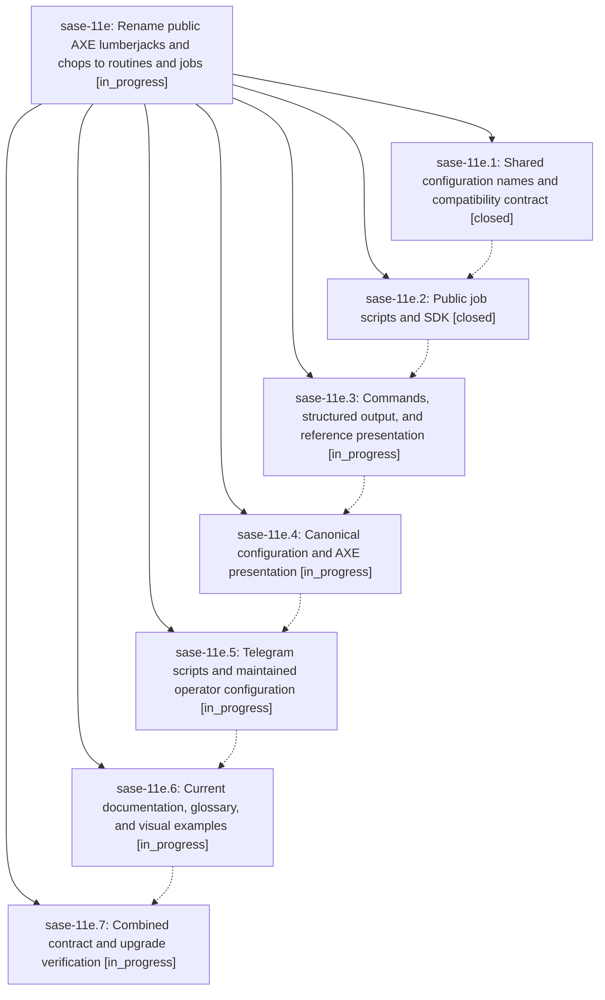

# Bead: sase-11e — Rename public AXE lumberjacks and chops to routines and jobs

[Bead Pages](../README.md) / sase-11e

**Status:** ◐ in_progress · **Type:** ▸ plan · **Tier:** epic · **↺ Reopened:** ↺1
**Owner:** `bryanbugyi34@gmail.com` · **Created by:** [bbugyi200.athena.0l8.r0](https://github.com/sase-org/sase--agents/blob/main/families/bbugyi200.athena.0l8.r0.md) · **Assignee:** `sase-11e.land`
**Created:** 2026-09-15 15:18:40 EDT
**Plan:** [202609/axe\_routines\_jobs.md](https://github.com/sase-org/sase--plans/blob/main/202609/axe_routines_jobs.md)

## Previously Closed

> ↺ Closed 2026-09-15T19:31:42Z · canceled
>
> Decided to go with the name Batch instead of Routine.
>
> Reopened 2026-09-15T19:41:04Z by a status update

## Description

Make routines and jobs the consistent public AXE vocabulary while preserving scheduling behavior and existing runtime identities.

## Notes

[2026-09-15T19:41:13Z · bryanbugyi34@gmail.com] I changed my mind on this. Routine still works better since it implies recurrence.

## Phases

| Bead | Title | Status | Size | Created | Agents | Commits |
|---|---|---|---|---|---:|---:|
| [sase-11e.1](sase-11e.1.md) | Shared configuration names and compatibility contract | ✓ closed | medium | 2026-09-15 | 1 | 2 |
| [sase-11e.2](sase-11e.2.md) | Public job scripts and SDK | ✓ closed | medium | 2026-09-15 | 1 | 1 |
| [sase-11e.3](sase-11e.3.md) | Commands, structured output, and reference presentation | ◐ in_progress | medium | 2026-09-15 | 1 | 0 |
| [sase-11e.4](sase-11e.4.md) | Canonical configuration and AXE presentation | ◐ in_progress | medium | 2026-09-15 | 1 | 0 |
| [sase-11e.5](sase-11e.5.md) | Telegram scripts and maintained operator configuration | ◐ in_progress | medium | 2026-09-15 | 1 | 0 |
| [sase-11e.6](sase-11e.6.md) | Current documentation, glossary, and visual examples | ◐ in_progress | medium | 2026-09-15 | 1 | 0 |
| [sase-11e.7](sase-11e.7.md) | Combined contract and upgrade verification | ◐ in_progress | medium | 2026-09-15 | 1 | 0 |

## Lineage

## Agents

| Agent | Bead | Commits |
|---|---|---:|
| [bbugyi200.athena.sase-11e.1](https://github.com/sase-org/sase--agents/blob/main/agents/bbugyi200.athena.sase-11e.1/README.md) | [sase-11e.1](sase-11e.1.md) | 2 |
| [bbugyi200.athena.sase-11e.2](https://github.com/sase-org/sase--agents/blob/main/agents/bbugyi200.athena.sase-11e.2/README.md) | [sase-11e.2](sase-11e.2.md) | 1 |
| [bbugyi200.athena.sase-11e.3](https://github.com/sase-org/sase--agents/blob/main/agents/bbugyi200.athena.sase-11e.3/README.md) | [sase-11e.3](sase-11e.3.md) | 0 |
| [bbugyi200.athena.sase-11e.4](https://github.com/sase-org/sase--agents/blob/main/agents/bbugyi200.athena.sase-11e.4/README.md) | [sase-11e.4](sase-11e.4.md) | 0 |
| [bbugyi200.athena.sase-11e.5](https://github.com/sase-org/sase--agents/blob/main/agents/bbugyi200.athena.sase-11e.5/README.md) | [sase-11e.5](sase-11e.5.md) | 0 |
| [bbugyi200.athena.sase-11e.6](https://github.com/sase-org/sase--agents/blob/main/agents/bbugyi200.athena.sase-11e.6/README.md) | [sase-11e.6](sase-11e.6.md) | 0 |
| [bbugyi200.athena.sase-11e.7](https://github.com/sase-org/sase--agents/blob/main/agents/bbugyi200.athena.sase-11e.7/README.md) | [sase-11e.7](sase-11e.7.md) | 0 |
| [bbugyi200.athena.sase-11e.land](https://github.com/sase-org/sase--agents/blob/main/agents/bbugyi200.athena.sase-11e.land/README.md) | [sase-11e](README.md) | 0 |

## Commits

| Repo | Commit | Subject | Bead | Committed |
|---|---|---|---|---|
| sase | [`e41f651`](https://github.com/sase-org/sase/commit/e41f651eb9fd6479d105c618d24e0a89db972991) | feat(axe): add routine/job config contract | [sase-11e.1](sase-11e.1.md) | 2026-09-15 17:22:53 EDT |
| sase-core | [`sase-core@a68ee7d`](https://github.com/sase-org/sase-core/commit/a68ee7ddaccad67330e9d1561ff9a64fab1d0990) | feat(axe): normalize routine/job config names | [sase-11e.1](sase-11e.1.md) | 2026-09-15 17:25:36 EDT |
| sase | [`f421051`](https://github.com/sase-org/sase/commit/f421051fdda8318c119b2201225337efd3f3398d) | feat(axe): add public job authoring aliases | [sase-11e.2](sase-11e.2.md) | 2026-09-15 18:15:15 EDT |
