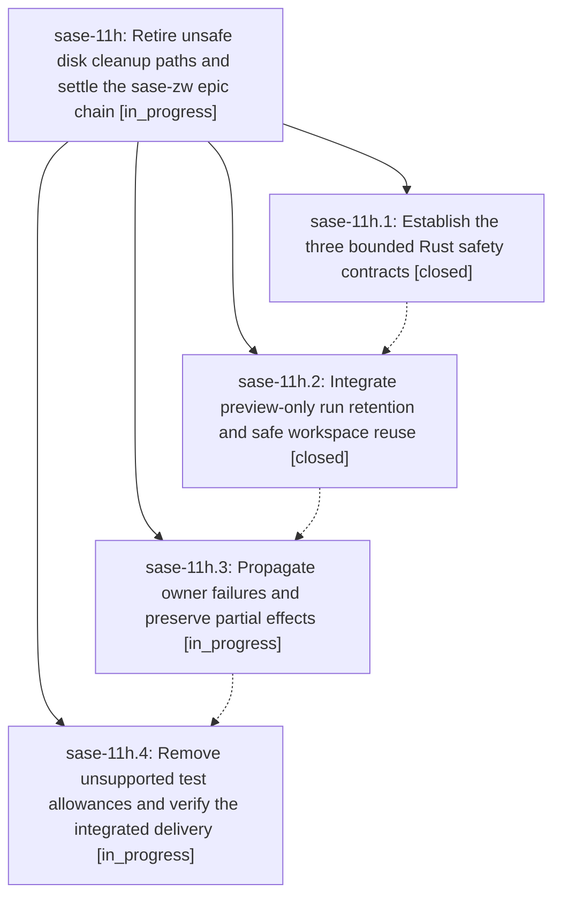

# Bead: sase-11h — Retire unsafe disk cleanup paths and settle the sase-zw epic chain

[Bead Pages](../README.md) / sase-11h

**Status:** ◐ in_progress · **Type:** ▸ plan · **Tier:** epic
**Owner:** `bryanbugyi34@gmail.com` · **Created by:** [bbugyi200.athena.0ln.f0](https://github.com/sase-org/sase--agents/blob/main/families/bbugyi200.athena.0ln.f0.md) · **Assignee:** `sase-11h.land`
**Created:** 2026-09-15 19:35:47 EDT
**Plan:** [202609/disk\_safety\_and\_epic\_retirement.md](https://github.com/sase-org/sase--plans/blob/main/202609/disk_safety_and_epic_retirement.md)

## Description

Artifact-run deletion fails closed, workspace reuse preserves object dependencies, cleanup failures remain visible, the tested core is pinned, and the abandoned sase-zw epics are closed with explicit scope and evidence.

## Phases

| Bead | Title | Status | Size | Created | Agents | Commits |
|---|---|---|---|---|---:|---:|
| [sase-11h.1](sase-11h.1.md) | Establish the three bounded Rust safety contracts | ✓ closed | medium | 2026-09-15 | 1 | 1 |
| [sase-11h.2](sase-11h.2.md) | Integrate preview-only run retention and safe workspace reuse | ✓ closed | medium | 2026-09-15 | 1 | 1 |
| [sase-11h.3](sase-11h.3.md) | Propagate owner failures and preserve partial effects | ◐ in_progress | medium | 2026-09-15 | 1 | 0 |
| [sase-11h.4](sase-11h.4.md) | Remove unsupported test allowances and verify the integrated delivery | ◐ in_progress | medium | 2026-09-15 | 1 | 0 |

## Lineage

## Agents

| Agent | Bead | Commits |
|---|---|---:|
| [bbugyi200.athena.sase-11h.1](https://github.com/sase-org/sase--agents/blob/main/agents/bbugyi200.athena.sase-11h.1/README.md) | [sase-11h.1](sase-11h.1.md) | 1 |
| [bbugyi200.athena.sase-11h.2](https://github.com/sase-org/sase--agents/blob/main/agents/bbugyi200.athena.sase-11h.2/README.md) | [sase-11h.2](sase-11h.2.md) | 1 |
| [bbugyi200.athena.sase-11h.3](https://github.com/sase-org/sase--agents/blob/main/agents/bbugyi200.athena.sase-11h.3/README.md) | [sase-11h.3](sase-11h.3.md) | 0 |
| [bbugyi200.athena.sase-11h.4](https://github.com/sase-org/sase--agents/blob/main/agents/bbugyi200.athena.sase-11h.4/README.md) | [sase-11h.4](sase-11h.4.md) | 0 |
| [bbugyi200.athena.sase-11h.land](https://github.com/sase-org/sase--agents/blob/main/agents/bbugyi200.athena.sase-11h.land/README.md) | [sase-11h](README.md) | 0 |

## Commits

| Repo | Commit | Subject | Bead | Committed |
|---|---|---|---|---|
| sase-core | [`sase-core@9b06dd8`](https://github.com/sase-org/sase-core/commit/9b06dd8bde31cf08f70f89daaab2b34af43102c9) | fix(core): enforce cleanup safety contracts | [sase-11h.1](sase-11h.1.md) | 2026-09-15 19:59:16 EDT |
| sase | [`95ac39f`](https://github.com/sase-org/sase/commit/95ac39fc7cb3b54ad0356cc7a82640249824deb7) | fix(disk): fail closed retention and preserve borrowers | [sase-11h.2](sase-11h.2.md) | 2026-09-15 21:41:19 EDT |
