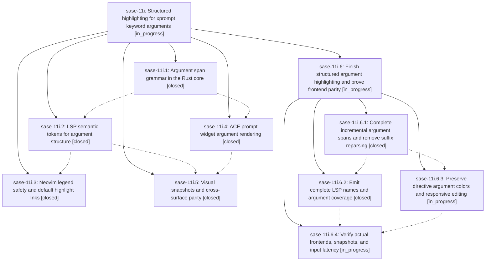

# Bead: sase-11i — Structured highlighting for xprompt keyword arguments

[Bead Pages](../README.md) / sase-11i

**Status:** ◐ in_progress · **Type:** ▸ plan · **Tier:** epic
**Owner:** `bryanbugyi34@gmail.com` · **Created by:** [bbugyi200.athena.0lq](https://github.com/sase-org/sase--agents/blob/main/families/bbugyi200.athena.0lq.md) · **Assignee:** `sase-11i.land`
**Created:** 2026-09-15 21:08:37 EDT
**Plan:** [202609/xprompt\_keyword\_arg\_highlighting.md](https://github.com/sase-org/sase--plans/blob/main/202609/xprompt_keyword_arg_highlighting.md)

## Description

A keyword argument such as `#research_swarm(lead_model=claude-fable-5)` reads as structured syntax rather than one flat blob, identically in the ACE prompt widget and in external editors over LSP, with key, value, punctuation, literal type, and declaration validity each visually distinct and driven by one shared Rust grammar.

## Notes

[2026-09-16T04:31:11Z · sase-11i.land] LANDING AUDIT (2026-09-16): Reviewed the epic (no prior notes or parent), all five closed phases and all six phase notes, the approved plan, and source/commits: core 4c25db2/f07bf53, nvim 502e716, sase 6847172922/649be3cb27. Epic remains incomplete. Confirmed blockers: (1) parse_parenthesized returns before parsing any arguments when no closing paren exists; runtime xprompt_argument_spans("#foo(key=42, other=true") returns only the opening delimiter, contrary to structural-highlighting-during-editing requirement and the newly landed a98b96e510 keyword completion flow. (2) LSP adds function/macro legend entries but emits no name tokens, drops multiline argument spans in push_token, and discards an entire value if any nested higher-priority artifact overlaps. (3) TUI structured arguments always use success-family colors; span.source is ignored, so directive arguments lose warning-family styling. (4) test_argument_surface_parity.py checks only locally invented LSP dictionaries, not the actual server, and therefore cannot catch those mismatches. (5) directive span extraction constructs and parses each remaining document suffix; installed-binding microbench on repeated "%queue(capacity=2, priority=3) #foo(key=42)" took median 7.18ms/100 lines, 147.52ms/600, 375.67ms/1000, all below 80KB/1200-line budget (five samples, not an end-to-end p95). Source shows the quadratic mechanism. Remaining-work child plan will address these and measure real widget latency. Intervening changes reviewed include static %if segments (d4b409921e/7e56423), argument completion (a98b96e510), proc queue admission (b6b11f2155/20f1dce), hold storage, AXE terminology, disk safety, shell-row convergence and dev rebuild timeout; focused integration needed for completion/static conditionals/queue; other changes have no shared highlighting logic. PROPOSED FOLLOW-UP outcome: sase-11i.5 note #1 forwarded as +1 to existing ready sase-x5 (+7); no new broad task, no claim that all reported 600 PNG mismatches share one cause. Existing sase-10u covers the specific Agents-footer subset; full visual rerun/classification still required. Viewed both new PNG goldens. Neovim glossary and semantic-overlay unit scripts passed; installed-LSP smoke failed because the ambient binary has no semantic-token capability, so source-matched rebuild is required. Workspace .venv binding is currently missing its compiled extension; do not treat this as a code regression or waive just install. Full checks not yet run. sase bead epic-symbols sase-11i reports no entries. No close or plan done update performed; submitting a parent-linked plan for only remaining implementation and acceptance work.

[2026-09-16T04:34:22Z · sase-11i.land] Remaining-work plan finish_argument_highlighting validated with --explain and revalidated after review, both with zero warnings. Four medium phases cover incremental/bounded core parsing, complete LSP output, directive-family TUI styling, and actual frontend/visual/performance acceptance; parent_bead is sase-11i, with no closure/status-update phase. Follow-up refinement: sase-10w.3 note #4 reports a September 14 rebaseline and full green run before four fixture-determinism failures, so old x5/10u counts cannot establish the cause of phase 11i.5\u0027s September 16 report. This qualification is on x5 and in the remaining-work plan. Proposing the plan; the epic remains open pending implementation and source-matched acceptance checks.

## Phases

| Bead | Title | Status | Size | Created | Agents | Commits |
|---|---|---|---|---|---:|---:|
| [sase-11i.1](sase-11i.1.md) | Argument span grammar in the Rust core | ✓ closed | medium | 2026-09-15 | 1 | 1 |
| [sase-11i.2](sase-11i.2.md) | LSP semantic tokens for argument structure | ✓ closed | medium | 2026-09-15 | 1 | 1 |
| [sase-11i.3](sase-11i.3.md) | Neovim legend safety and default highlight links | ✓ closed | small | 2026-09-15 | 1 | 1 |
| [sase-11i.4](sase-11i.4.md) | ACE prompt widget argument rendering | ✓ closed | medium | 2026-09-15 | 1 | 1 |
| [sase-11i.5](sase-11i.5.md) | Visual snapshots and cross-surface parity | ✓ closed | medium | 2026-09-15 | 1 | 1 |

## Lineage

## Agents

| Agent | Bead | Commits |
|---|---|---:|
| [bbugyi200.athena.sase-11i.1](https://github.com/sase-org/sase--agents/blob/main/agents/bbugyi200.athena.sase-11i.1/README.md) | [sase-11i.1](sase-11i.1.md) | 1 |
| [bbugyi200.athena.sase-11i.2](https://github.com/sase-org/sase--agents/blob/main/agents/bbugyi200.athena.sase-11i.2/README.md) | [sase-11i.2](sase-11i.2.md) | 1 |
| [bbugyi200.athena.sase-11i.3](https://github.com/sase-org/sase--agents/blob/main/agents/bbugyi200.athena.sase-11i.3/README.md) | [sase-11i.3](sase-11i.3.md) | 1 |
| [bbugyi200.athena.sase-11i.4](https://github.com/sase-org/sase--agents/blob/main/agents/bbugyi200.athena.sase-11i.4/README.md) | [sase-11i.4](sase-11i.4.md) | 1 |
| [bbugyi200.athena.sase-11i.5](https://github.com/sase-org/sase--agents/blob/main/agents/bbugyi200.athena.sase-11i.5/README.md) | [sase-11i.5](sase-11i.5.md) | 1 |
| [bbugyi200.athena.sase-11i.6.1](https://github.com/sase-org/sase--agents/blob/main/agents/bbugyi200.athena.sase-11i.6.1/README.md) | [sase-11i.6.1](sase-11i.6.1.md) | 1 |
| [bbugyi200.athena.sase-11i.6.2](https://github.com/sase-org/sase--agents/blob/main/agents/bbugyi200.athena.sase-11i.6.2/README.md) | [sase-11i.6.2](sase-11i.6.2.md) | 2 |
| [bbugyi200.athena.sase-11i.6.3](https://github.com/sase-org/sase--agents/blob/main/agents/bbugyi200.athena.sase-11i.6.3/README.md) | [sase-11i.6.3](sase-11i.6.3.md) | 0 |
| [bbugyi200.athena.sase-11i.6.4](https://github.com/sase-org/sase--agents/blob/main/agents/bbugyi200.athena.sase-11i.6.4/README.md) | [sase-11i.6.4](sase-11i.6.4.md) | 0 |
| [bbugyi200.athena.sase-11i.6.land](https://github.com/sase-org/sase--agents/blob/main/agents/bbugyi200.athena.sase-11i.6.land/README.md) | [sase-11i.6](sase-11i.6.md) | 0 |
| [bbugyi200.athena.sase-11i.land](https://github.com/sase-org/sase--agents/blob/main/families/bbugyi200.athena.sase-11i.land.md) | [sase-11i](README.md) | 0 |

## Commits

| Repo | Commit | Subject | Bead | Committed |
|---|---|---|---|---|
| sase-core | [`sase-core@4c25db2`](https://github.com/sase-org/sase-core/commit/4c25db2f59c9dbb18638bacdb2e288665485b105) | feat: add xprompt argument span grammar | [sase-11i.1](sase-11i.1.md) | 2026-09-15 21:41:21 EDT |
| sase-core | [`sase-core@f07bf53`](https://github.com/sase-org/sase-core/commit/f07bf53906f406fd51318068896739eaa34fcf2b) | feat(xprompt-lsp): emit argument semantic tokens | [sase-11i.2](sase-11i.2.md) | 2026-09-15 21:59:58 EDT |
| sase-nvim | [`sase-nvim@502e716`](https://github.com/sase-org/sase-nvim/commit/502e716ada561bb8f1eba1f97f696edd9bdcc62c) | feat(nvim): highlight xprompt argument semantic tokens | [sase-11i.3](sase-11i.3.md) | 2026-09-15 22:14:21 EDT |
| sase | [`6847172`](https://github.com/sase-org/sase/commit/6847172922e4e0486659ea5b30af74d72ef08ad1) | feat(tui): render xprompt argument spans | [sase-11i.4](sase-11i.4.md) | 2026-09-15 23:23:02 EDT |
| sase | [`649be3c`](https://github.com/sase-org/sase/commit/649be3cb27d016bab20e2323dd9a646482428aa6) | test(xprompt): pin argument highlight parity | [sase-11i.5](sase-11i.5.md) | 2026-09-16 00:16:31 EDT |
| sase-core | [`sase-core@874077c`](https://github.com/sase-org/sase-core/commit/874077cf7f4d6cd8982b8e62925a11e9bdd63075) | fix(editor): preserve open argument spans | [sase-11i.6.1](sase-11i.6.1.md) | 2026-09-16 01:02:10 EDT |
| sase-core | [`sase-core@6e2891d`](https://github.com/sase-org/sase-core/commit/6e2891d392b6cae2c7c65783fd5a68e8d46c824c) | feat(lsp): complete xprompt semantic token coverage | [sase-11i.6.2](sase-11i.6.2.md) | 2026-09-16 01:28:36 EDT |
| sase-nvim | [`sase-nvim@3115d9d`](https://github.com/sase-org/sase-nvim/commit/3115d9dbdf023d1fef31720ebd1fc41860d609a8) | test(lsp): assert xprompt name and multiline tokens | [sase-11i.6.2](sase-11i.6.2.md) | 2026-09-16 01:31:10 EDT |
