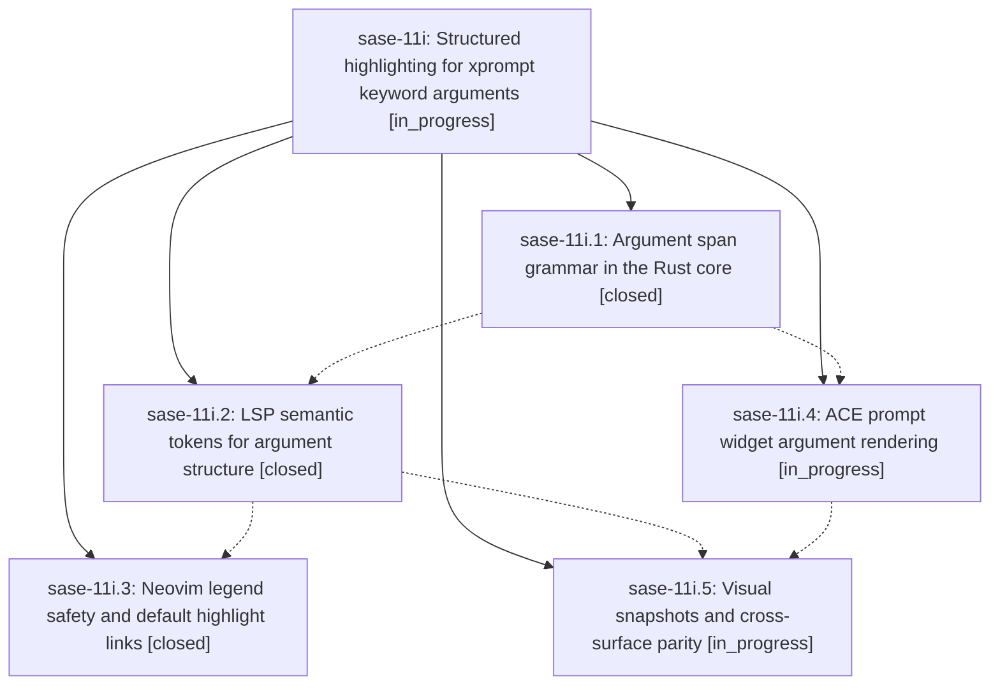

# Bead: sase-11i — Structured highlighting for xprompt keyword arguments

[Bead Pages](../README.md) / sase-11i

**Status:** ◐ in_progress · **Type:** ▸ plan · **Tier:** epic
**Owner:** `bryanbugyi34@gmail.com` · **Created by:** [bbugyi200.athena.0lq](https://github.com/sase-org/sase--agents/blob/main/families/bbugyi200.athena.0lq.md) · **Assignee:** `sase-11i.land`
**Created:** 2026-09-15 21:08:37 EDT
**Plan:** [202609/xprompt\_keyword\_arg\_highlighting.md](https://github.com/sase-org/sase--plans/blob/main/202609/xprompt_keyword_arg_highlighting.md)

## Description

A keyword argument such as `#research_swarm(lead_model=claude-fable-5)` reads as structured syntax rather than one flat blob, identically in the ACE prompt widget and in external editors over LSP, with key, value, punctuation, literal type, and declaration validity each visually distinct and driven by one shared Rust grammar.

## Phases

| Bead | Title | Status | Size | Created | Agents | Commits |
|---|---|---|---|---|---:|---:|
| [sase-11i.1](sase-11i.1.md) | Argument span grammar in the Rust core | ✓ closed | medium | 2026-09-15 | 1 | 1 |
| [sase-11i.2](sase-11i.2.md) | LSP semantic tokens for argument structure | ✓ closed | medium | 2026-09-15 | 1 | 1 |
| [sase-11i.3](sase-11i.3.md) | Neovim legend safety and default highlight links | ✓ closed | small | 2026-09-15 | 1 | 1 |
| [sase-11i.4](sase-11i.4.md) | ACE prompt widget argument rendering | ◐ in_progress | medium | 2026-09-15 | 1 | 0 |
| [sase-11i.5](sase-11i.5.md) | Visual snapshots and cross-surface parity | ◐ in_progress | medium | 2026-09-15 | 1 | 0 |

## Lineage

## Agents

| Agent | Bead | Commits |
|---|---|---:|
| [bbugyi200.athena.sase-11i.1](https://github.com/sase-org/sase--agents/blob/main/agents/bbugyi200.athena.sase-11i.1/README.md) | [sase-11i.1](sase-11i.1.md) | 1 |
| [bbugyi200.athena.sase-11i.2](https://github.com/sase-org/sase--agents/blob/main/agents/bbugyi200.athena.sase-11i.2/README.md) | [sase-11i.2](sase-11i.2.md) | 1 |
| [bbugyi200.athena.sase-11i.3](https://github.com/sase-org/sase--agents/blob/main/agents/bbugyi200.athena.sase-11i.3/README.md) | [sase-11i.3](sase-11i.3.md) | 1 |
| [bbugyi200.athena.sase-11i.4](https://github.com/sase-org/sase--agents/blob/main/agents/bbugyi200.athena.sase-11i.4/README.md) | [sase-11i.4](sase-11i.4.md) | 0 |
| [bbugyi200.athena.sase-11i.5](https://github.com/sase-org/sase--agents/blob/main/agents/bbugyi200.athena.sase-11i.5/README.md) | [sase-11i.5](sase-11i.5.md) | 0 |
| [bbugyi200.athena.sase-11i.land](https://github.com/sase-org/sase--agents/blob/main/agents/bbugyi200.athena.sase-11i.land/README.md) | [sase-11i](README.md) | 0 |

## Commits

| Repo | Commit | Subject | Bead | Committed |
|---|---|---|---|---|
| sase-core | [`sase-core@4c25db2`](https://github.com/sase-org/sase-core/commit/4c25db2f59c9dbb18638bacdb2e288665485b105) | feat: add xprompt argument span grammar | [sase-11i.1](sase-11i.1.md) | 2026-09-15 21:41:21 EDT |
| sase-core | [`sase-core@f07bf53`](https://github.com/sase-org/sase-core/commit/f07bf53906f406fd51318068896739eaa34fcf2b) | feat(xprompt-lsp): emit argument semantic tokens | [sase-11i.2](sase-11i.2.md) | 2026-09-15 21:59:58 EDT |
| sase-nvim | [`sase-nvim@502e716`](https://github.com/sase-org/sase-nvim/commit/502e716ada561bb8f1eba1f97f696edd9bdcc62c) | feat(nvim): highlight xprompt argument semantic tokens | [sase-11i.3](sase-11i.3.md) | 2026-09-15 22:14:21 EDT |
