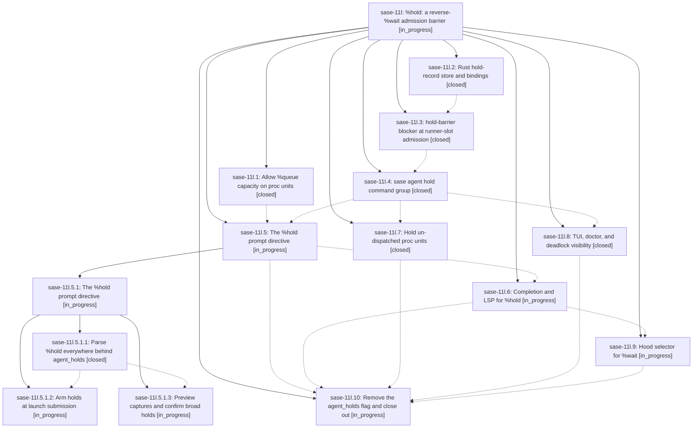

# Bead: sase-11l — %hold: a reverse-%wait admission barrier

[Bead Pages](../README.md) / sase-11l

**Status:** ◐ in_progress · **Type:** ▸ plan · **Tier:** epic
**Owner:** `bryanbugyi34@gmail.com` · **Created by:** [bbugyi200.athena.0ls](https://github.com/sase-org/sase--agents/blob/main/families/bbugyi200.athena.0ls.md) · **Assignee:** `sase-11l.land`
**Created:** 2026-09-15 22:45:58 EDT
**Plan:** [202609/hold\_directive.md](https://github.com/sase-org/sase--plans/blob/main/202609/hold_directive.md)

<!-- sase:links:start -->

## Links

| Relation | Artifact | Why |
| --- | --- | --- |
| implemented-by | [plan:202609/hold_directive.md][1] | derived from the plan's `bead_id:` frontmatter field |

[1]: https://github.com/sase-org/sase--plans/blob/main/202609/hold_directive.md

<!-- sase:links:end -->

## Description

A launch (agent or stand-alone proc) can arm a durable, TTL-bounded, fail-open hold that makes selected WAITING/QUEUED agents and un-dispatched procs wait for it to settle — never touching running work — with a first-class CLI, a %hold prompt directive, ACE/LSP completion, and TUI visibility.

## Phases

| Bead | Title | Status | Size | Created | Agents | Commits |
|---|---|---|---|---|---:|---:|
| [sase-11l.1](sase-11l.1.md) | Allow %queue capacity on proc units | ✓ closed | large | 2026-09-15 | 1 | 2 |
| [sase-11l.10](sase-11l.10.md) | Remove the agent\_holds flag and close out | ◐ in_progress | small | 2026-09-15 | 1 | 0 |
| [sase-11l.2](sase-11l.2.md) | Rust hold-record store and bindings | ✓ closed | large | 2026-09-15 | 1 | 2 |
| [sase-11l.3](sase-11l.3.md) | hold-barrier blocker at runner-slot admission | ✓ closed | large | 2026-09-15 | 1 | 2 |
| [sase-11l.4](sase-11l.4.md) | sase agent hold command group | ✓ closed | large | 2026-09-15 | 1 | 1 |
| [sase-11l.5](sase-11l.5.md) | The %hold prompt directive | ◐ in_progress | large | 2026-09-15 | 1 | 0 |
| [sase-11l.6](sase-11l.6.md) | Completion and LSP for %hold | ◐ in_progress | medium | 2026-09-15 | 1 | 0 |
| [sase-11l.7](sase-11l.7.md) | Hold un-dispatched proc units | ✓ closed | medium | 2026-09-15 | 1 | 1 |
| [sase-11l.8](sase-11l.8.md) | TUI, doctor, and deadlock visibility | ✓ closed | medium | 2026-09-15 | 1 | 1 |
| [sase-11l.9](sase-11l.9.md) | Hood selector for %wait | ◐ in_progress | medium | 2026-09-15 | 1 | 0 |

## Lineage

## Agents

| Agent | Bead | Commits |
|---|---|---:|
| [bbugyi200.athena.sase-11l.1](https://github.com/sase-org/sase--agents/blob/main/families/bbugyi200.athena.sase-11l.1.md) | [sase-11l.1](sase-11l.1.md) | 2 |
| [bbugyi200.athena.sase-11l.10](https://github.com/sase-org/sase--agents/blob/main/agents/bbugyi200.athena.sase-11l.10/README.md) | [sase-11l.10](sase-11l.10.md) | 0 |
| [bbugyi200.athena.sase-11l.2](https://github.com/sase-org/sase--agents/blob/main/agents/bbugyi200.athena.sase-11l.2/README.md) | [sase-11l.2](sase-11l.2.md) | 2 |
| [bbugyi200.athena.sase-11l.3](https://github.com/sase-org/sase--agents/blob/main/families/bbugyi200.athena.sase-11l.3.md) | [sase-11l.3](sase-11l.3.md) | 2 |
| [bbugyi200.athena.sase-11l.4](https://github.com/sase-org/sase--agents/blob/main/families/bbugyi200.athena.sase-11l.4.md) | [sase-11l.4](sase-11l.4.md) | 1 |
| [bbugyi200.athena.sase-11l.5](https://github.com/sase-org/sase--agents/blob/main/families/bbugyi200.athena.sase-11l.5.md) | [sase-11l.5](sase-11l.5.md) | 0 |
| [bbugyi200.athena.sase-11l.5.1.1](https://github.com/sase-org/sase--agents/blob/main/families/bbugyi200.athena.sase-11l.5.1.1.md) | [sase-11l.5.1.1](sase-11l.5.1.1.md) | 1 |
| [bbugyi200.athena.sase-11l.5.1.2](https://github.com/sase-org/sase--agents/blob/main/agents/bbugyi200.athena.sase-11l.5.1.2/README.md) | [sase-11l.5.1.2](sase-11l.5.1.2.md) | 0 |
| [bbugyi200.athena.sase-11l.5.1.3](https://github.com/sase-org/sase--agents/blob/main/agents/bbugyi200.athena.sase-11l.5.1.3/README.md) | [sase-11l.5.1.3](sase-11l.5.1.3.md) | 0 |
| [bbugyi200.athena.sase-11l.5.1.land](https://github.com/sase-org/sase--agents/blob/main/agents/bbugyi200.athena.sase-11l.5.1.land/README.md) | [sase-11l.5.1](sase-11l.5.1.md) | 0 |
| [bbugyi200.athena.sase-11l.6](https://github.com/sase-org/sase--agents/blob/main/agents/bbugyi200.athena.sase-11l.6/README.md) | [sase-11l.6](sase-11l.6.md) | 0 |
| [bbugyi200.athena.sase-11l.7](https://github.com/sase-org/sase--agents/blob/main/agents/bbugyi200.athena.sase-11l.7/README.md) | [sase-11l.7](sase-11l.7.md) | 1 |
| [bbugyi200.athena.sase-11l.8](https://github.com/sase-org/sase--agents/blob/main/agents/bbugyi200.athena.sase-11l.8/README.md) | [sase-11l.8](sase-11l.8.md) | 1 |
| [bbugyi200.athena.sase-11l.9](https://github.com/sase-org/sase--agents/blob/main/agents/bbugyi200.athena.sase-11l.9/README.md) | [sase-11l.9](sase-11l.9.md) | 0 |
| [bbugyi200.athena.sase-11l.land](https://github.com/sase-org/sase--agents/blob/main/agents/bbugyi200.athena.sase-11l.land/README.md) | [sase-11l](README.md) | 0 |

## Commits

| Repo | Commit | Subject | Bead | Committed |
|---|---|---|---|---|
| sase-core | [`sase-core@4ef449d`](https://github.com/sase-org/sase-core/commit/4ef449de9fc232402fc1eee72dbd5b6199438bf7) | feat(agent-hold): add durable hold store | [sase-11l.2](sase-11l.2.md) | 2026-09-15 23:17:28 EDT |
| sase | [`b6b11f2`](https://github.com/sase-org/sase/commit/b6b11f21556bccae2efcd8c32a161d4171614528) | feat(agent-launch): admit queued proc units | [sase-11l.1](sase-11l.1.md) | 2026-09-15 23:58:04 EDT |
| sase-core | [`sase-core@20f1dce`](https://github.com/sase-org/sase-core/commit/20f1dce477880f97995eb8ea87fcd48aa0515fc4) | feat(agent-launch): parse proc queue directives | [sase-11l.1](sase-11l.1.md) | 2026-09-16 00:01:16 EDT |
| sase-core | [`sase-core@a7d5882`](https://github.com/sase-org/sase-core/commit/a7d588263e5a1c69f49dddbb2f72a138382b53a5) | fix(agent-hold): enforce hold boundary semantics | [sase-11l.2](sase-11l.2.md) | 2026-09-16 00:24:24 EDT |
| sase | [`c174144`](https://github.com/sase-org/sase/commit/c1741443d96c51dc8144a2209e1f1f6c457db45e) | feat(agent-hold): enforce hold barriers in runner admission | [sase-11l.3](sase-11l.3.md) | 2026-09-16 10:30:27 EDT |
| sase-core | [`sase-core@67dc596`](https://github.com/sase-org/sase-core/commit/67dc596d1edb974b4f6b45625f2fc76f950f62b3) | feat(runner-capacity): apply agent hold barriers | [sase-11l.3](sase-11l.3.md) | 2026-09-16 10:33:32 EDT |
| sase | [`520c7db`](https://github.com/sase-org/sase/commit/520c7dbf419d3847f941c0a1cb47e384b4f0cf6d) | feat(agent-hold): add the sase agent hold command group | [sase-11l.4](sase-11l.4.md) | 2026-09-16 13:02:32 EDT |
| sase | [`b5f51b1`](https://github.com/sase-org/sase/commit/b5f51b192e5995a55d6a0571cf1aad7f6c394906) | feat(agent): hold undispatched procs before dispatch | [sase-11l.7](sase-11l.7.md) | 2026-09-16 15:08:03 EDT |
| sase | [`82a37b0`](https://github.com/sase-org/sase/commit/82a37b0c02100a37083217c21a6a4ee4a30eb2dc) | feat(xprompt): add hold directive surface | [sase-11l.5.1.1](sase-11l.5.1.1.md) | 2026-09-16 15:26:25 EDT |
| sase | [`09cb008`](https://github.com/sase-org/sase/commit/09cb008b22ea90adbf87cdae583fd31491e6ee67) | feat(agent-hold): surface hold visibility in the TUI, doctor, and admission notifications | [sase-11l.8](sase-11l.8.md) | 2026-09-16 15:32:33 EDT |
