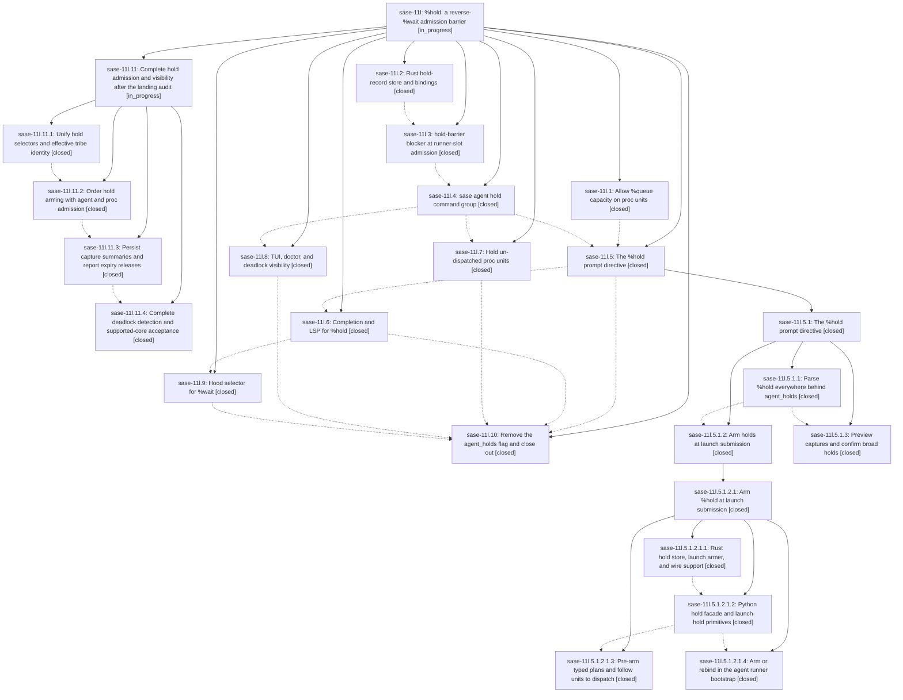

# Bead: sase-11l — %hold: a reverse-%wait admission barrier

[Bead Pages](../README.md) / sase-11l

**Status:** ◐ in_progress · **Type:** ▸ plan · **Tier:** epic
**Owner:** `bryanbugyi34@gmail.com` · **Created by:** [bbugyi200.athena.0ls](https://github.com/sase-org/sase--agents/blob/main/families/bbugyi200.athena.0ls.md) · **Assignee:** `sase-11l.land`
**Created:** 2026-09-15 22:45:58 EDT
**Plan:** [202609/hold\_directive.md](https://github.com/sase-org/sase--plans/blob/main/202609/hold_directive.md)

<!-- sase:links:start -->

## Links

| Relation | Artifact | Why |
| --- | --- | --- |
| implemented-by | [plan:202609/hold_directive.md][1] | derived from the plan's `bead_id:` frontmatter field |

[1]: https://github.com/sase-org/sase--plans/blob/main/202609/hold_directive.md

<!-- sase:links:end -->

## Description

A launch (agent or stand-alone proc) can arm a durable, TTL-bounded, fail-open hold that makes selected WAITING/QUEUED agents and un-dispatched procs wait for it to settle — never touching running work — with a first-class CLI, a %hold prompt directive, ACE/LSP completion, and TUI visibility.

## Notes

[2026-09-18T20:46:37Z · bryanbugyi34@gmail.com] The sase-11l.10 agent failed. I think it may have left some sase-core work behind? The epic lander agent should look into this.

[2026-09-18T22:04:35Z · sase-11l.land] LANDING REVIEW: not ready to close. Reviewed the epic, every child and every note (19 descendants: 17 phases and two nested plans), all three linked plans, the research report, epic commits in Python/core, and intervening source changes. Audit and reproducible isolated probes: file:explicit:50d20b6062acfc5207bafbbb. Original plan remains unchanged. No epic-symbol entries; no parent bead.

Phase-10 concern in epic note #1 is resolved: the core removal is committed in mixed finalizer commit 8d5341a and Python removal in a60210501; the core checkout is clean. Reviewed from first epic commit b6b11f215 through fa61906da, then fetched/fast-forwarded to bb332b5aa and reviewed that startup-only drift. Concurrent tribe/provenance changes require hold integration.

Confirmed remaining epic work: (1) a hold can arm between the runner hold snapshot and claim while the candidate still starts; audit the analogous stale proc action transition, (2) CLI selectors differ from directive family/clan/workflow expansion and CLI operands do not match the approved positional contract, (3) runner admission misses stored/effective tribe assignments recognized by wait/display paths, (4) required historical capture counts are not persisted or displayed, (5) expiry silently prunes without the required release notification, (6) deadlock traversal follows only one dependency branch and omits hood waits, and (7) the package floor predates the complete hood/unconditional contracts. These remain epic repairs, not unrelated feature tasks. A directly parented child repair plan is being submitted through the tier-aware plan workflow; no original-epic close/symvision/status phase is included.

Validation: 77 focused tests passed in 22.34s against fa61906da and released core 0.34.53. Additional real-binding probes exposed the race, selector, tribe, persistence, expiry, and branched-deadlock defects despite that pass. Full core and check-full passes are not claimed; they remain required after repairs. The audit includes probe source and output.

All nine PROPOSED FOLLOW-UP outcomes, to preserve in the eventual close note:
1. sase-11l.2 note #1, libpython: existing sase-xv owns it. Core 77492cc configures LIBDIR; added resolution evidence there. No fresh failure or duplicate task.
2. sase-11l.2 note #2, missing research: reproduced before opening the research sidecar, then audited read succeeded. Corroborated sase-u3 with +1. Declined reclaim/republish because the report is intact.
3. sase-11l.6 note #1, usage-probes temp guard: fixed by 2c46c84b7; focused tests pass. Declined new task.
4. sase-11l.8 note #1, sase_questions phrase: fixed by e17d4e0c0/fb1e7f576; exact test passes and fixed-at entry exists. Added evidence to sase-11z; declined duplicate/current-failure report.
5. sase-11l.8 note #2, persistent capture counts: explicitly required by original plan sections 4.4/4.8. Accepted into epic repairs, not a separate feature task.
6. sase-11l.10 note #1, memory documentation: created READY medium memory task sase-134, dependent on sase-11l, for xprompts.md and a decision strand. No memory files changed.
7. sase-11l.5.1.3 note #1, stale core floor: prior bindings were ratcheted, but complete hood/flag contracts require a newer minimum than 0.34.48. Supported-release acceptance is in the repair plan, no separate task.
8. sase-11l.5.1.3 note #2, twelve historical failures/flakes: nested landing 756a07c9b already handled the baseline. Existing tasks sase-120, sase-121, sase-12c, sase-12d, sase-12e, sase-12g, sase-12h own seven still-listed nodes; five repaired nodes have fixed-at entries. No new failure reproduced, so declined duplicate tasks/+1s. Reassess actual post-repair full-check results.
9. sase-11l.5.1.2.1.2 note #1, moved config-test node: fixed by 88175f34f and exact test passes. Added evidence to sase-122; declined duplicate/current-failure report.

The task triage included all-status searches, the last-week task sweep, and all active-epic descriptions. After the child lands, re-read this audit, descendants/notes, linked plans and post-child drift, then perform the original normal landing only when complete. Do not force-close this epic to bypass readiness.

## Phases

| Bead | Title | Status | Size | Created | Agents | Commits |
|---|---|---|---|---|---:|---:|
| [sase-11l.1](sase-11l.1.md) | Allow %queue capacity on proc units | ✓ closed | large | 2026-09-15 | 1 | 2 |
| [sase-11l.10](sase-11l.10.md) | Remove the agent\_holds flag and close out | ✓ closed | small | 2026-09-15 | 1 | 1 |
| [sase-11l.2](sase-11l.2.md) | Rust hold-record store and bindings | ✓ closed | large | 2026-09-15 | 1 | 2 |
| [sase-11l.3](sase-11l.3.md) | hold-barrier blocker at runner-slot admission | ✓ closed | large | 2026-09-15 | 1 | 2 |
| [sase-11l.4](sase-11l.4.md) | sase agent hold command group | ✓ closed | large | 2026-09-15 | 1 | 1 |
| [sase-11l.5](sase-11l.5.md) | The %hold prompt directive | ✓ closed | large | 2026-09-15 | 1 | 0 |
| [sase-11l.6](sase-11l.6.md) | Completion and LSP for %hold | ✓ closed | medium | 2026-09-15 | 1 | 2 |
| [sase-11l.7](sase-11l.7.md) | Hold un-dispatched proc units | ✓ closed | medium | 2026-09-15 | 1 | 2 |
| [sase-11l.8](sase-11l.8.md) | TUI, doctor, and deadlock visibility | ✓ closed | medium | 2026-09-15 | 1 | 1 |
| [sase-11l.9](sase-11l.9.md) | Hood selector for %wait | ✓ closed | medium | 2026-09-15 | 1 | 2 |

## Lineage

## Dependencies

- **Blocks:** [sase-134](../sase-134/README.md) ◇ · ⧖ 2026-09-18

## Agents

| Agent | Bead | Commits |
|---|---|---:|
| [bbugyi200.athena.sase-11l.1](https://github.com/sase-org/sase--agents/blob/main/families/bbugyi200.athena.sase-11l.1.md) | [sase-11l.1](sase-11l.1.md) | 2 |
| [bbugyi200.athena.sase-11l.10](https://github.com/sase-org/sase--agents/blob/main/families/bbugyi200.athena.sase-11l.10.md) | [sase-11l.10](sase-11l.10.md) | 1 |
| [bbugyi200.athena.sase-11l.11.1](https://github.com/sase-org/sase--agents/blob/main/families/bbugyi200.athena.sase-11l.11.1.md) | [sase-11l.11.1](sase-11l.11.1.md) | 2 |
| [bbugyi200.athena.sase-11l.11.2](https://github.com/sase-org/sase--agents/blob/main/families/bbugyi200.athena.sase-11l.11.2.md) | [sase-11l.11.2](sase-11l.11.2.md) | 1 |
| [bbugyi200.athena.sase-11l.11.3](https://github.com/sase-org/sase--agents/blob/main/families/bbugyi200.athena.sase-11l.11.3.md) | [sase-11l.11.3](sase-11l.11.3.md) | 2 |
| [bbugyi200.athena.sase-11l.11.4](https://github.com/sase-org/sase--agents/blob/main/families/bbugyi200.athena.sase-11l.11.4.md) | [sase-11l.11.4](sase-11l.11.4.md) | 2 |
| [bbugyi200.athena.sase-11l.11.land](https://github.com/sase-org/sase--agents/blob/main/agents/bbugyi200.athena.sase-11l.11.land/README.md) | [sase-11l.11](sase-11l.11.md) | 0 |
| [bbugyi200.athena.sase-11l.2](https://github.com/sase-org/sase--agents/blob/main/agents/bbugyi200.athena.sase-11l.2/README.md) | [sase-11l.2](sase-11l.2.md) | 2 |
| [bbugyi200.athena.sase-11l.3](https://github.com/sase-org/sase--agents/blob/main/families/bbugyi200.athena.sase-11l.3.md) | [sase-11l.3](sase-11l.3.md) | 2 |
| [bbugyi200.athena.sase-11l.4](https://github.com/sase-org/sase--agents/blob/main/families/bbugyi200.athena.sase-11l.4.md) | [sase-11l.4](sase-11l.4.md) | 1 |
| [bbugyi200.athena.sase-11l.5](https://github.com/sase-org/sase--agents/blob/main/families/bbugyi200.athena.sase-11l.5.md) | [sase-11l.5](sase-11l.5.md) | 0 |
| [bbugyi200.athena.sase-11l.5.1.1](https://github.com/sase-org/sase--agents/blob/main/families/bbugyi200.athena.sase-11l.5.1.1.md) | [sase-11l.5.1.1](sase-11l.5.1.1.md) | 2 |
| [bbugyi200.athena.sase-11l.5.1.2](https://github.com/sase-org/sase--agents/blob/main/families/bbugyi200.athena.sase-11l.5.1.2.md) | [sase-11l.5.1.2](sase-11l.5.1.2.md) | 0 |
| [bbugyi200.athena.sase-11l.5.1.2.1.1](https://github.com/sase-org/sase--agents/blob/main/agents/bbugyi200.athena.sase-11l.5.1.2.1.1/README.md) | [sase-11l.5.1.2.1.1](sase-11l.5.1.2.1.1.md) | 1 |
| [bbugyi200.athena.sase-11l.5.1.2.1.2](https://github.com/sase-org/sase--agents/blob/main/agents/bbugyi200.athena.sase-11l.5.1.2.1.2/README.md) | [sase-11l.5.1.2.1.2](sase-11l.5.1.2.1.2.md) | 1 |
| [bbugyi200.athena.sase-11l.5.1.2.1.4](https://github.com/sase-org/sase--agents/blob/main/agents/bbugyi200.athena.sase-11l.5.1.2.1.4/README.md) | [sase-11l.5.1.2.1.4](sase-11l.5.1.2.1.4.md) | 1 |
| [bbugyi200.athena.sase-11l.5.1.2.1.land](https://github.com/sase-org/sase--agents/blob/main/families/bbugyi200.athena.sase-11l.5.1.2.1.land.md) | [sase-11l.5.1.2.1](sase-11l.5.1.2.1.md) | 1 |
| [bbugyi200.athena.sase-11l.5.1.3](https://github.com/sase-org/sase--agents/blob/main/families/bbugyi200.athena.sase-11l.5.1.3.md) | [sase-11l.5.1.3](sase-11l.5.1.3.md) | 1 |
| [bbugyi200.athena.sase-11l.5.1.land](https://github.com/sase-org/sase--agents/blob/main/families/bbugyi200.athena.sase-11l.5.1.land.md) | [sase-11l.5.1](sase-11l.5.1.md) | 0 |
| [bbugyi200.athena.sase-11l.6](https://github.com/sase-org/sase--agents/blob/main/agents/bbugyi200.athena.sase-11l.6/README.md) | [sase-11l.6](sase-11l.6.md) | 2 |
| [bbugyi200.athena.sase-11l.7](https://github.com/sase-org/sase--agents/blob/main/agents/bbugyi200.athena.sase-11l.7/README.md) | [sase-11l.7](sase-11l.7.md) | 2 |
| [bbugyi200.athena.sase-11l.8](https://github.com/sase-org/sase--agents/blob/main/agents/bbugyi200.athena.sase-11l.8/README.md) | [sase-11l.8](sase-11l.8.md) | 1 |
| [bbugyi200.athena.sase-11l.9](https://github.com/sase-org/sase--agents/blob/main/agents/bbugyi200.athena.sase-11l.9/README.md) | [sase-11l.9](sase-11l.9.md) | 2 |
| [bbugyi200.athena.sase-11l.land](https://github.com/sase-org/sase--agents/blob/main/families/bbugyi200.athena.sase-11l.land.md) | [sase-11l](README.md) | 0 |

## Commits

| Repo | Commit | Subject | Bead | Committed |
|---|---|---|---|---|
| sase-core | [`sase-core@4ef449d`](https://github.com/sase-org/sase-core/commit/4ef449de9fc232402fc1eee72dbd5b6199438bf7) | feat(agent-hold): add durable hold store | [sase-11l.2](sase-11l.2.md) | 2026-09-15 23:17:28 EDT |
| sase | [`b6b11f2`](https://github.com/sase-org/sase/commit/b6b11f21556bccae2efcd8c32a161d4171614528) | feat(agent-launch): admit queued proc units | [sase-11l.1](sase-11l.1.md) | 2026-09-15 23:58:04 EDT |
| sase-core | [`sase-core@20f1dce`](https://github.com/sase-org/sase-core/commit/20f1dce477880f97995eb8ea87fcd48aa0515fc4) | feat(agent-launch): parse proc queue directives | [sase-11l.1](sase-11l.1.md) | 2026-09-16 00:01:16 EDT |
| sase-core | [`sase-core@a7d5882`](https://github.com/sase-org/sase-core/commit/a7d588263e5a1c69f49dddbb2f72a138382b53a5) | fix(agent-hold): enforce hold boundary semantics | [sase-11l.2](sase-11l.2.md) | 2026-09-16 00:24:24 EDT |
| sase | [`c174144`](https://github.com/sase-org/sase/commit/c1741443d96c51dc8144a2209e1f1f6c457db45e) | feat(agent-hold): enforce hold barriers in runner admission | [sase-11l.3](sase-11l.3.md) | 2026-09-16 10:30:27 EDT |
| sase-core | [`sase-core@67dc596`](https://github.com/sase-org/sase-core/commit/67dc596d1edb974b4f6b45625f2fc76f950f62b3) | feat(runner-capacity): apply agent hold barriers | [sase-11l.3](sase-11l.3.md) | 2026-09-16 10:33:32 EDT |
| sase | [`520c7db`](https://github.com/sase-org/sase/commit/520c7dbf419d3847f941c0a1cb47e384b4f0cf6d) | feat(agent-hold): add the sase agent hold command group | [sase-11l.4](sase-11l.4.md) | 2026-09-16 13:02:32 EDT |
| sase | [`b5f51b1`](https://github.com/sase-org/sase/commit/b5f51b192e5995a55d6a0571cf1aad7f6c394906) | feat(agent): hold undispatched procs before dispatch | [sase-11l.7](sase-11l.7.md) | 2026-09-16 15:08:03 EDT |
| sase-core | [`sase-core@4ec5fca`](https://github.com/sase-org/sase-core/commit/4ec5fca725227c0e8a060189a40b42afa42d5e51) | feat(agent): expose proc hold admission facts | [sase-11l.7](sase-11l.7.md) | 2026-09-16 15:11:59 EDT |
| sase | [`82a37b0`](https://github.com/sase-org/sase/commit/82a37b0c02100a37083217c21a6a4ee4a30eb2dc) | feat(xprompt): add hold directive surface | [sase-11l.5.1.1](sase-11l.5.1.1.md) | 2026-09-16 15:26:25 EDT |
| sase | [`09cb008`](https://github.com/sase-org/sase/commit/09cb008b22ea90adbf87cdae583fd31491e6ee67) | feat(agent-hold): surface hold visibility in the TUI, doctor, and admission notifications | [sase-11l.8](sase-11l.8.md) | 2026-09-16 15:32:33 EDT |
| sase-core | [`sase-core@a685c07`](https://github.com/sase-org/sase-core/commit/a685c0725fba4b6391bfb8541a06f935480253d4) | feat(core): add hold directive contracts | [sase-11l.5.1.1](sase-11l.5.1.1.md) | 2026-09-16 15:40:45 EDT |
| sase-core | [`sase-core@f93ed13`](https://github.com/sase-org/sase-core/commit/f93ed139f4b1295d7c508a90cf822be9f229e75c) | feat(agent-hold): add launch armer core support | [sase-11l.5.1.2.1.1](sase-11l.5.1.2.1.1.md) | 2026-09-16 17:09:25 EDT |
| sase | [`43c8721`](https://github.com/sase-org/sase/commit/43c87210f5821663c21d9198865f52f02473d009) | feat(agent-hold): preview pending %hold captures and confirm broad holds | [sase-11l.5.1.3](sase-11l.5.1.3.md) | 2026-09-16 18:38:38 EDT |
| sase | [`02f0fd3`](https://github.com/sase-org/sase/commit/02f0fd3893f57267a0bef8f6f69fc23adc89c675) | feat(agent-hold): add launch-hold facade primitives and launch armer kind | [sase-11l.5.1.2.1.2](sase-11l.5.1.2.1.2.md) | 2026-09-17 07:28:41 EDT |
| sase | [`88175f3`](https://github.com/sase-org/sase/commit/88175f34fc8b9431bb3e3a89ac56a620137b8a2a) | feat(agent-hold): arm bootstrap holds | [sase-11l.5.1.2.1.4](sase-11l.5.1.2.1.4.md) | 2026-09-17 08:36:56 EDT |
| sase | [`ff08843`](https://github.com/sase-org/sase/commit/ff088437985ffa0f679ae59406280202f58b9279) | feat(agent): pre-arm typed launch holds | [sase-11l.5.1.2.1](sase-11l.5.1.2.1.md) | 2026-09-17 14:53:35 EDT |
| sase | [`f852cdc`](https://github.com/sase-org/sase/commit/f852cdcbba7a5901c386ec12bd8190d621a9f3cf) | feat(ace): complete hold directive completions | [sase-11l.6](sase-11l.6.md) | 2026-09-18 07:52:28 EDT |
| sase-core | [`sase-core@0b4beed`](https://github.com/sase-org/sase-core/commit/0b4beedb42061eb9ba5fafaafee7fcc05decc279) | feat(editor): support hold completion roles | [sase-11l.6](sase-11l.6.md) | 2026-09-18 08:13:39 EDT |
| sase | [`c8c842f`](https://github.com/sase-org/sase/commit/c8c842fb3e8f7e042e4e1543341f2be95ee77169) | feat(wait): support hood selectors | [sase-11l.9](sase-11l.9.md) | 2026-09-18 10:05:11 EDT |
| sase-core | [`sase-core@549b168`](https://github.com/sase-org/sase-core/commit/549b168603d0700cdee71d068905dc70987cf7c3) | feat(wait): add hood directive contract | [sase-11l.9](sase-11l.9.md) | 2026-09-18 10:09:02 EDT |
| sase | [`932e6ff`](https://github.com/sase-org/sase/commit/932e6ffae232e38ecd0f72b3ee18bed3e0f6bf24) | feat(hold): make %hold unconditional and retire agent\_holds | [sase-11l.10](sase-11l.10.md) | 2026-09-18 16:24:14 EDT |
| sase | [`0e4cfe9`](https://github.com/sase-org/sase/commit/0e4cfe92cb9a0f007de7e44149c47e4495686cab) | feat(hold): unify CLI and directive selector parity | [sase-11l.11.1](sase-11l.11.1.md) | 2026-09-18 22:41:35 EDT |
| sase-core | [`sase-core@7e95d3f`](https://github.com/sase-org/sase-core/commit/7e95d3fe272beccc484cfa1270cdb41e55ed2c43) | feat(hold): unify CLI and directive selector identity | [sase-11l.11.1](sase-11l.11.1.md) | 2026-09-18 22:47:06 EDT |
| sase | [`8de747c`](https://github.com/sase-org/sase/commit/8de747c36a0a1e01f56ce455d2bb14621f27ef6b) | feat(hold): serialize hold publication with admission transitions | [sase-11l.11.2](sase-11l.11.2.md) | 2026-09-19 00:40:12 EDT |
| sase | [`a1bb1df`](https://github.com/sase-org/sase/commit/a1bb1df4544d68bf28168d448aab94b708ea0b17) | feat(hold): render arm-time capture summaries and expiry releases | [sase-11l.11.3](sase-11l.11.3.md) | 2026-09-19 02:22:18 EDT |
| sase-core | [`sase-core@6fe31cb`](https://github.com/sase-org/sase-core/commit/6fe31cb076d067e2a61252c4f05ce27a888b3b0a) | feat(hold): persist capture summaries and return prune evidence | [sase-11l.11.3](sase-11l.11.3.md) | 2026-09-19 02:25:36 EDT |
| sase | [`388d516`](https://github.com/sase-org/sase/commit/388d5160308367121467539eb3114bc342833ffc) | feat(hold): delegate deadlock detection to shared core reachability | [sase-11l.11.4](sase-11l.11.4.md) | 2026-09-19 04:18:43 EDT |
| sase-core | [`sase-core@0a7301c`](https://github.com/sase-org/sase-core/commit/0a7301ca435d7ace7dfd732455a4997ad34b3624) | feat(hold): walk every wait branch for hold deadlock reachability | [sase-11l.11.4](sase-11l.11.4.md) | 2026-09-19 04:22:16 EDT |
