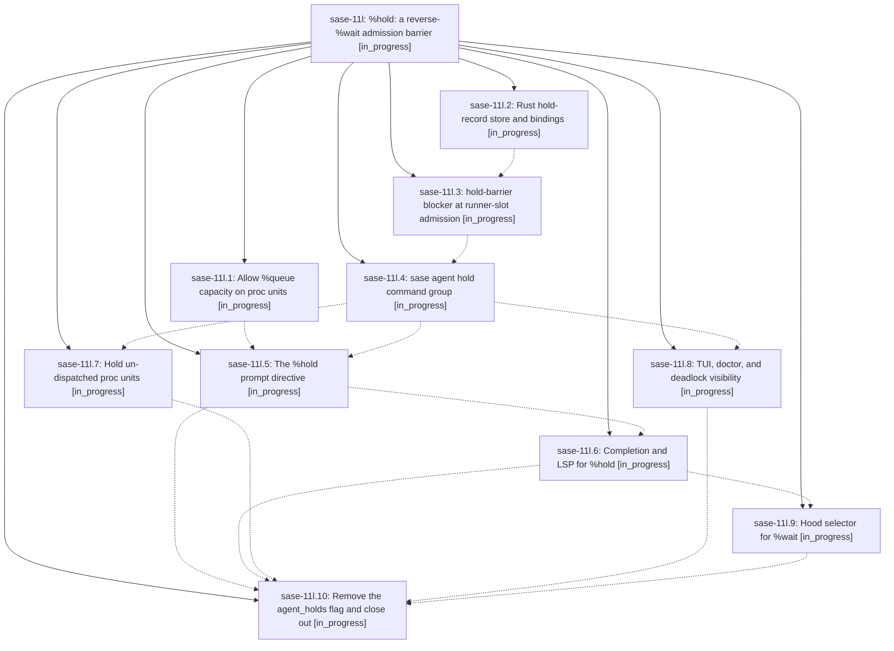

# Bead: sase-11l — %hold: a reverse-%wait admission barrier

[Bead Pages](../README.md) / sase-11l

**Status:** ◐ in_progress · **Type:** ▸ plan · **Tier:** epic
**Owner:** `bryanbugyi34@gmail.com` · **Created by:** [bbugyi200.athena.0ls](https://github.com/sase-org/sase--agents/blob/main/families/bbugyi200.athena.0ls.md) · **Assignee:** `sase-11l.land`
**Created:** 2026-09-15 22:45:58 EDT
**Plan:** [202609/hold\_directive.md](https://github.com/sase-org/sase--plans/blob/main/202609/hold_directive.md)

## Description

A launch (agent or stand-alone proc) can arm a durable, TTL-bounded, fail-open hold that makes selected WAITING/QUEUED agents and un-dispatched procs wait for it to settle — never touching running work — with a first-class CLI, a %hold prompt directive, ACE/LSP completion, and TUI visibility.

## Phases

| Bead | Title | Status | Size | Created | Agents | Commits |
|---|---|---|---|---|---:|---:|
| [sase-11l.1](sase-11l.1.md) | Allow %queue capacity on proc units | ◐ in_progress | large | 2026-09-15 | 1 | 0 |
| [sase-11l.10](sase-11l.10.md) | Remove the agent\_holds flag and close out | ◐ in_progress | small | 2026-09-15 | 1 | 0 |
| [sase-11l.2](sase-11l.2.md) | Rust hold-record store and bindings | ◐ in_progress | large | 2026-09-15 | 1 | 1 |
| [sase-11l.3](sase-11l.3.md) | hold-barrier blocker at runner-slot admission | ◐ in_progress | large | 2026-09-15 | 1 | 0 |
| [sase-11l.4](sase-11l.4.md) | sase agent hold command group | ◐ in_progress | large | 2026-09-15 | 1 | 0 |
| [sase-11l.5](sase-11l.5.md) | The %hold prompt directive | ◐ in_progress | large | 2026-09-15 | 1 | 0 |
| [sase-11l.6](sase-11l.6.md) | Completion and LSP for %hold | ◐ in_progress | medium | 2026-09-15 | 1 | 0 |
| [sase-11l.7](sase-11l.7.md) | Hold un-dispatched proc units | ◐ in_progress | medium | 2026-09-15 | 1 | 0 |
| [sase-11l.8](sase-11l.8.md) | TUI, doctor, and deadlock visibility | ◐ in_progress | medium | 2026-09-15 | 1 | 0 |
| [sase-11l.9](sase-11l.9.md) | Hood selector for %wait | ◐ in_progress | medium | 2026-09-15 | 1 | 0 |

## Lineage

## Agents

| Agent | Bead | Commits |
|---|---|---:|
| [bbugyi200.athena.sase-11l.1](https://github.com/sase-org/sase--agents/blob/main/families/bbugyi200.athena.sase-11l.1.md) | [sase-11l.1](sase-11l.1.md) | 0 |
| [bbugyi200.athena.sase-11l.10](https://github.com/sase-org/sase--agents/blob/main/agents/bbugyi200.athena.sase-11l.10/README.md) | [sase-11l.10](sase-11l.10.md) | 0 |
| [bbugyi200.athena.sase-11l.2](https://github.com/sase-org/sase--agents/blob/main/families/bbugyi200.athena.sase-11l.2.md) | [sase-11l.2](sase-11l.2.md) | 1 |
| [bbugyi200.athena.sase-11l.3](https://github.com/sase-org/sase--agents/blob/main/agents/bbugyi200.athena.sase-11l.3/README.md) | [sase-11l.3](sase-11l.3.md) | 0 |
| [bbugyi200.athena.sase-11l.4](https://github.com/sase-org/sase--agents/blob/main/agents/bbugyi200.athena.sase-11l.4/README.md) | [sase-11l.4](sase-11l.4.md) | 0 |
| [bbugyi200.athena.sase-11l.5](https://github.com/sase-org/sase--agents/blob/main/agents/bbugyi200.athena.sase-11l.5/README.md) | [sase-11l.5](sase-11l.5.md) | 0 |
| [bbugyi200.athena.sase-11l.6](https://github.com/sase-org/sase--agents/blob/main/agents/bbugyi200.athena.sase-11l.6/README.md) | [sase-11l.6](sase-11l.6.md) | 0 |
| [bbugyi200.athena.sase-11l.7](https://github.com/sase-org/sase--agents/blob/main/agents/bbugyi200.athena.sase-11l.7/README.md) | [sase-11l.7](sase-11l.7.md) | 0 |
| [bbugyi200.athena.sase-11l.8](https://github.com/sase-org/sase--agents/blob/main/agents/bbugyi200.athena.sase-11l.8/README.md) | [sase-11l.8](sase-11l.8.md) | 0 |
| [bbugyi200.athena.sase-11l.9](https://github.com/sase-org/sase--agents/blob/main/agents/bbugyi200.athena.sase-11l.9/README.md) | [sase-11l.9](sase-11l.9.md) | 0 |
| [bbugyi200.athena.sase-11l.land](https://github.com/sase-org/sase--agents/blob/main/agents/bbugyi200.athena.sase-11l.land/README.md) | [sase-11l](README.md) | 0 |

## Commits

| Repo | Commit | Subject | Bead | Committed |
|---|---|---|---|---|
| sase-core | [`sase-core@4ef449d`](https://github.com/sase-org/sase-core/commit/4ef449de9fc232402fc1eee72dbd5b6199438bf7) | feat(agent-hold): add durable hold store | [sase-11l.2](sase-11l.2.md) | 2026-09-15 23:17:28 EDT |
