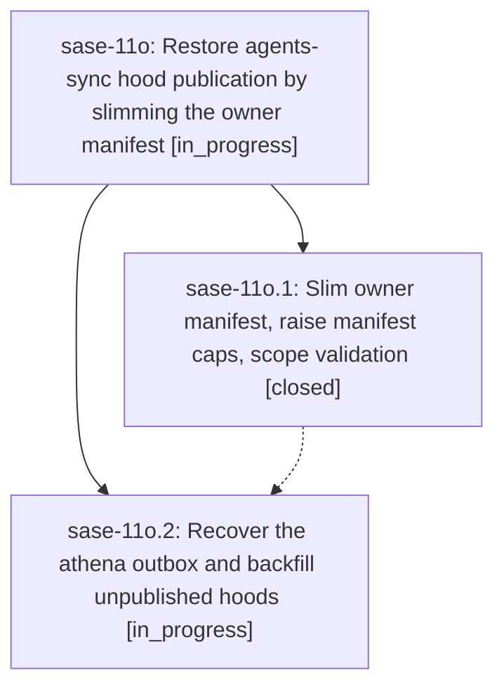

# Bead: sase-11o — Restore agents-sync hood publication by slimming the owner manifest

[Bead Pages](../README.md) / sase-11o

**Status:** ◐ in_progress · **Type:** ▸ plan · **Tier:** epic
**Owner:** `bryanbugyi34@gmail.com` · **Created by:** [bbugyi200.athena.0lt](https://github.com/sase-org/sase--agents/blob/main/families/bbugyi200.athena.0lt.md) · **Assignee:** `sase-11o.land`
**Created:** 2026-09-16 09:17:27 EDT
**Plan:** [202609/agents\_sync\_manifest\_slim.md](https://github.com/sase-org/sase--plans/blob/main/202609/agents_sync_manifest_slim.md)

## Description

New agent hoods publish to the sase--agents sidecar again on athena (including the backfilled sase-11l hood and its sase-11l.2 run page), single-hood publishes finish well inside the drain timeout, and the owner manifest format no longer has an imminent byte or hood-count ceiling.

## Phases

| Bead | Title | Status | Size | Created | Agents | Commits |
|---|---|---|---|---|---:|---:|
| [sase-11o.1](sase-11o.1.md) | Slim owner manifest, raise manifest caps, scope validation | ✓ closed | medium | 2026-09-16 | 1 | 1 |
| [sase-11o.2](sase-11o.2.md) | Recover the athena outbox and backfill unpublished hoods | ◐ in_progress | small | 2026-09-16 | 1 | 0 |

## Lineage

## Agents

| Agent | Bead | Commits |
|---|---|---:|
| [bbugyi200.athena.sase-11o.1](https://github.com/sase-org/sase--agents/blob/main/agents/bbugyi200.athena.sase-11o.1/README.md) | [sase-11o.1](sase-11o.1.md) | 1 |
| [bbugyi200.athena.sase-11o.2](https://github.com/sase-org/sase--agents/blob/main/agents/bbugyi200.athena.sase-11o.2/README.md) | [sase-11o.2](sase-11o.2.md) | 0 |
| [bbugyi200.athena.sase-11o.land](https://github.com/sase-org/sase--agents/blob/main/agents/bbugyi200.athena.sase-11o.land/README.md) | [sase-11o](README.md) | 0 |

## Commits

| Repo | Commit | Subject | Bead | Committed |
|---|---|---|---|---|
| sase | [`4249ccd`](https://github.com/sase-org/sase/commit/4249ccdc182d1638e3e10f58ef698f1b1fe779b5) | feat(agents-sync): slim per-hood manifests behind slim\_agents\_manifest flag | [sase-11o.1](sase-11o.1.md) | 2026-09-16 11:59:25 EDT |
