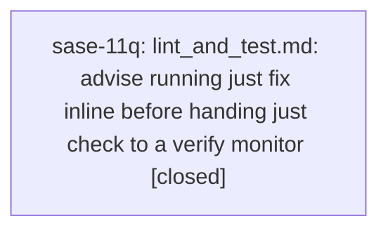

# Bead: sase-11q — lint\_and\_test.md: advise running just fix inline before handing just check to a verify monitor

[Bead Pages](../README.md) / sase-11q

**Status:** ✓ closed · **Resolution:** done · **Type:** ◆ task · **Task type:** ▤ memory
**Owner:** `bryanbugyi34@gmail.com` · **Created by:** [bbugyi200.athena.0lx](https://github.com/sase-org/sase--agents/blob/main/families/bbugyi200.athena.0lx.md) · **Assignee:** `sase-11q` · **Size:** small
**Created:** 2026-09-16 10:01:57 EDT · **Closed:** 2026-09-16 10:36:17 EDT

## Description

Discovered while diagnosing the sase-11o.1 failure (2026-09-16): the phase worker followed lint_and_test.md guidance and handed 'just check' to a verify monitor, but had never run 'just fmt'/'just fix', so the monitor failed in ~3s on ruff-format for two edited files (src/sase/agents_sync/v2_manifest_io.py, tests/agents_sync/test_v2_io.py). The check failure itself was trivially avoidable: 'just fix' takes seconds inline. The note's Two-Speed Verification section covers when to run just check inline vs via monitor, but never says to run the cheap autofix gates inline BEFORE a monitor handoff, so a fast trivially-avoidable formatting failure burns a whole monitor+follow-up cycle (and in sase-11o.1's case surfaced a fatal followup-dispatch race).

---

\## Memory update

- **Path:** `lint_and_test.md`

Add one line to the Two-Speed Verification section: before handing 'just check' or 'just check-full' to a verify monitor, run 'just fix' (or at minimum 'just fmt') inline first — it takes seconds and prevents the most common class of avoidable verify-monitor failures (formatting/keep-sorted autofixables).

## Notes

[2026-09-16T14:36:17Z · sase-11q] Updated sase/memory/lint_and_test.md to tell agents to run just fix inline before handing just check/check-full to a verify monitor; regenerated memory README with sase memory init --no-commit; verified with just fix and a passing rerun of just check (initial full-suite escalation had one transient test failure that passed on isolated rerun).

## Lineage

## Agents

| Agent | Bead | Commits |
|---|---|---:|
| [bbugyi200.athena.sase-11q](https://github.com/sase-org/sase--agents/blob/main/agents/bbugyi200.athena.sase-11q/README.md) | [sase-11q](README.md) | 1 |

## Commits

| Repo | Commit | Subject | Bead | Committed |
|---|---|---|---|---|
| sase | [`79a95ee`](https://github.com/sase-org/sase/commit/79a95eea9ee13c6170838a4abc75d7b4fcf18359) | docs(memory): advise just fix before verify monitors | [sase-11q](README.md) | 2026-09-16 10:38:07 EDT |
