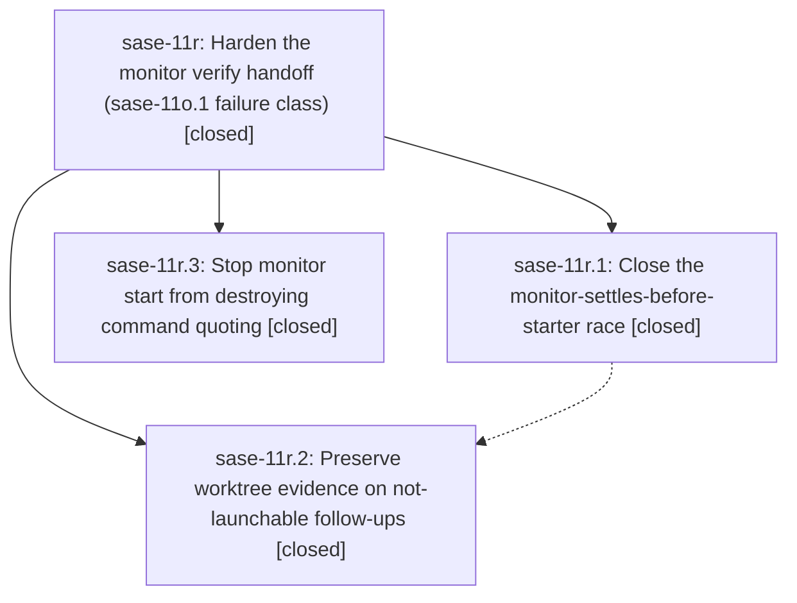

# Bead: sase-11r — Harden the monitor verify handoff (sase-11o.1 failure class)

[Bead Pages](../README.md) / sase-11r

**Status:** ✓ closed · **Resolution:** done · **Type:** ▸ plan · **Tier:** epic
**Owner:** `bryanbugyi34@gmail.com` · **Created by:** [bbugyi200.athena.0lx](https://github.com/sase-org/sase--agents/blob/main/families/bbugyi200.athena.0lx.md) · **Assignee:** `sase-11r.land`
**Created:** 2026-09-16 10:07:18 EDT · **Closed:** 2026-09-16 17:36:46 EDT
**Plan:** [202609/monitor\_verify\_handoff\_hardening.md](https://github.com/sase-org/sase--plans/blob/main/202609/monitor_verify_handoff_hardening.md)

<!-- sase:links:start -->

## Links

| Relation | Artifact | Why |
| --- | --- | --- |
| implemented-by | [plan:202609/monitor_verify_handoff_hardening.md][1] | derived from the plan's `bead_id:` frontmatter field |

[1]: https://github.com/sase-org/sase--plans/blob/main/202609/monitor_verify_handoff_hardening.md

<!-- sase:links:end -->

## Description

A fast-settling verify monitor no longer strands its family: the follow-up still dispatches once the starter settles, a not-launchable follow-up durably preserves the dirty worktree and names its recovery command, and monitor start never destroys command quoting.

## Notes

[2026-09-16T21:36:46Z · sase-11r.land] LANDED at master c05aa3a94a plus one land-agent integration change (committed by this land turn). VERIFY: reviewed the epic and its plan (plan:202609/monitor_verify_handoff_hardening.md); the epic bead has no notes of its own. Reviewed all three phases (all closed) and every child note. Read the actual source and tests of commits a36ff57c9d (sase-11r.3), 44f4c44170 (sase-11r.1) and fb1e7f576b (sase-11r.2) against each plan step.
- argv-quoting: start_command returns a single word verbatim and shlex.joins several words. The bash -c/sh -c warning goes to stderr only. The sase_monitor skill Hazards section is updated. Unit and e2e quoting tests exist.
- starter-race: persist_monitor_result waits, bounded by DEFAULT_STARTER_SETTLE_TIMEOUT_SECONDS, for the named starter's done.json and re-hydrates before stamping needs_recovery. Settlement's repair_missing_starter_parent_disposition re-evaluates once before not-launchable and backfills the node record, the monitor_result_manifest parent ids and the meta (clearing continuation_capture_error). Stopped/lost monitors stay exempt. I confirmed the starter persists its agent-delta continuation_node_id before writing done.json (run_agent_exec_finalize / run_agent_exec_monitor), so the wait is sound.
- recovery-evidence: worktree_recovery.py snapshots git diff HEAD plus untracked files to diagnostics/worktree_recovery.diff before claim release, on both not-launchable paths. It is skipped for a clean tree or a missing cwd, and every failure degrades to None. monitor_worktree_recovery_diff_path and monitor_id are copied into done.json. The wait_checks terminal-blocked notification adds `sase monitor resume <id>` and the snapshot path.
The two test-cost budget bumps and the sase-core-rs floor bump in 44f4c44170 are documented and unrelated. The phase-2 sase_questions skill rewording kept the test's exact phrase. Focused epic tests: 50 passed.
INTEGRATE: reviewed all 18 non-epic commits since a36ff57c9d. Only the 9fc5e4d5cd/e17d4e0c0a sase_questions skill edits touch epic files, and they are consistent with fb1e7f576b. The gate-intent, hold and tribe work does not touch monitor settlement or continuation capture. Integration change: `sase monitor resume` (src/sase/monitor/resume.py) now runs the epic's repair_missing_starter_parent_disposition before its capture_recovery refusal. The new wait_checks notification names that command as the recovery path, and without this change it refused every missing-starter-parent monitor unless given -k FILE, even after the starter had settled. Added two tests in tests/monitor/test_monitor_resume_manual.py: repair-then-launch, and still refusing while the parent is missing. The positive test fails without the change. Deployed the landed skill templates (sase_monitor/sase_questions plus the already-landed sase-11t skills) from a clean origin/master tree with the guarded `sase skill init -y`: 35 files, chezmoi 6905ded7 pushed and applied.
VERIFICATION: just fix; just check on the combined tree escalated to the full governed lane. All fmt/lint gates, symvision, SASE validation and committed plans passed; pytest: 42,376 passed / 14 skipped / 1 failed. The failure, tests/sdd/test_git_identity_fixture.py::test_sdd_git_identity_survives_empty_home_subprocess, is a nested-pytest temp-leak-guard flake on the shared /var/tmp root and passed in isolation. Not rerun as a separate check-full monitor: its test-cost lane repeats this suite, and its flake-baseline gate (tools/selection_health --fail-on-new-flake) is red repo-wide on the same 12 pre-existing nodes sase-11r.1 reported, none caused by this epic (details below).
FOLLOW-UPS:
- sase-11r.1 #1 (test_continuation_baseline leaks SASE_MONITOR_DIAGNOSTICS_DIR) duplicates ready task sase-114. Recorded a +1 after rechecking that line 105 still overrides only SASE_ARTIFACTS_DIR.
- sase-11r.1 #2 (12 flake-baseline nodes): no blanket task, which sase-zw.8.7.land also declined on 2026-09-15 with node-level dispositions; baseline correctness is being handled by sase-zw.8.7 remaining work and sase-11h.4. The git-identity node matches sase-120, where I recorded a +1 with this run's temp-leak-guard failure. The sase_questions node matches sase-11z, which is already fixed by e17d4e0c0a; I added a note there with the fixed-at retirement to use. Shell-writer and incremental nodes are existing tasks sase-10p and sase-10v. The remaining nodes passed in this full lane; declined as speculative without a same-tree intermittent mechanism.
- sase-11r.2 #1 (sudo canary false positive): the root cause is the bare b'8119' credential-length substring token in tests/test_sudo_acceptance.py, which belongs to active epic sase-110's phase sase-110.8 canary suite. Recorded as a DISCOVERED ISSUE note on sase-110 instead of a task.
epic-symbols sase-11r: no entries. No parent bead.

[2026-09-16T21:42:21Z · sase-11r.land] LANDING ADDENDUM: plan file marked status: done (committed with this land turn); just symvision after close: clean. While finalizing, 'sase final submit' refused bead_action close with unreadable_bead_status for this readable, closed bead. That is a systemic submit-time defect (135 refusals since 2026-09-12) with a credible causal link to active epic sase-zq, recorded there as a DISCOVERED ISSUE note rather than a new task. This land commit therefore declares keep; the epic was already closed by hand above.

## Phases

| Bead | Title | Status | Size | Created | Agents | Commits |
|---|---|---|---|---|---:|---:|
| [sase-11r.1](sase-11r.1.md) | Close the monitor-settles-before-starter race | ✓ closed | medium | 2026-09-16 | 1 | 1 |
| [sase-11r.2](sase-11r.2.md) | Preserve worktree evidence on not-launchable follow-ups | ✓ closed | medium | 2026-09-16 | 1 | 1 |
| [sase-11r.3](sase-11r.3.md) | Stop monitor start from destroying command quoting | ✓ closed | small | 2026-09-16 | 1 | 1 |

## Lineage

## Agents

| Agent | Bead | Commits |
|---|---|---:|
| [bbugyi200.athena.sase-11r.1](https://github.com/sase-org/sase--agents/blob/main/families/bbugyi200.athena.sase-11r.1.md) | [sase-11r.1](sase-11r.1.md) | 1 |
| [bbugyi200.athena.sase-11r.2](https://github.com/sase-org/sase--agents/blob/main/agents/bbugyi200.athena.sase-11r.2/README.md) | [sase-11r.2](sase-11r.2.md) | 1 |
| [bbugyi200.athena.sase-11r.3](https://github.com/sase-org/sase--agents/blob/main/agents/bbugyi200.athena.sase-11r.3/README.md) | [sase-11r.3](sase-11r.3.md) | 1 |
| [bbugyi200.athena.sase-11r.land](https://github.com/sase-org/sase--agents/blob/main/agents/bbugyi200.athena.sase-11r.land/README.md) | [sase-11r](README.md) | 1 |

## Commits

| Repo | Commit | Subject | Bead | Committed |
|---|---|---|---|---|
| sase | [`a36ff57`](https://github.com/sase-org/sase/commit/a36ff57c9d462edc77d000938724053459f9e529) | fix(monitor): stop monitor start from destroying command quoting | [sase-11r.3](sase-11r.3.md) | 2026-09-16 10:47:17 EDT |
| sase | [`44f4c44`](https://github.com/sase-org/sase/commit/44f4c441706f5c58ab92a9fe503954d154fa2b95) | fix(monitor): close the monitor-settles-before-starter race | [sase-11r.1](sase-11r.1.md) | 2026-09-16 13:07:09 EDT |
| sase | [`fb1e7f5`](https://github.com/sase-org/sase/commit/fb1e7f576b6c99a87a136094df9ce1b468e186fd) | fix(monitor): preserve recovery evidence for not-launchable follow-ups | [sase-11r.2](sase-11r.2.md) | 2026-09-16 14:29:12 EDT |
| sase | [`d0d5720`](https://github.com/sase-org/sase/commit/d0d5720b25937dd0e343011a8453f3eb730101bc) | fix(monitor): let monitor resume repair a missing starter parent | [sase-11r](README.md) | 2026-09-16 17:43:26 EDT |
