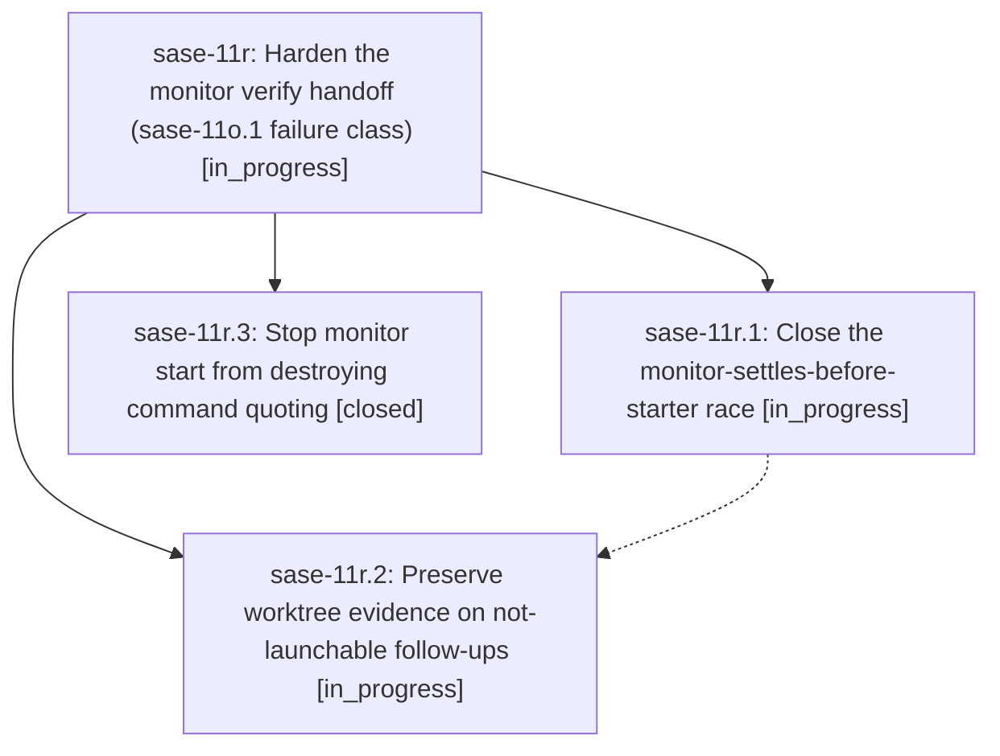

# Bead: sase-11r — Harden the monitor verify handoff (sase-11o.1 failure class)

[Bead Pages](../README.md) / sase-11r

**Status:** ◐ in_progress · **Type:** ▸ plan · **Tier:** epic
**Owner:** `bryanbugyi34@gmail.com` · **Created by:** [bbugyi200.athena.0lx](https://github.com/sase-org/sase--agents/blob/main/families/bbugyi200.athena.0lx.md) · **Assignee:** `sase-11r.land`
**Created:** 2026-09-16 10:07:18 EDT
**Plan:** [202609/monitor\_verify\_handoff\_hardening.md](https://github.com/sase-org/sase--plans/blob/main/202609/monitor_verify_handoff_hardening.md)

## Description

A fast-settling verify monitor no longer strands its family: the follow-up still dispatches once the starter settles, a not-launchable follow-up durably preserves the dirty worktree and names its recovery command, and monitor start never destroys command quoting.

## Phases

| Bead | Title | Status | Size | Created | Agents | Commits |
|---|---|---|---|---|---:|---:|
| [sase-11r.1](sase-11r.1.md) | Close the monitor-settles-before-starter race | ◐ in_progress | medium | 2026-09-16 | 1 | 0 |
| [sase-11r.2](sase-11r.2.md) | Preserve worktree evidence on not-launchable follow-ups | ◐ in_progress | medium | 2026-09-16 | 1 | 0 |
| [sase-11r.3](sase-11r.3.md) | Stop monitor start from destroying command quoting | ✓ closed | small | 2026-09-16 | 1 | 1 |

## Lineage

## Agents

| Agent | Bead | Commits |
|---|---|---:|
| [bbugyi200.athena.sase-11r.1](https://github.com/sase-org/sase--agents/blob/main/families/bbugyi200.athena.sase-11r.1.md) | [sase-11r.1](sase-11r.1.md) | 0 |
| [bbugyi200.athena.sase-11r.2](https://github.com/sase-org/sase--agents/blob/main/agents/bbugyi200.athena.sase-11r.2/README.md) | [sase-11r.2](sase-11r.2.md) | 0 |
| [bbugyi200.athena.sase-11r.3](https://github.com/sase-org/sase--agents/blob/main/agents/bbugyi200.athena.sase-11r.3/README.md) | [sase-11r.3](sase-11r.3.md) | 1 |
| [bbugyi200.athena.sase-11r.land](https://github.com/sase-org/sase--agents/blob/main/agents/bbugyi200.athena.sase-11r.land/README.md) | [sase-11r](README.md) | 0 |

## Commits

| Repo | Commit | Subject | Bead | Committed |
|---|---|---|---|---|
| sase | [`a36ff57`](https://github.com/sase-org/sase/commit/a36ff57c9d462edc77d000938724053459f9e529) | fix(monitor): stop monitor start from destroying command quoting | [sase-11r.3](sase-11r.3.md) | 2026-09-16 10:47:17 EDT |
