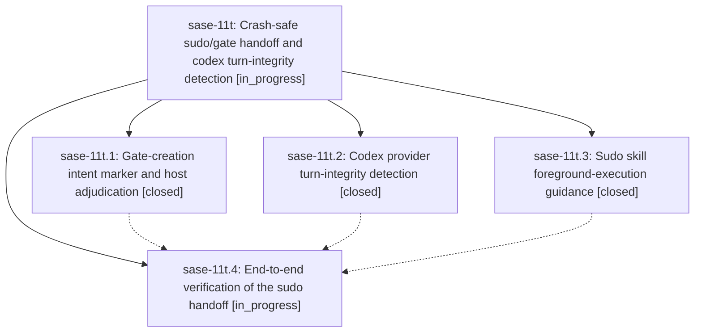

# Bead: sase-11t — Crash-safe sudo/gate handoff and codex turn-integrity detection

[Bead Pages](../README.md) / sase-11t

**Status:** ◐ in_progress · **Type:** ▸ plan · **Tier:** epic
**Owner:** `bryanbugyi34@gmail.com` · **Created by:** [bbugyi200.athena.0lw.r0.f0](https://github.com/sase-org/sase--agents/blob/main/families/bbugyi200.athena.0lw.r0.f0.md) · **Assignee:** `sase-11t.land`
**Created:** 2026-09-16 10:41:58 EDT
**Plan:** [202609/sudo\_gate\_crash\_safe\_handoff.md](https://github.com/sase-org/sase--plans/blob/main/202609/sudo_gate_crash_safe_handoff.md)

## Description

An in-agent gate creation that dies mid-flight can never end as a silent SUCCESS again: the host fails the run loudly, the codex provider detects aborted turns, and the sudo skill prevents the yield-and-abandon pattern.

## Phases

| Bead | Title | Status | Size | Created | Agents | Commits |
|---|---|---|---|---|---:|---:|
| [sase-11t.1](sase-11t.1.md) | Gate-creation intent marker and host adjudication | ✓ closed | large | 2026-09-16 | 1 | 1 |
| [sase-11t.2](sase-11t.2.md) | Codex provider turn-integrity detection | ✓ closed | medium | 2026-09-16 | 1 | 1 |
| [sase-11t.3](sase-11t.3.md) | Sudo skill foreground-execution guidance | ✓ closed | small | 2026-09-16 | 1 | 1 |
| [sase-11t.4](sase-11t.4.md) | End-to-end verification of the sudo handoff | ◐ in_progress | small | 2026-09-16 | 1 | 0 |

## Lineage

## Agents

| Agent | Bead | Commits |
|---|---|---:|
| [bbugyi200.athena.sase-11t.1](https://github.com/sase-org/sase--agents/blob/main/families/bbugyi200.athena.sase-11t.1.md) | [sase-11t.1](sase-11t.1.md) | 1 |
| [bbugyi200.athena.sase-11t.2](https://github.com/sase-org/sase--agents/blob/main/families/bbugyi200.athena.sase-11t.2.md) | [sase-11t.2](sase-11t.2.md) | 1 |
| [bbugyi200.athena.sase-11t.3](https://github.com/sase-org/sase--agents/blob/main/families/bbugyi200.athena.sase-11t.3.md) | [sase-11t.3](sase-11t.3.md) | 1 |
| [bbugyi200.athena.sase-11t.4](https://github.com/sase-org/sase--agents/blob/main/agents/bbugyi200.athena.sase-11t.4/README.md) | [sase-11t.4](sase-11t.4.md) | 0 |
| [bbugyi200.athena.sase-11t.land](https://github.com/sase-org/sase--agents/blob/main/agents/bbugyi200.athena.sase-11t.land/README.md) | [sase-11t](README.md) | 0 |

## Commits

| Repo | Commit | Subject | Bead | Committed |
|---|---|---|---|---|
| sase | [`9fc5e4d`](https://github.com/sase-org/sase/commit/9fc5e4d5cd884c66ea8e7bf96e3e7f97442c30c0) | docs(skills): add foreground-execution guidance to sudo/gate/run/questions skills | [sase-11t.3](sase-11t.3.md) | 2026-09-16 11:20:29 EDT |
| sase | [`491daa9`](https://github.com/sase-org/sase/commit/491daa988a2095e3b7ad32105135e87bb6adbf68) | fix(gates): adjudicate lost gate intents | [sase-11t.1](sase-11t.1.md) | 2026-09-16 12:14:25 EDT |
| sase | [`06a53a0`](https://github.com/sase-org/sase/commit/06a53a0e51ab815679e81f735a25d831458988c6) | fix(llm-provider): detect codex turn-integrity failures on empty-final killed-command turns | [sase-11t.2](sase-11t.2.md) | 2026-09-16 14:46:18 EDT |
