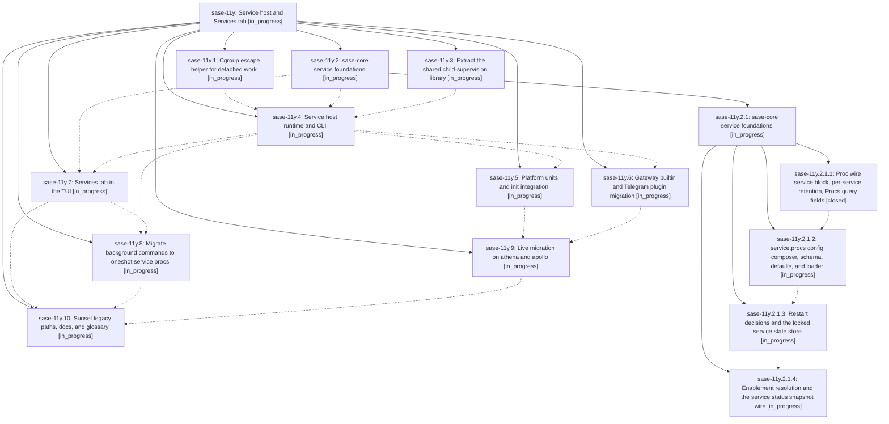

# Bead: sase-11y — Service host and Services tab

[Bead Pages](../README.md) / sase-11y

**Status:** ◐ in_progress · **Type:** ▸ plan · **Tier:** epic
**Owner:** `bryanbugyi34@gmail.com` · **Created by:** [bbugyi200.athena.0m3](https://github.com/sase-org/sase--agents/blob/main/families/bbugyi200.athena.0m3.md) · **Assignee:** `sase-11y.land`
**Created:** 2026-09-16 14:41:56 EDT
**Plan:** [202609/service\_host\_1.md](https://github.com/sase-org/sase--plans/blob/main/202609/service_host_1.md)

<!-- sase:links:start -->

## Links

| Relation | Artifact | Why |
| --- | --- | --- |
| implemented-by | [plan:202609/service_host_1.md][1] | derived from the plan's `bead_id:` frontmatter field |

[1]: https://github.com/sase-org/sase--plans/blob/main/202609/service_host_1.md

<!-- sase:links:end -->

## Description

Every SASE background process on a machine — the AXE scheduler, the mobile gateway, plugin daemons like the Telegram receiver, user daemons, and `!` background commands — is owned by one `sase service` host that a platform unit (systemd user unit on Linux, launchd LaunchAgent on macOS) starts at boot/login, controlled from one `sase service` CLI and one Services tab, with every legacy supervision path retired as its replacement lands.

## Phases

| Bead | Title | Status | Size | Created | Agents | Commits |
|---|---|---|---|---|---:|---:|
| [sase-11y.1](sase-11y.1.md) | Cgroup escape helper for detached work | ◐ in_progress | medium | 2026-09-16 | 1 | 0 |
| [sase-11y.10](sase-11y.10.md) | Sunset legacy paths, docs, and glossary | ◐ in_progress | large | 2026-09-16 | 1 | 0 |
| [sase-11y.2](sase-11y.2.md) | sase-core service foundations | ◐ in_progress | large | 2026-09-16 | 1 | 0 |
| [sase-11y.3](sase-11y.3.md) | Extract the shared child-supervision library | ◐ in_progress | medium | 2026-09-16 | 1 | 0 |
| [sase-11y.4](sase-11y.4.md) | Service host runtime and CLI | ◐ in_progress | large | 2026-09-16 | 1 | 0 |
| [sase-11y.5](sase-11y.5.md) | Platform units and init integration | ◐ in_progress | large | 2026-09-16 | 1 | 0 |
| [sase-11y.6](sase-11y.6.md) | Gateway builtin and Telegram plugin migration | ◐ in_progress | large | 2026-09-16 | 1 | 0 |
| [sase-11y.7](sase-11y.7.md) | Services tab in the TUI | ◐ in_progress | large | 2026-09-16 | 1 | 0 |
| [sase-11y.8](sase-11y.8.md) | Migrate background commands to oneshot service procs | ◐ in_progress | medium | 2026-09-16 | 1 | 0 |
| [sase-11y.9](sase-11y.9.md) | Live migration on athena and apollo | ◐ in_progress | medium | 2026-09-16 | 1 | 0 |

## Lineage

## Agents

| Agent | Bead | Commits |
|---|---|---:|
| [bbugyi200.athena.sase-11y.1](https://github.com/sase-org/sase--agents/blob/main/agents/bbugyi200.athena.sase-11y.1/README.md) | [sase-11y.1](sase-11y.1.md) | 0 |
| [bbugyi200.athena.sase-11y.10](https://github.com/sase-org/sase--agents/blob/main/agents/bbugyi200.athena.sase-11y.10/README.md) | [sase-11y.10](sase-11y.10.md) | 0 |
| [bbugyi200.athena.sase-11y.2](https://github.com/sase-org/sase--agents/blob/main/families/bbugyi200.athena.sase-11y.2.md) | [sase-11y.2](sase-11y.2.md) | 0 |
| [bbugyi200.athena.sase-11y.2.1.1](https://github.com/sase-org/sase--agents/blob/main/agents/bbugyi200.athena.sase-11y.2.1.1/README.md) | [sase-11y.2.1.1](sase-11y.2.1.1.md) | 2 |
| [bbugyi200.athena.sase-11y.2.1.2](https://github.com/sase-org/sase--agents/blob/main/agents/bbugyi200.athena.sase-11y.2.1.2/README.md) | [sase-11y.2.1.2](sase-11y.2.1.2.md) | 0 |
| [bbugyi200.athena.sase-11y.2.1.3](https://github.com/sase-org/sase--agents/blob/main/agents/bbugyi200.athena.sase-11y.2.1.3/README.md) | [sase-11y.2.1.3](sase-11y.2.1.3.md) | 0 |
| [bbugyi200.athena.sase-11y.2.1.4](https://github.com/sase-org/sase--agents/blob/main/agents/bbugyi200.athena.sase-11y.2.1.4/README.md) | [sase-11y.2.1.4](sase-11y.2.1.4.md) | 0 |
| [bbugyi200.athena.sase-11y.2.1.land](https://github.com/sase-org/sase--agents/blob/main/agents/bbugyi200.athena.sase-11y.2.1.land/README.md) | [sase-11y.2.1](sase-11y.2.1.md) | 0 |
| [bbugyi200.athena.sase-11y.3](https://github.com/sase-org/sase--agents/blob/main/families/bbugyi200.athena.sase-11y.3.md) | [sase-11y.3](sase-11y.3.md) | 0 |
| [bbugyi200.athena.sase-11y.4](https://github.com/sase-org/sase--agents/blob/main/agents/bbugyi200.athena.sase-11y.4/README.md) | [sase-11y.4](sase-11y.4.md) | 0 |
| [bbugyi200.athena.sase-11y.5](https://github.com/sase-org/sase--agents/blob/main/agents/bbugyi200.athena.sase-11y.5/README.md) | [sase-11y.5](sase-11y.5.md) | 0 |
| [bbugyi200.athena.sase-11y.6](https://github.com/sase-org/sase--agents/blob/main/agents/bbugyi200.athena.sase-11y.6/README.md) | [sase-11y.6](sase-11y.6.md) | 0 |
| [bbugyi200.athena.sase-11y.7](https://github.com/sase-org/sase--agents/blob/main/agents/bbugyi200.athena.sase-11y.7/README.md) | [sase-11y.7](sase-11y.7.md) | 0 |
| [bbugyi200.athena.sase-11y.8](https://github.com/sase-org/sase--agents/blob/main/agents/bbugyi200.athena.sase-11y.8/README.md) | [sase-11y.8](sase-11y.8.md) | 0 |
| [bbugyi200.athena.sase-11y.9](https://github.com/sase-org/sase--agents/blob/main/agents/bbugyi200.athena.sase-11y.9/README.md) | [sase-11y.9](sase-11y.9.md) | 0 |
| [bbugyi200.athena.sase-11y.land](https://github.com/sase-org/sase--agents/blob/main/agents/bbugyi200.athena.sase-11y.land/README.md) | [sase-11y](README.md) | 0 |

## Commits

| Repo | Commit | Subject | Bead | Committed |
|---|---|---|---|---|
| sase | [`5c0da1b`](https://github.com/sase-org/sase/commit/5c0da1be43816696d9c66d3bd1febb2eb3673e4b) | feat(procs): surface service metadata | [sase-11y.2.1.1](sase-11y.2.1.1.md) | 2026-09-16 16:58:56 EDT |
| sase-core | [`sase-core@4cee31a`](https://github.com/sase-org/sase-core/commit/4cee31acb81e7d304c5cdec04eaed426f33cec40) | feat(procs): add service proc wire metadata | [sase-11y.2.1.1](sase-11y.2.1.1.md) | 2026-09-16 17:02:07 EDT |
