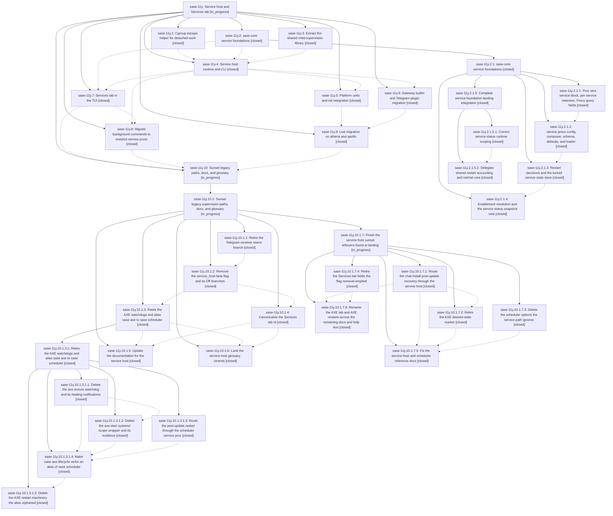

# Bead: sase-11y — Service host and Services tab

[Bead Pages](../README.md) / sase-11y

**Status:** ◐ in_progress · **Type:** ▸ plan · **Tier:** epic
**Owner:** `bryanbugyi34@gmail.com` · **Created by:** [bbugyi200.athena.0m3](https://github.com/sase-org/sase--agents/blob/main/families/bbugyi200.athena.0m3.md) · **Assignee:** `sase-11y.land`
**Created:** 2026-09-16 14:41:56 EDT
**Plan:** [202609/service\_host\_1.md](https://github.com/sase-org/sase--plans/blob/main/202609/service_host_1.md)

<!-- sase:links:start -->

## Links

| Relation | Artifact | Why |
| --- | --- | --- |
| implemented-by | [plan:202609/service_host_1.md][1] | derived from the plan's `bead_id:` frontmatter field |
| related | file:explicit:e6751fe4134815e6e564a922 | attached via sase artifact create --bead |

[1]: https://github.com/sase-org/sase--plans/blob/main/202609/service_host_1.md

<!-- sase:links:end -->

## Description

Every SASE background process on a machine — the AXE scheduler, the mobile gateway, plugin daemons like the Telegram receiver, user daemons, and `!` background commands — is owned by one `sase service` host that a platform unit (systemd user unit on Linux, launchd LaunchAgent on macOS) starts at boot/login, controlled from one `sase service` CLI and one Services tab, with every legacy supervision path retired as its replacement lands.

## Notes

[2026-09-19T12:23:43Z · sase-11l.11.5.land--1] DISCOVERED ISSUE: tests/ace/tui/actions/test_service_host_keys.py::test_x_does_not_toggle_the_host_on_nested_scheduler_rows fails deterministically on current master (423316a051 and origin 8989d0a724, which does not touch this file).

Reproduction (isolated, 1 failed in 3.79s):
  .venv/bin/python -m pytest tests/ace/tui/actions/test_service_host_keys.py::test_x_does_not_toggle_the_host_on_nested_scheduler_rows -q --tb=short

Assertion: host.calls == [] but got ['start-host'].

Cause: AxeMixin._toggle_or_kill_axe_view (src/sase/ace/tui/actions/axe.py) treats `_axe_service_selection is None` as "toggle the service host". Nested Scheduler rows (ChopItem / lumberjack children) set `_axe_service_selection = None` in `_derive_axe_view_from_selection` (axe_display/_loader_items.py) and never set a service-proc name, so `x` starts the host. The test was added in 485a6082e1 ("test: Add sase services tests") as a contract for sase-11y.7 Services-tab key routing.

Impact: just check-full test-cost is red on a clean tree; unrelated epic landings cannot close. Not caused by hold repairs or the core pin.

Evidence: file:monitor-stage:test-cost-924070-1789818373189266687-84ef1c63 monitor pz319b38sapt (sase-11l.11.5.land).

[2026-09-19T14:21:18Z · sase-11l.11.5.land.f0--code] The Services-tab `x` vs `!x` routing issue from LANDING BLOCKED / DISCOVERED ISSUE is fixed (plan:202609/landing_gate_test_failures_1.md). Bare `x` toggles a selected service proc and is a no-op on nested Scheduler rows, empty selection, and host chrome. `!x` on the Services tab always starts/stops the host. Tests in `tests/ace/tui/actions/test_service_host_keys.py` cover empty selection, nested rows, and `!x` with a proc selected. Leave this phase/epic open; remaining Services-tab work is unchanged.

[2026-09-20T15:14:37Z · sase-12z.5.2] DISCOVERED ISSUE: 18 ACE PNG goldens are stale on origin/master 58f2de8f8 because the sase-11y.7 Services-tab commit 92dd554c4 changed rendered output without refreshing them. Reproduce: 'just fix-tui-screenshots --check -- tests/ace/tui/visual/test_ace_png_snapshots_axe*.py tests/ace/tui/visual/test_ace_png_snapshots_help_panel.py tests/ace/tui/visual/test_ace_png_snapshots_link_rail.py' reports updated=18 unchanged=25. (1) 17 goldens: 16 axe_* (axe_chop_description, axe_chop_description_collapsed, axe_chop_overrun, axe_chop_report_absent/error/rich, axe_chop_run_info_panel, axe_chop_run_info_panel_running, axe_description_overflow, axe_disabled_chop_row, axe_empty, axe_long_label_widened, axe_lumberjack_description/error/tree, axe_selected_row) plus link_rail_axe_twelve_links_120x40. Cause: _TAB_COLORS['axe'] in src/sase/ace/tui/widgets/tab_bar.py went from #FF5F5F to #00D7AF in 92dd554c4; the pixel diff is only the active 'Services' tab label recolored red to teal. (2) help_keymaps_changespecs_120x40: the same commit changed the Bang Mode '!x' help row text to 'Start / stop service host or axe (or select process)' in ace/tui/modals/help_modal/{agents,patches}_bindings.py. Not a flake (deterministic on rerun) and not caused by the repairing commit, which never touches tab_bar.py or help text. Fix: run 'just fix-tui-screenshots' targeted at those modules and inspect the report before applying. Visible as red in 'just fix-tui-screenshots --check' and the CI visual-test job.

[2026-09-20T16:33:17Z · sase-12z.5.land] DISCOVERED ISSUE: phase sase-11y.7 (commit 92dd554c4, 'feat(tui): finish Services tab host chrome, health pill, and quit flow') changed rendered TUI output without committing the dirty screenshot goldens, leaving 18 PNG goldens stale on master. It changed _TAB_COLORS['axe'] in src/sase/ace/tui/widgets/tab_bar.py from #FF5F5F to #00D7AF, so the active Services tab label renders teal instead of red in every AXE-surface golden, and it reworded the '!x' help entry to 'Start / stop service host or ...'. Found on 2026-09-20 by the sase-12z.5 land agent: a complete 'just test-visual' at master 624a29ea7 reported created=0 updated=19 unchanged=690 with update groups representative axe_chop_description_120x40.png (17 members) and help_keymaps_changespecs_120x40.png. I reviewed both groups against expected/actual captures, confirmed the only differences are the intended tab accent and the reworded binding, and refreshed all 18 as part of landing sase-12z.5 (axe_chop_description, axe_chop_description_collapsed, axe_chop_overrun, axe_chop_report_absent, axe_chop_report_error, axe_chop_report_rich, axe_chop_run_info_panel, axe_chop_run_info_panel_running, axe_description_overflow, axe_disabled_chop_row, axe_empty, axe_long_label_widened, axe_lumberjack_description, axe_lumberjack_error, axe_lumberjack_tree, axe_selected_row, help_keymaps_changespecs, link_rail_axe_twelve_links). No action is needed on the goldens; the note is here so this epic's remaining phases run 'just fix-tui-screenshots' after any further Services-tab rendering change — that requirement is now in the canonical finalizer skill (sase-12z.5.1, commit 3538713c0).

[2026-09-20T21:03:39Z · 0o9--code] DISCOVERED ISSUE: `just check` fails at lint (feature flags) on origin/master ec7dbbfdf with `rule 7: closed flag bead 'sase-12m' still has a surviving 'service_host' definition` (SASE_SYMVISION_BEAD_STATUS_ONLY=1 BD_COMMAND=tools/sase_bead tools/check_feature_flags). Cause: flag bead sase-12m was closed at 2026-09-20T19:11:15Z by phase sase-11y.10.1.2, whose note #1 says FeatureFlag.service_host, its registry definition and its schema property are deleted. That removal is not on origin/master as of a fresh fetch at about 20:50Z: src/sase/feature_flags/registry.py still defines FeatureFlag.service_host (lines 35 and 151), and sase-11y.10.1.2 was still IN_PROGRESS. The bead store is shared across workspaces, so the close is visible to every agent at once while the code is not, and `just check` is red for all of them until the change lands. Reproduced on a clean tree with local changes stashed. No new task filed: it should clear when the phase's change reaches master.

[2026-09-20T22:49:49Z · 18--code] DISCOVERED ISSUE: 'just check' stops at 'lint (feature flags)' on master 4255afbb05 with 'rule 7: closed flag bead sase-12m still has a surviving service_host definition' (tools/check_feature_flags, run via SASE_SYMVISION_BEAD_STATUS_ONLY=1 BD_COMMAND=tools/sase_bead). Flag bead sase-12m (Retire service_host) is closed (2026-09-20T19:11Z) but the service_host flag definition is still present, so the gate is red until the removal phase (sase-11y.10.1.x) lands. The same tree also fails symvision on 27 unused public symbols in service/host_support.py and service/host_reporting.py (tracked as sase-13s). Found by an unrelated agent (Update-panel provider detail work); reproduced on a tree with none of these files touched.

## Phases

| Bead | Title | Status | Size | Created | Agents | Commits |
|---|---|---|---|---|---:|---:|
| [sase-11y.1](sase-11y.1.md) | Cgroup escape helper for detached work | ✓ closed | medium | 2026-09-16 | 1 | 1 |
| [sase-11y.10](sase-11y.10.md) | Sunset legacy paths, docs, and glossary | ◐ in_progress | large | 2026-09-16 | 1 | 0 |
| [sase-11y.2](sase-11y.2.md) | sase-core service foundations | ✓ closed | large | 2026-09-16 | 1 | 0 |
| [sase-11y.3](sase-11y.3.md) | Extract the shared child-supervision library | ✓ closed | medium | 2026-09-16 | 1 | 1 |
| [sase-11y.4](sase-11y.4.md) | Service host runtime and CLI | ✓ closed | large | 2026-09-16 | 1 | 1 |
| [sase-11y.5](sase-11y.5.md) | Platform units and init integration | ✓ closed | large | 2026-09-16 | 1 | 2 |
| [sase-11y.6](sase-11y.6.md) | Gateway builtin and Telegram plugin migration | ✓ closed | large | 2026-09-16 | 1 | 1 |
| [sase-11y.7](sase-11y.7.md) | Services tab in the TUI | ✓ closed | large | 2026-09-16 | 1 | 2 |
| [sase-11y.8](sase-11y.8.md) | Migrate background commands to oneshot service procs | ✓ closed | medium | 2026-09-16 | 1 | 1 |
| [sase-11y.9](sase-11y.9.md) | Live migration on athena and apollo | ✓ closed | medium | 2026-09-16 | 1 | 0 |

## Lineage

## Agents

| Agent | Bead | Commits |
|---|---|---:|
| [bbugyi200.athena.sase-11y.1](https://github.com/sase-org/sase--agents/blob/main/agents/bbugyi200.athena.sase-11y.1/README.md) | [sase-11y.1](sase-11y.1.md) | 1 |
| [bbugyi200.athena.sase-11y.10](https://github.com/sase-org/sase--agents/blob/main/families/bbugyi200.athena.sase-11y.10.md) | [sase-11y.10](sase-11y.10.md) | 0 |
| [bbugyi200.athena.sase-11y.10.1.1](https://github.com/sase-org/sase--agents/blob/main/agents/bbugyi200.athena.sase-11y.10.1.1/README.md) | [sase-11y.10.1.1](sase-11y.10.1.1.md) | 0 |
| [bbugyi200.athena.sase-11y.10.1.2](https://github.com/sase-org/sase--agents/blob/main/families/bbugyi200.athena.sase-11y.10.1.2.md) | [sase-11y.10.1.2](sase-11y.10.1.2.md) | 1 |
| [bbugyi200.athena.sase-11y.10.1.3](https://github.com/sase-org/sase--agents/blob/main/families/bbugyi200.athena.sase-11y.10.1.3.md) | [sase-11y.10.1.3](sase-11y.10.1.3.md) | 0 |
| [bbugyi200.athena.sase-11y.10.1.3.1.1](https://github.com/sase-org/sase--agents/blob/main/agents/bbugyi200.athena.sase-11y.10.1.3.1.1/README.md) | [sase-11y.10.1.3.1.1](sase-11y.10.1.3.1.1.md) | 1 |
| [bbugyi200.athena.sase-11y.10.1.3.1.2](https://github.com/sase-org/sase--agents/blob/main/families/bbugyi200.athena.sase-11y.10.1.3.1.2.md) | [sase-11y.10.1.3.1.2](sase-11y.10.1.3.1.2.md) | 1 |
| [bbugyi200.athena.sase-11y.10.1.3.1.3](https://github.com/sase-org/sase--agents/blob/main/agents/bbugyi200.athena.sase-11y.10.1.3.1.3/README.md) | [sase-11y.10.1.3.1.3](sase-11y.10.1.3.1.3.md) | 1 |
| [bbugyi200.athena.sase-11y.10.1.3.1.4](https://github.com/sase-org/sase--agents/blob/main/agents/bbugyi200.athena.sase-11y.10.1.3.1.4/README.md) | [sase-11y.10.1.3.1.4](sase-11y.10.1.3.1.4.md) | 1 |
| [bbugyi200.athena.sase-11y.10.1.3.1.5](https://github.com/sase-org/sase--agents/blob/main/agents/bbugyi200.athena.sase-11y.10.1.3.1.5/README.md) | [sase-11y.10.1.3.1.5](sase-11y.10.1.3.1.5.md) | 1 |
| [bbugyi200.athena.sase-11y.10.1.3.1.land](https://github.com/sase-org/sase--agents/blob/main/agents/bbugyi200.athena.sase-11y.10.1.3.1.land/README.md) | [sase-11y.10.1.3.1](sase-11y.10.1.3.1.md) | 2 |
| [bbugyi200.athena.sase-11y.10.1.4](https://github.com/sase-org/sase--agents/blob/main/families/bbugyi200.athena.sase-11y.10.1.4.md) | [sase-11y.10.1.4](sase-11y.10.1.4.md) | 1 |
| [bbugyi200.athena.sase-11y.10.1.5](https://github.com/sase-org/sase--agents/blob/main/agents/bbugyi200.athena.sase-11y.10.1.5/README.md) | [sase-11y.10.1.5](sase-11y.10.1.5.md) | 1 |
| [bbugyi200.athena.sase-11y.10.1.6](https://github.com/sase-org/sase--agents/blob/main/agents/bbugyi200.athena.sase-11y.10.1.6/README.md) | [sase-11y.10.1.6](sase-11y.10.1.6.md) | 1 |
| [bbugyi200.athena.sase-11y.10.1.7.1](https://github.com/sase-org/sase--agents/blob/main/agents/bbugyi200.athena.sase-11y.10.1.7.1/README.md) | [sase-11y.10.1.7.1](sase-11y.10.1.7.1.md) | 1 |
| [bbugyi200.athena.sase-11y.10.1.7.2](https://github.com/sase-org/sase--agents/blob/main/agents/bbugyi200.athena.sase-11y.10.1.7.2/README.md) | [sase-11y.10.1.7.2](sase-11y.10.1.7.2.md) | 1 |
| [bbugyi200.athena.sase-11y.10.1.7.3](https://github.com/sase-org/sase--agents/blob/main/agents/bbugyi200.athena.sase-11y.10.1.7.3/README.md) | [sase-11y.10.1.7.3](sase-11y.10.1.7.3.md) | 1 |
| [bbugyi200.athena.sase-11y.10.1.7.4](https://github.com/sase-org/sase--agents/blob/main/agents/bbugyi200.athena.sase-11y.10.1.7.4/README.md) | [sase-11y.10.1.7.4](sase-11y.10.1.7.4.md) | 1 |
| [bbugyi200.athena.sase-11y.10.1.7.5](https://github.com/sase-org/sase--agents/blob/main/agents/bbugyi200.athena.sase-11y.10.1.7.5/README.md) | [sase-11y.10.1.7.5](sase-11y.10.1.7.5.md) | 1 |
| [bbugyi200.athena.sase-11y.10.1.7.6](https://github.com/sase-org/sase--agents/blob/main/agents/bbugyi200.athena.sase-11y.10.1.7.6/README.md) | [sase-11y.10.1.7.6](sase-11y.10.1.7.6.md) | 1 |
| [bbugyi200.athena.sase-11y.10.1.7.land](https://github.com/sase-org/sase--agents/blob/main/agents/bbugyi200.athena.sase-11y.10.1.7.land/README.md) | [sase-11y.10.1.7](sase-11y.10.1.7.md) | 0 |
| [bbugyi200.athena.sase-11y.10.1.land](https://github.com/sase-org/sase--agents/blob/main/families/bbugyi200.athena.sase-11y.10.1.land.md) | [sase-11y.10.1](sase-11y.10.1.md) | 0 |
| [bbugyi200.athena.sase-11y.2](https://github.com/sase-org/sase--agents/blob/main/families/bbugyi200.athena.sase-11y.2.md) | [sase-11y.2](sase-11y.2.md) | 0 |
| [bbugyi200.athena.sase-11y.2.1.1](https://github.com/sase-org/sase--agents/blob/main/agents/bbugyi200.athena.sase-11y.2.1.1/README.md) | [sase-11y.2.1.1](sase-11y.2.1.1.md) | 2 |
| [bbugyi200.athena.sase-11y.2.1.2](https://github.com/sase-org/sase--agents/blob/main/families/bbugyi200.athena.sase-11y.2.1.2.md) | [sase-11y.2.1.2](sase-11y.2.1.2.md) | 2 |
| [bbugyi200.athena.sase-11y.2.1.3](https://github.com/sase-org/sase--agents/blob/main/agents/bbugyi200.athena.sase-11y.2.1.3/README.md) | [sase-11y.2.1.3](sase-11y.2.1.3.md) | 2 |
| [bbugyi200.athena.sase-11y.2.1.4](https://github.com/sase-org/sase--agents/blob/main/agents/bbugyi200.athena.sase-11y.2.1.4/README.md) | [sase-11y.2.1.4](sase-11y.2.1.4.md) | 2 |
| [bbugyi200.athena.sase-11y.2.1.5.1](https://github.com/sase-org/sase--agents/blob/main/agents/bbugyi200.athena.sase-11y.2.1.5.1/README.md) | [sase-11y.2.1.5.1](sase-11y.2.1.5.1.md) | 1 |
| [bbugyi200.athena.sase-11y.2.1.5.2](https://github.com/sase-org/sase--agents/blob/main/agents/bbugyi200.athena.sase-11y.2.1.5.2/README.md) | [sase-11y.2.1.5.2](sase-11y.2.1.5.2.md) | 1 |
| [bbugyi200.athena.sase-11y.2.1.5.land](https://github.com/sase-org/sase--agents/blob/main/families/bbugyi200.athena.sase-11y.2.1.5.land.md) | [sase-11y.2.1.5](sase-11y.2.1.5.md) | 1 |
| [bbugyi200.athena.sase-11y.3](https://github.com/sase-org/sase--agents/blob/main/families/bbugyi200.athena.sase-11y.3.md) | [sase-11y.3](sase-11y.3.md) | 1 |
| [bbugyi200.athena.sase-11y.4](https://github.com/sase-org/sase--agents/blob/main/families/bbugyi200.athena.sase-11y.4.md) | [sase-11y.4](sase-11y.4.md) | 1 |
| [bbugyi200.athena.sase-11y.5](https://github.com/sase-org/sase--agents/blob/main/families/bbugyi200.athena.sase-11y.5.md) | [sase-11y.5](sase-11y.5.md) | 2 |
| [bbugyi200.athena.sase-11y.6](https://github.com/sase-org/sase--agents/blob/main/families/bbugyi200.athena.sase-11y.6.md) | [sase-11y.6](sase-11y.6.md) | 1 |
| [bbugyi200.athena.sase-11y.7](https://github.com/sase-org/sase--agents/blob/main/families/bbugyi200.athena.sase-11y.7.md) | [sase-11y.7](sase-11y.7.md) | 2 |
| [bbugyi200.athena.sase-11y.8](https://github.com/sase-org/sase--agents/blob/main/agents/bbugyi200.athena.sase-11y.8/README.md) | [sase-11y.8](sase-11y.8.md) | 1 |
| [bbugyi200.athena.sase-11y.9](https://github.com/sase-org/sase--agents/blob/main/agents/bbugyi200.athena.sase-11y.9/README.md) | [sase-11y.9](sase-11y.9.md) | 0 |
| [bbugyi200.athena.sase-11y.land](https://github.com/sase-org/sase--agents/blob/main/agents/bbugyi200.athena.sase-11y.land/README.md) | [sase-11y](README.md) | 0 |

## Commits

| Repo | Commit | Subject | Bead | Committed |
|---|---|---|---|---|
| sase | [`5c0da1b`](https://github.com/sase-org/sase/commit/5c0da1be43816696d9c66d3bd1febb2eb3673e4b) | feat(procs): surface service metadata | [sase-11y.2.1.1](sase-11y.2.1.1.md) | 2026-09-16 16:58:56 EDT |
| sase-core | [`sase-core@4cee31a`](https://github.com/sase-org/sase-core/commit/4cee31acb81e7d304c5cdec04eaed426f33cec40) | feat(procs): add service proc wire metadata | [sase-11y.2.1.1](sase-11y.2.1.1.md) | 2026-09-16 17:02:07 EDT |
| sase | [`dfb07cb`](https://github.com/sase-org/sase/commit/dfb07cbbbdff4c9f1e9808a79aef92599ebb4ac4) | refactor(axe): extract child-supervision logic into supervision-lib | [sase-11y.3](sase-11y.3.md) | 2026-09-16 17:49:35 EDT |
| sase | [`86458d2`](https://github.com/sase-org/sase/commit/86458d2607813e23d3004415579d209bec0fc529) | feat(scope): escape detached work from service cgroups | [sase-11y.1](sase-11y.1.md) | 2026-09-16 17:57:07 EDT |
| sase | [`c74fb37`](https://github.com/sase-org/sase/commit/c74fb37065a69795d0f592f87729202bac12be91) | feat(service): add service.procs config composer, schema, defaults, and loader | [sase-11y.2.1.2](sase-11y.2.1.2.md) | 2026-09-17 10:06:09 EDT |
| sase-core | [`sase-core@51ae484`](https://github.com/sase-org/sase-core/commit/51ae484ea8c85be15a8e8594b6e0785afca1dfe6) | feat(service): add service\_config\_compose composer and PyO3 binding | [sase-11y.2.1.2](sase-11y.2.1.2.md) | 2026-09-17 10:21:36 EDT |
| sase | [`13ea3da`](https://github.com/sase-org/sase/commit/13ea3da511e4c5673a41873be1f1ddaba08232ad) | feat(service): add restart and state facades | [sase-11y.2.1.3](sase-11y.2.1.3.md) | 2026-09-17 11:40:22 EDT |
| sase-core | [`sase-core@a756136`](https://github.com/sase-org/sase-core/commit/a756136bcf545eb5681236d22e818b731b693910) | feat(service): add restart and state core | [sase-11y.2.1.3](sase-11y.2.1.3.md) | 2026-09-17 11:41:27 EDT |
| sase | [`05c6094`](https://github.com/sase-org/sase/commit/05c6094b80894b3f9623d20c5259900835c732b6) | feat(service): add status snapshot facade | [sase-11y.2.1.4](sase-11y.2.1.4.md) | 2026-09-17 19:22:40 EDT |
| sase-core | [`sase-core@fe7c4a0`](https://github.com/sase-org/sase-core/commit/fe7c4a0e6c555af3100c9c7463b7e982ec2cfa4f) | feat(service): add status snapshot wire | [sase-11y.2.1.4](sase-11y.2.1.4.md) | 2026-09-17 19:24:46 EDT |
| sase-core | [`sase-core@3c75d2e`](https://github.com/sase-org/sase-core/commit/3c75d2e6f5bdeb4fe7f88ef5ff542c524a61283e) | fix(service): scope service status stops by boot | [sase-11y.2.1.5.1](sase-11y.2.1.5.1.md) | 2026-09-17 19:54:03 EDT |
| sase | [`6e06a3e`](https://github.com/sase-org/sase/commit/6e06a3e24c691c87afaf53b43cefd89d24d6e97f) | fix(supervision): align restart and gate decisions with core | [sase-11y.2.1.5.2](sase-11y.2.1.5.2.md) | 2026-09-17 22:49:42 EDT |
| sase--plans | [`sase--plans@e916ec0`](https://github.com/sase-org/sase--plans/commit/e916ec0414bcf375babe6976333b8fad1623eafa) | docs(plans): record completed service foundations landing | [sase-11y.2.1.5](sase-11y.2.1.5.md) | 2026-09-17 23:27:01 EDT |
| sase | [`9ecf40c`](https://github.com/sase-org/sase/commit/9ecf40c5d60a9f9f8478e2d6a854c5934ae1cdd2) | feat(service): add beta service host runtime CLI | [sase-11y.4](sase-11y.4.md) | 2026-09-18 05:31:15 EDT |
| sase | [`c2befdb`](https://github.com/sase-org/sase/commit/c2befdbb3e83e6531c61d28af5dacb91f661ce16) | feat(tui): add services tab controls | [sase-11y.7](sase-11y.7.md) | 2026-09-18 06:59:19 EDT |
| sase | [`e92e6c9`](https://github.com/sase-org/sase/commit/e92e6c91c1ed4f8ff8d8f83250674d7dd46dbf61) | feat(mobile): move gateway to service host | [sase-11y.6](sase-11y.6.md) | 2026-09-18 07:49:43 EDT |
| sase | [`3fb42fa`](https://github.com/sase-org/sase/commit/3fb42fa11ee2ba0539a085484edb2e3f98e6dd1f) | feat(service): add platform unit integration | [sase-11y.5](sase-11y.5.md) | 2026-09-18 09:07:18 EDT |
| sase | [`23c740a`](https://github.com/sase-org/sase/commit/23c740a9aab8eb0f6a2e24abfab9e5cfb02321c0) | feat(service): finish native platform units and init integration | [sase-11y.5](sase-11y.5.md) | 2026-09-19 09:57:17 EDT |
| sase | [`92dd554`](https://github.com/sase-org/sase/commit/92dd554c4cc33db81ae9232a31d1a31d5cc2f493) | feat(tui): finish Services tab host chrome, health pill, and quit flow | [sase-11y.7](sase-11y.7.md) | 2026-09-20 07:32:38 EDT |
| sase | [`9316a24`](https://github.com/sase-org/sase/commit/9316a24e5b05016e0819c9f3a5e687a84f878d99) | feat(service): run ! background commands as transient oneshot service procs | [sase-11y.8](sase-11y.8.md) | 2026-09-20 13:36:06 EDT |
| sase | [`ef99009`](https://github.com/sase-org/sase/commit/ef990099089ba524972140bd4268631e11c74b29) | refactor(service): remove the service\_host beta flag and its Off branches | [sase-11y.10.1.2](sase-11y.10.1.2.md) | 2026-09-20 17:08:43 EDT |
| sase | [`0806937`](https://github.com/sase-org/sase/commit/08069374675ab58558336be75bef2e8dbb8fe866) | feat(axe): delete the axe ensure watchdog and its healing notifications | [sase-11y.10.1.3.1.1](sase-11y.10.1.3.1.1.md) | 2026-09-20 22:20:59 EDT |
| sase | [`d653162`](https://github.com/sase-org/sase/commit/d65316234ccf22a570969fef0561fc455e00eadf) | refactor(update): restart scheduler via service-proc after update | [sase-11y.10.1.3.1.3](sase-11y.10.1.3.1.3.md) | 2026-09-20 22:24:05 EDT |
| sase | [`c833ff3`](https://github.com/sase-org/sase/commit/c833ff3e5435457f991f47dd19cc120863e7f6bd) | refactor(axe): delete axe-start systemd scope wrapper and its evidence | [sase-11y.10.1.3.1.2](sase-11y.10.1.3.1.2.md) | 2026-09-21 00:22:52 EDT |
| sase | [`0508f28`](https://github.com/sase-org/sase/commit/0508f288fb34fdb5786629bde28066c1217c48fb) | refactor(axe): alias sase axe lifecycle verbs to sase scheduler | [sase-11y.10.1.3.1.4](sase-11y.10.1.3.1.4.md) | 2026-09-21 01:07:10 EDT |
| sase | [`b87c8e3`](https://github.com/sase-org/sase/commit/b87c8e3eef8554ba6a31a9be1aa84fe34f285304) | refactor(axe): delete AXE restart machinery orphaned by scheduler alias | [sase-11y.10.1.3.1.5](sase-11y.10.1.3.1.5.md) | 2026-09-21 01:50:35 EDT |
| sase | [`b27b023`](https://github.com/sase-org/sase/commit/b27b02323719eb6dca1288403b77a700ef9f1a37) | feat(ace): canonicalize the Services tab id with axe as legacy alias | [sase-11y.10.1.4](sase-11y.10.1.4.md) | 2026-09-21 02:29:05 EDT |
| sase | [`103db4b`](https://github.com/sase-org/sase/commit/103db4bfa8af0a114efecf109a02b8298701f2a6) | refactor(axe): retire leftovers of the AXE CLI sunset epic | [sase-11y.10.1.3.1](sase-11y.10.1.3.1.md) | 2026-09-21 03:02:19 EDT |
| sase--plans | [`sase--plans@d798718`](https://github.com/sase-org/sase--plans/commit/d798718ddd828de453b24406cac4d67e1ba7240f) | chore(plans): mark axe\_cli\_sunset done | [sase-11y.10.1.3.1](sase-11y.10.1.3.1.md) | 2026-09-21 03:06:02 EDT |
| sase | [`3016e92`](https://github.com/sase-org/sase/commit/3016e92d2edaa30e1d6bb6d7a1082fa409ccdecb) | feat(glossary): land the service-host glossary strands | [sase-11y.10.1.6](sase-11y.10.1.6.md) | 2026-09-21 03:13:01 EDT |
| sase | [`0ea0f5a`](https://github.com/sase-org/sase/commit/0ea0f5a7b3102b717228d32bdd974f870e57b19b) | docs(service-host): rewrite docs around the scheduler/host split | [sase-11y.10.1.5](sase-11y.10.1.5.md) | 2026-09-21 03:28:21 EDT |
| sase | [`ff7efa0`](https://github.com/sase-org/sase/commit/ff7efa0190c8902f0282315ff54d9401943e9f69) | refactor(scheduler-cli): drop service-ignored options from scheduler start\|restart | [sase-11y.10.1.7.3](sase-11y.10.1.7.3.md) | 2026-09-21 04:16:32 EDT |
| sase | [`62c902f`](https://github.com/sase-org/sase/commit/62c902f0deccaead6b32de6a88fef9bc83e37aa5) | feat(chat-restart): route chat-install recovery through scheduler service host | [sase-11y.10.1.7.1](sase-11y.10.1.7.1.md) | 2026-09-21 04:25:43 EDT |
| sase | [`3fbe914`](https://github.com/sase-org/sase/commit/3fbe914fb1a920af5f2cfa3fc3b1b7053b5c8f5f) | refactor(services-tab): retire flag-emptied TUI dead state | [sase-11y.10.1.7.4](sase-11y.10.1.7.4.md) | 2026-09-21 04:46:22 EDT |
| sase | [`0a43e09`](https://github.com/sase-org/sase/commit/0a43e09d64620d04fe52f3d72c3634ac6ca8af51) | refactor(axe): retire desired-state marker in favor of scheduler-derived state | [sase-11y.10.1.7.2](sase-11y.10.1.7.2.md) | 2026-09-21 04:47:59 EDT |
| sase | [`2328b07`](https://github.com/sase-org/sase/commit/2328b07ab81702aec7701490781df2b34e72c621) | docs(scheduler): rewrite axe/configuration docs around scheduler proc model | [sase-11y.10.1.7.5](sase-11y.10.1.7.5.md) | 2026-09-21 05:07:56 EDT |
| sase | [`d9ae431`](https://github.com/sase-org/sase/commit/d9ae431dc719bdfc5e4a686c200c5c02f4f32593) | docs(surfaces): rename AXE tab and AXE restarts to Services tab and scheduler | [sase-11y.10.1.7.6](sase-11y.10.1.7.6.md) | 2026-09-21 05:35:52 EDT |
