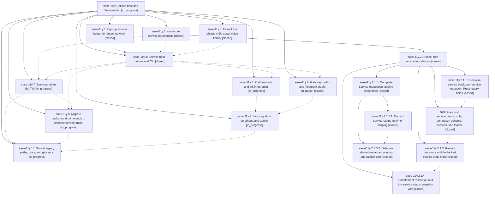

# Bead: sase-11y — Service host and Services tab

[Bead Pages](../README.md) / sase-11y

**Status:** ◐ in_progress · **Type:** ▸ plan · **Tier:** epic
**Owner:** `bryanbugyi34@gmail.com` · **Created by:** [bbugyi200.athena.0m3](https://github.com/sase-org/sase--agents/blob/main/families/bbugyi200.athena.0m3.md) · **Assignee:** `sase-11y.land`
**Created:** 2026-09-16 14:41:56 EDT
**Plan:** [202609/service\_host\_1.md](https://github.com/sase-org/sase--plans/blob/main/202609/service_host_1.md)

<!-- sase:links:start -->

## Links

| Relation | Artifact | Why |
| --- | --- | --- |
| implemented-by | [plan:202609/service_host_1.md][1] | derived from the plan's `bead_id:` frontmatter field |

[1]: https://github.com/sase-org/sase--plans/blob/main/202609/service_host_1.md

<!-- sase:links:end -->

## Description

Every SASE background process on a machine — the AXE scheduler, the mobile gateway, plugin daemons like the Telegram receiver, user daemons, and `!` background commands — is owned by one `sase service` host that a platform unit (systemd user unit on Linux, launchd LaunchAgent on macOS) starts at boot/login, controlled from one `sase service` CLI and one Services tab, with every legacy supervision path retired as its replacement lands.

## Phases

| Bead | Title | Status | Size | Created | Agents | Commits |
|---|---|---|---|---|---:|---:|
| [sase-11y.1](sase-11y.1.md) | Cgroup escape helper for detached work | ✓ closed | medium | 2026-09-16 | 1 | 1 |
| [sase-11y.10](sase-11y.10.md) | Sunset legacy paths, docs, and glossary | ◐ in_progress | large | 2026-09-16 | 1 | 0 |
| [sase-11y.2](sase-11y.2.md) | sase-core service foundations | ✓ closed | large | 2026-09-16 | 1 | 0 |
| [sase-11y.3](sase-11y.3.md) | Extract the shared child-supervision library | ✓ closed | medium | 2026-09-16 | 1 | 1 |
| [sase-11y.4](sase-11y.4.md) | Service host runtime and CLI | ✓ closed | large | 2026-09-16 | 1 | 1 |
| [sase-11y.5](sase-11y.5.md) | Platform units and init integration | ◐ in_progress | large | 2026-09-16 | 1 | 0 |
| [sase-11y.6](sase-11y.6.md) | Gateway builtin and Telegram plugin migration | ✓ closed | large | 2026-09-16 | 1 | 1 |
| [sase-11y.7](sase-11y.7.md) | Services tab in the TUI | ◐ in_progress | large | 2026-09-16 | 1 | 1 |
| [sase-11y.8](sase-11y.8.md) | Migrate background commands to oneshot service procs | ◐ in_progress | medium | 2026-09-16 | 1 | 0 |
| [sase-11y.9](sase-11y.9.md) | Live migration on athena and apollo | ◐ in_progress | medium | 2026-09-16 | 1 | 0 |

## Lineage

## Agents

| Agent | Bead | Commits |
|---|---|---:|
| [bbugyi200.athena.sase-11y.1](https://github.com/sase-org/sase--agents/blob/main/agents/bbugyi200.athena.sase-11y.1/README.md) | [sase-11y.1](sase-11y.1.md) | 1 |
| [bbugyi200.athena.sase-11y.10](https://github.com/sase-org/sase--agents/blob/main/agents/bbugyi200.athena.sase-11y.10/README.md) | [sase-11y.10](sase-11y.10.md) | 0 |
| [bbugyi200.athena.sase-11y.2](https://github.com/sase-org/sase--agents/blob/main/families/bbugyi200.athena.sase-11y.2.md) | [sase-11y.2](sase-11y.2.md) | 0 |
| [bbugyi200.athena.sase-11y.2.1.1](https://github.com/sase-org/sase--agents/blob/main/agents/bbugyi200.athena.sase-11y.2.1.1/README.md) | [sase-11y.2.1.1](sase-11y.2.1.1.md) | 2 |
| [bbugyi200.athena.sase-11y.2.1.2](https://github.com/sase-org/sase--agents/blob/main/families/bbugyi200.athena.sase-11y.2.1.2.md) | [sase-11y.2.1.2](sase-11y.2.1.2.md) | 2 |
| [bbugyi200.athena.sase-11y.2.1.3](https://github.com/sase-org/sase--agents/blob/main/agents/bbugyi200.athena.sase-11y.2.1.3/README.md) | [sase-11y.2.1.3](sase-11y.2.1.3.md) | 2 |
| [bbugyi200.athena.sase-11y.2.1.4](https://github.com/sase-org/sase--agents/blob/main/agents/bbugyi200.athena.sase-11y.2.1.4/README.md) | [sase-11y.2.1.4](sase-11y.2.1.4.md) | 2 |
| [bbugyi200.athena.sase-11y.2.1.5.1](https://github.com/sase-org/sase--agents/blob/main/agents/bbugyi200.athena.sase-11y.2.1.5.1/README.md) | [sase-11y.2.1.5.1](sase-11y.2.1.5.1.md) | 1 |
| [bbugyi200.athena.sase-11y.2.1.5.2](https://github.com/sase-org/sase--agents/blob/main/agents/bbugyi200.athena.sase-11y.2.1.5.2/README.md) | [sase-11y.2.1.5.2](sase-11y.2.1.5.2.md) | 1 |
| [bbugyi200.athena.sase-11y.2.1.5.land](https://github.com/sase-org/sase--agents/blob/main/families/bbugyi200.athena.sase-11y.2.1.5.land.md) | [sase-11y.2.1.5](sase-11y.2.1.5.md) | 1 |
| [bbugyi200.athena.sase-11y.2.1.land](https://github.com/sase-org/sase--agents/blob/main/families/bbugyi200.athena.sase-11y.2.1.land.md) | [sase-11y.2.1](sase-11y.2.1.md) | 0 |
| [bbugyi200.athena.sase-11y.3](https://github.com/sase-org/sase--agents/blob/main/families/bbugyi200.athena.sase-11y.3.md) | [sase-11y.3](sase-11y.3.md) | 1 |
| [bbugyi200.athena.sase-11y.4](https://github.com/sase-org/sase--agents/blob/main/families/bbugyi200.athena.sase-11y.4.md) | [sase-11y.4](sase-11y.4.md) | 1 |
| [bbugyi200.athena.sase-11y.5](https://github.com/sase-org/sase--agents/blob/main/families/bbugyi200.athena.sase-11y.5.md) | [sase-11y.5](sase-11y.5.md) | 0 |
| [bbugyi200.athena.sase-11y.6](https://github.com/sase-org/sase--agents/blob/main/families/bbugyi200.athena.sase-11y.6.md) | [sase-11y.6](sase-11y.6.md) | 1 |
| [bbugyi200.athena.sase-11y.7](https://github.com/sase-org/sase--agents/blob/main/families/bbugyi200.athena.sase-11y.7.md) | [sase-11y.7](sase-11y.7.md) | 1 |
| [bbugyi200.athena.sase-11y.8](https://github.com/sase-org/sase--agents/blob/main/agents/bbugyi200.athena.sase-11y.8/README.md) | [sase-11y.8](sase-11y.8.md) | 0 |
| [bbugyi200.athena.sase-11y.9](https://github.com/sase-org/sase--agents/blob/main/agents/bbugyi200.athena.sase-11y.9/README.md) | [sase-11y.9](sase-11y.9.md) | 0 |
| [bbugyi200.athena.sase-11y.land](https://github.com/sase-org/sase--agents/blob/main/agents/bbugyi200.athena.sase-11y.land/README.md) | [sase-11y](README.md) | 0 |

## Commits

| Repo | Commit | Subject | Bead | Committed |
|---|---|---|---|---|
| sase | [`5c0da1b`](https://github.com/sase-org/sase/commit/5c0da1be43816696d9c66d3bd1febb2eb3673e4b) | feat(procs): surface service metadata | [sase-11y.2.1.1](sase-11y.2.1.1.md) | 2026-09-16 16:58:56 EDT |
| sase-core | [`sase-core@4cee31a`](https://github.com/sase-org/sase-core/commit/4cee31acb81e7d304c5cdec04eaed426f33cec40) | feat(procs): add service proc wire metadata | [sase-11y.2.1.1](sase-11y.2.1.1.md) | 2026-09-16 17:02:07 EDT |
| sase | [`dfb07cb`](https://github.com/sase-org/sase/commit/dfb07cbbbdff4c9f1e9808a79aef92599ebb4ac4) | refactor(axe): extract child-supervision logic into supervision-lib | [sase-11y.3](sase-11y.3.md) | 2026-09-16 17:49:35 EDT |
| sase | [`86458d2`](https://github.com/sase-org/sase/commit/86458d2607813e23d3004415579d209bec0fc529) | feat(scope): escape detached work from service cgroups | [sase-11y.1](sase-11y.1.md) | 2026-09-16 17:57:07 EDT |
| sase | [`c74fb37`](https://github.com/sase-org/sase/commit/c74fb37065a69795d0f592f87729202bac12be91) | feat(service): add service.procs config composer, schema, defaults, and loader | [sase-11y.2.1.2](sase-11y.2.1.2.md) | 2026-09-17 10:06:09 EDT |
| sase-core | [`sase-core@51ae484`](https://github.com/sase-org/sase-core/commit/51ae484ea8c85be15a8e8594b6e0785afca1dfe6) | feat(service): add service\_config\_compose composer and PyO3 binding | [sase-11y.2.1.2](sase-11y.2.1.2.md) | 2026-09-17 10:21:36 EDT |
| sase | [`13ea3da`](https://github.com/sase-org/sase/commit/13ea3da511e4c5673a41873be1f1ddaba08232ad) | feat(service): add restart and state facades | [sase-11y.2.1.3](sase-11y.2.1.3.md) | 2026-09-17 11:40:22 EDT |
| sase-core | [`sase-core@a756136`](https://github.com/sase-org/sase-core/commit/a756136bcf545eb5681236d22e818b731b693910) | feat(service): add restart and state core | [sase-11y.2.1.3](sase-11y.2.1.3.md) | 2026-09-17 11:41:27 EDT |
| sase | [`05c6094`](https://github.com/sase-org/sase/commit/05c6094b80894b3f9623d20c5259900835c732b6) | feat(service): add status snapshot facade | [sase-11y.2.1.4](sase-11y.2.1.4.md) | 2026-09-17 19:22:40 EDT |
| sase-core | [`sase-core@fe7c4a0`](https://github.com/sase-org/sase-core/commit/fe7c4a0e6c555af3100c9c7463b7e982ec2cfa4f) | feat(service): add status snapshot wire | [sase-11y.2.1.4](sase-11y.2.1.4.md) | 2026-09-17 19:24:46 EDT |
| sase-core | [`sase-core@3c75d2e`](https://github.com/sase-org/sase-core/commit/3c75d2e6f5bdeb4fe7f88ef5ff542c524a61283e) | fix(service): scope service status stops by boot | [sase-11y.2.1.5.1](sase-11y.2.1.5.1.md) | 2026-09-17 19:54:03 EDT |
| sase | [`6e06a3e`](https://github.com/sase-org/sase/commit/6e06a3e24c691c87afaf53b43cefd89d24d6e97f) | fix(supervision): align restart and gate decisions with core | [sase-11y.2.1.5.2](sase-11y.2.1.5.2.md) | 2026-09-17 22:49:42 EDT |
| sase--plans | [`sase--plans@e916ec0`](https://github.com/sase-org/sase--plans/commit/e916ec0414bcf375babe6976333b8fad1623eafa) | docs(plans): record completed service foundations landing | [sase-11y.2.1.5](sase-11y.2.1.5.md) | 2026-09-17 23:27:01 EDT |
| sase | [`9ecf40c`](https://github.com/sase-org/sase/commit/9ecf40c5d60a9f9f8478e2d6a854c5934ae1cdd2) | feat(service): add beta service host runtime CLI | [sase-11y.4](sase-11y.4.md) | 2026-09-18 05:31:15 EDT |
| sase | [`c2befdb`](https://github.com/sase-org/sase/commit/c2befdbb3e83e6531c61d28af5dacb91f661ce16) | feat(tui): add services tab controls | [sase-11y.7](sase-11y.7.md) | 2026-09-18 06:59:19 EDT |
| sase | [`e92e6c9`](https://github.com/sase-org/sase/commit/e92e6c91c1ed4f8ff8d8f83250674d7dd46dbf61) | feat(mobile): move gateway to service host | [sase-11y.6](sase-11y.6.md) | 2026-09-18 07:49:43 EDT |
