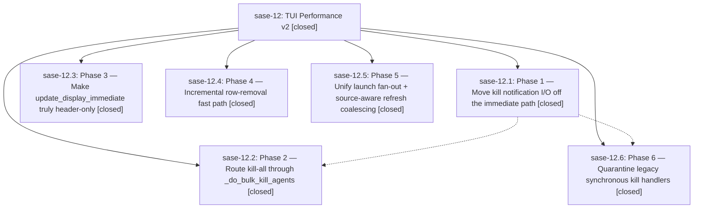

# Bead: sase-12 — TUI Performance v2

[Bead Pages](../README.md) / sase-12

**Status:** ✓ closed · **Resolution:** (unrecorded) · **Type:** plan · **Tier:** epic
**Owner:** `bryanbugyi34@gmail.com`
**Created:** 2026-04-28 22:45:04 UTC · **Closed:** 2026-04-28 23:21:58 UTC
**Plan:** [202604/tui\_perf\_v2.md](https://github.com/sase-org/sase--plans/blob/main/202604/tui_perf_v2.md)

## Description

Phased implementation plan to eliminate main-thread hot spots and overly-broad refreshes in the TUI Agents tab. See plans/202604/tui_perf_v2.md.

## Phases

| Bead | Title | Status | Size | Agents | Commits |
|---|---|---|---|---:|---:|
| [sase-12.1](sase-12.1.md) | Phase 1 — Move kill notification I/O off the immediate path | ✓ closed | small | 0 | 1 |
| [sase-12.2](sase-12.2.md) | Phase 2 — Route kill-all through \_do\_bulk\_kill\_agents | ✓ closed | small | 0 | 1 |
| [sase-12.3](sase-12.3.md) | Phase 3 — Make update\_display\_immediate truly header-only | ✓ closed | small | 0 | 1 |
| [sase-12.4](sase-12.4.md) | Phase 4 — Incremental row-removal fast path | ✓ closed | small | 0 | 1 |
| [sase-12.5](sase-12.5.md) | Phase 5 — Unify launch fan-out + source-aware refresh coalescing | ✓ closed | small | 0 | 1 |
| [sase-12.6](sase-12.6.md) | Phase 6 — Quarantine legacy synchronous kill handlers | ✓ closed | small | 0 | 1 |

## Lineage

## Commits

| Commit | Subject | Bead | Committed (UTC) |
|---|---|---|---|
| [`c7ff0dc`](https://github.com/sase-org/sase/commit/c7ff0dc239ec0436f6131ec1c6ad316d0e2098f4) | feat(ace/tui): make \`update\_display\_immediate\` truly header-only (sase-12.3) | [sase-12.3](sase-12.3.md) | 2026-04-28 22:55:13 |
| [`4d0c252`](https://github.com/sase-org/sase/commit/4d0c252d7a6c5268476e6606b5bcb259ca63782c) | feat: move kill notification I/O off the immediate path (sase-12.1) | [sase-12.1](sase-12.1.md) | 2026-04-28 22:58:41 |
| [`156face`](https://github.com/sase-org/sase/commit/156face4685e0dec827a3915379750b1df3567e1) | feat(ace/tui/perf): unify launch fan-out + coalesce refresh (sase-12.5) | [sase-12.5](sase-12.5.md) | 2026-04-28 23:04:05 |
| [`4b13664`](https://github.com/sase-org/sase/commit/4b13664c6ae3a07fa1b5df835dc36667dd82f7a0) | feat(ace/tui): incremental row-removal fast path for kill+dismiss (sase-12.4) | [sase-12.4](sase-12.4.md) | 2026-04-28 23:06:48 |
| [`70d6438`](https://github.com/sase-org/sase/commit/70d64381bc23af079c3fc6e31ec8f651b2a670f2) | feat(ace/tui): route kill-all through \`\_do\_bulk\_kill\_agents\` (sase-12.2) | [sase-12.2](sase-12.2.md) | 2026-04-28 23:12:07 |
| [`75c2508`](https://github.com/sase-org/sase/commit/75c2508f15e585d2eb85c49bcafc06b63cc80bc4) | ref: quarantine legacy synchronous kill handlers (sase-12.6) | [sase-12.6](sase-12.6.md) | 2026-04-28 23:14:43 |
