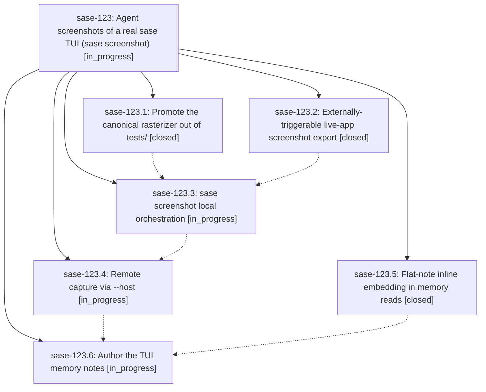

# Bead: sase-123 — Agent screenshots of a real sase TUI (sase screenshot)

[Bead Pages](../README.md) / sase-123

**Status:** ◐ in_progress · **Type:** ▸ plan · **Tier:** epic
**Owner:** `bryanbugyi34@gmail.com` · **Created by:** [bbugyi200.athena.0m5](https://github.com/sase-org/sase--agents/blob/main/families/bbugyi200.athena.0m5.md) · **Assignee:** `sase-123.land`
**Created:** 2026-09-17 08:43:26 EDT
**Plan:** [202609/tui\_agent\_screenshots.md](https://github.com/sase-org/sase--plans/blob/main/202609/tui_agent_screenshots.md)

<!-- sase:links:start -->

## Links

| Relation | Artifact | Why |
| --- | --- | --- |
| implemented-by | [plan:202609/tui_agent_screenshots.md][1] | derived from the plan's `bead_id:` frontmatter field |

[1]: https://github.com/sase-org/sase--plans/blob/main/202609/tui_agent_screenshots.md

<!-- sase:links:end -->

## Description

Agents can launch a real `sase tui` locally or on a remote machine, drive it with keypresses, and capture a canonical PNG of the live screen; TUI memory is restructured under a new tui.md reference note that inlines tui_screenshot.md and tui_perf.md.

## Notes

[2026-09-17T14:10:15Z · sase-11y.2.1.2--2] DISCOVERED ISSUE: just lint (and therefore just check / just check-full) fails mypy on a fresh ephemeral workspace after phase sase-123.1's commit 7aef3364e2 (feat(tui): promote visual rasterizer) landed. That commit added src/sase/ace/tui/visual_render.py, which imports resvg_py at module scope. resvg_py lives only in pyproject.toml's optional [visual] extras group, but _lint-mypy: _setup (Justfile) installs only the default/dev extras, not [visual]. Repro: mypy src/sase/ace/tui/visual_render.py:38: error: Cannot find implementation or library stub for module named "resvg_py" [import-not-found]. CI's master-gate/ci.yml lint job also uses the default 'install' recipe (not 'install-visual') via .github/actions/setup-sase, so this likely reproduces in CI's lint job too, not just local ephemeral workspaces. Installing the [visual] extras group locally (uv pip install -e '.[dev,visual]') made mypy and the rest of just lint pass cleanly with 0 errors, confirming this is a missing-dependency-in-default-lint-install gap rather than a code defect. Likely fixes: either have visual_render.py's resvg_py import be mypy-tolerant (type: ignore / guarded import) since it is a soft/optional-extra dependency of source (not test) code, or make the lint gate install [visual] extras. Found incidentally while repairing an unrelated rebase conflict in the Justfile's symvision --epic-symbol list; not otherwise related to this epic's remaining phases.

## Phases

| Bead | Title | Status | Size | Created | Agents | Commits |
|---|---|---|---|---|---:|---:|
| [sase-123.1](sase-123.1.md) | Promote the canonical rasterizer out of tests/ | ✓ closed | small | 2026-09-17 | 1 | 1 |
| [sase-123.2](sase-123.2.md) | Externally-triggerable live-app screenshot export | ✓ closed | medium | 2026-09-17 | 1 | 1 |
| [sase-123.3](sase-123.3.md) | sase screenshot local orchestration | ◐ in_progress | medium | 2026-09-17 | 1 | 0 |
| [sase-123.4](sase-123.4.md) | Remote capture via --host | ◐ in_progress | medium | 2026-09-17 | 1 | 0 |
| [sase-123.5](sase-123.5.md) | Flat-note inline embedding in memory reads | ✓ closed | medium | 2026-09-17 | 1 | 1 |
| [sase-123.6](sase-123.6.md) | Author the TUI memory notes | ◐ in_progress | small | 2026-09-17 | 1 | 0 |

## Lineage

## Agents

| Agent | Bead | Commits |
|---|---|---:|
| [bbugyi200.athena.sase-123.1](https://github.com/sase-org/sase--agents/blob/main/agents/bbugyi200.athena.sase-123.1/README.md) | [sase-123.1](sase-123.1.md) | 1 |
| [bbugyi200.athena.sase-123.2](https://github.com/sase-org/sase--agents/blob/main/agents/bbugyi200.athena.sase-123.2/README.md) | [sase-123.2](sase-123.2.md) | 1 |
| [bbugyi200.athena.sase-123.3](https://github.com/sase-org/sase--agents/blob/main/agents/bbugyi200.athena.sase-123.3/README.md) | [sase-123.3](sase-123.3.md) | 0 |
| [bbugyi200.athena.sase-123.4](https://github.com/sase-org/sase--agents/blob/main/agents/bbugyi200.athena.sase-123.4/README.md) | [sase-123.4](sase-123.4.md) | 0 |
| [bbugyi200.athena.sase-123.5](https://github.com/sase-org/sase--agents/blob/main/agents/bbugyi200.athena.sase-123.5/README.md) | [sase-123.5](sase-123.5.md) | 1 |
| [bbugyi200.athena.sase-123.6](https://github.com/sase-org/sase--agents/blob/main/agents/bbugyi200.athena.sase-123.6/README.md) | [sase-123.6](sase-123.6.md) | 0 |
| [bbugyi200.athena.sase-123.land](https://github.com/sase-org/sase--agents/blob/main/agents/bbugyi200.athena.sase-123.land/README.md) | [sase-123](README.md) | 0 |

## Commits

| Repo | Commit | Subject | Bead | Committed |
|---|---|---|---|---|
| sase | [`7aef336`](https://github.com/sase-org/sase/commit/7aef3364e22929aba2bc495306313ff17189c549) | feat(tui): promote visual rasterizer | [sase-123.1](sase-123.1.md) | 2026-09-17 09:55:49 EDT |
| sase | [`797feeb`](https://github.com/sase-org/sase/commit/797feeb62dcb34d1a6e0616a56d06afbdead6bc4) | feat(tui): add live screenshot export | [sase-123.2](sase-123.2.md) | 2026-09-17 10:09:10 EDT |
| sase | [`863892b`](https://github.com/sase-org/sase/commit/863892b3491e85378cf5c13a080be5f0243ec744) | feat(memory): inline flat note memory links | [sase-123.5](sase-123.5.md) | 2026-09-17 10:42:20 EDT |
