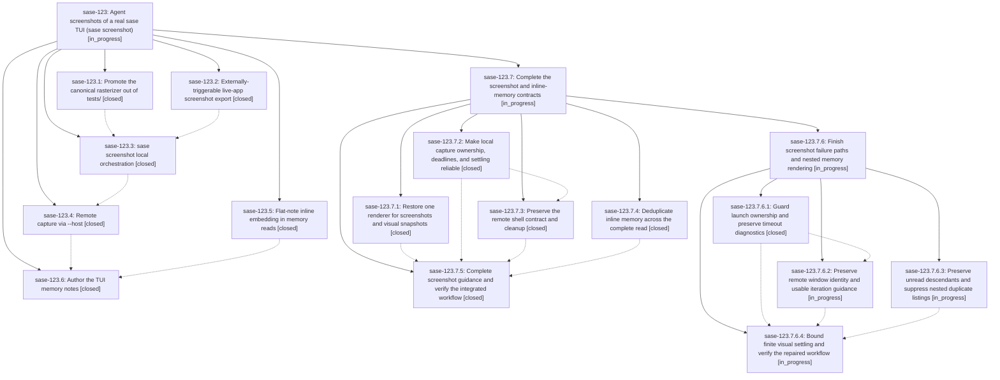

# Bead: sase-123 — Agent screenshots of a real sase TUI (sase screenshot)

[Bead Pages](../README.md) / sase-123

**Status:** ◐ in_progress · **Type:** ▸ plan · **Tier:** epic
**Owner:** `bryanbugyi34@gmail.com` · **Created by:** [bbugyi200.athena.0m5](https://github.com/sase-org/sase--agents/blob/main/families/bbugyi200.athena.0m5.md) · **Assignee:** `sase-123.land`
**Created:** 2026-09-17 08:43:26 EDT
**Plan:** [202609/tui\_agent\_screenshots.md](https://github.com/sase-org/sase--plans/blob/main/202609/tui_agent_screenshots.md)

<!-- sase:links:start -->

## Links

| Relation | Artifact | Why |
| --- | --- | --- |
| implemented-by | [plan:202609/tui_agent_screenshots.md][1] | derived from the plan's `bead_id:` frontmatter field |

[1]: https://github.com/sase-org/sase--plans/blob/main/202609/tui_agent_screenshots.md

<!-- sase:links:end -->

## Description

Agents can launch a real `sase tui` locally or on a remote machine, drive it with keypresses, and capture a canonical PNG of the live screen; TUI memory is restructured under a new tui.md reference note that inlines tui_screenshot.md and tui_perf.md.

## Notes

[2026-09-17T14:10:15Z · sase-11y.2.1.2--2] DISCOVERED ISSUE: just lint (and therefore just check / just check-full) fails mypy on a fresh ephemeral workspace after phase sase-123.1's commit 7aef3364e2 (feat(tui): promote visual rasterizer) landed. That commit added src/sase/ace/tui/visual_render.py, which imports resvg_py at module scope. resvg_py lives only in pyproject.toml's optional [visual] extras group, but _lint-mypy: _setup (Justfile) installs only the default/dev extras, not [visual]. Repro: mypy src/sase/ace/tui/visual_render.py:38: error: Cannot find implementation or library stub for module named "resvg_py" [import-not-found]. CI's master-gate/ci.yml lint job also uses the default 'install' recipe (not 'install-visual') via .github/actions/setup-sase, so this likely reproduces in CI's lint job too, not just local ephemeral workspaces. Installing the [visual] extras group locally (uv pip install -e '.[dev,visual]') made mypy and the rest of just lint pass cleanly with 0 errors, confirming this is a missing-dependency-in-default-lint-install gap rather than a code defect. Likely fixes: either have visual_render.py's resvg_py import be mypy-tolerant (type: ignore / guarded import) since it is a soft/optional-extra dependency of source (not test) code, or make the lint gate install [visual] extras. Found incidentally while repairing an unrelated rebase conflict in the Justfile's symvision --epic-symbol list; not otherwise related to this epic's remaining phases.

[2026-09-17T20:17:01Z · 0d--code] DISCOVERED ISSUE: During unrelated sudo working-directory repair verification on 2026-09-17, `just check` in workspace 16 failed at lint (symvision) before the scoped test lane. The failure is deterministic config hygiene, not a flake: `--epic-symbol 'sase-123.3(render_svg_to_png)'` points at closed phase `sase-123.3`, and symvision reports: "bead 'sase-123.3' is closed. Remove this stale --epic-symbol entry and clean up the symbol." The local sudo diff does not touch the Justfile/symvision config or screenshot code. Because active epic `sase-123` owns closed phase `sase-123.3` and still has open phases, route the cleanup here rather than creating a separate task.

[2026-09-18T01:12:06Z · sase-123.land] LANDING AUDIT at c199dcb6ca on 2026-09-17: leaving sase-123 open and its linked plan unchanged because the implementation is incomplete. Read both epic notes, every child and all seven child notes, the accepted plan, six epic commits, current source/tests, and the 31 non-epic commits since the first epic commit. Fetched origin/master matches HEAD; no parent bead. Durable audit: file:explicit:66624d11a0d4d2c8d4fbead9.

CONFIRMED REMAINING WORK: (1) Concurrent 5e4c866eb5 removed the promoted renderer and 37d1b2592e put its implementation in tests/ace/tui/visual/png_diff.py; phase 3 restored src/sase/ace/tui/visual_render.py without repointing tests. There are now TWO rasterizers, violating the central contract. (2) Real isolated tmux reproduction: two create_agent_tmux_window calls both return sase_tmux_1 with distinct PIDs; resolving the second name targets the first PID and both use the same request dir. The reused launcher falsely assumes tmux rejects duplicate display names. This inherited defect must be integrated for the new keep/iteration contract. (3) Successful new-window followed by injected resize failure invokes no cleanup; launch subprocess timeouts are all None. (4) Replaying the actual SSH shell boundary with a harmless local argv printer turns wait regex 'Agents Ready|Loading' into a shell pipeline and exits 127 (Loading: not found). (5) The actual remote cleanup command exits 1 (rm: missing operand) and leaves the SVG behind. Existing transport mocks do not model shell parsing. (6) Isolated memory fixtures show shared inline bodies twice across requested roots, reference-before-inline targets still in Linked References, and embedded children still in JSON Children. The real tui.md read duplicates the tui_perf reference. (7) Source review finds only fixed 100 ms startup delay/one refresh rather than the approved finite visual convergence, plus incomplete overall deadlines and fragile timeout diagnostics; these need targeted delayed-render acceptance, not a claimed live reproduction. (8) tui_screenshot.md omits several explicitly required workflow/troubleshooting details from phase 6.

ORIGINAL NOTE DISPOSITIONS: epic note 1 is fixed by 73e4318edf's resvg_py mypy overrides; focused mypy with --no-site-packages --follow-imports=skip passes for the runtime renderer (runtime import is lazy). Epic note 2's exemption was removed in 5e4c866eb5, although that commit introduced the renderer relocation above. Current sase bead epic-symbols sase-123 returns no entries. Preserve newer sase-124/124.8 attention/capacity/refresh work, sase-127 stable-search/fleet work, grouping/layout/detail pickers, shared sudo target resolution, and sase-126's core floor/visual repairs.

ALL PROPOSAL OUTCOMES: the sole PROPOSED FOLLOW-UP is sase-123.1 note 1, broad ambient visual drift. Used sase_new_task, all-status searches and last-week ci sweep, inspected sase-x5/sase-10u and active epic scopes including sase-126/.2, then recorded inherited observation/impact evidence on existing sase-x5 (+10). This is not a fresh full-suite failure or common-cause claim. fd626ec222 (sase-126.2) subsequently reports a full visual pass after fixture fixes and reviewed rebaselining. No new duplicate or speculative task. Recheck current visual results and carry this disposition into the eventual close note.

CHECKS: 93 focused screenshot/launcher/export and memory selector/render/mutation tests passed in 21.85s. The just test attempt reached an unexpected Rust LSP setup rebuild and was stopped; the focused suite ran directly with the workspace interpreter after the cached binding updated to 0.34.50. No check-full or full visual pass is claimed. No tracked source, canonical memory, or original plan was edited. Prepared remaining-only five-phase epic proposal sase_plan_complete_tui_screenshots.md with parent_bead=sase-123; it passed validate --explain and revalidation with zero warnings. Phases cover renderer reunification, local lifecycle, SSH contract, memory deduplication, and workflow guidance/acceptance. Submitting via sase_plan. After the child lands, re-read descendants/notes/plans and post-child drift, run governed landing verification, retire any new exemptions, and close normally only when the original contract is satisfied. Do not force-close or mark the original plan done before then.

## Phases

| Bead | Title | Status | Size | Created | Agents | Commits |
|---|---|---|---|---|---:|---:|
| [sase-123.1](sase-123.1.md) | Promote the canonical rasterizer out of tests/ | ✓ closed | small | 2026-09-17 | 1 | 1 |
| [sase-123.2](sase-123.2.md) | Externally-triggerable live-app screenshot export | ✓ closed | medium | 2026-09-17 | 1 | 1 |
| [sase-123.3](sase-123.3.md) | sase screenshot local orchestration | ✓ closed | medium | 2026-09-17 | 1 | 1 |
| [sase-123.4](sase-123.4.md) | Remote capture via --host | ✓ closed | medium | 2026-09-17 | 1 | 1 |
| [sase-123.5](sase-123.5.md) | Flat-note inline embedding in memory reads | ✓ closed | medium | 2026-09-17 | 1 | 1 |
| [sase-123.6](sase-123.6.md) | Author the TUI memory notes | ✓ closed | small | 2026-09-17 | 1 | 1 |

## Lineage

## Agents

| Agent | Bead | Commits |
|---|---|---:|
| [bbugyi200.athena.sase-123.1](https://github.com/sase-org/sase--agents/blob/main/agents/bbugyi200.athena.sase-123.1/README.md) | [sase-123.1](sase-123.1.md) | 1 |
| [bbugyi200.athena.sase-123.2](https://github.com/sase-org/sase--agents/blob/main/agents/bbugyi200.athena.sase-123.2/README.md) | [sase-123.2](sase-123.2.md) | 1 |
| [bbugyi200.athena.sase-123.3](https://github.com/sase-org/sase--agents/blob/main/agents/bbugyi200.athena.sase-123.3/README.md) | [sase-123.3](sase-123.3.md) | 1 |
| [bbugyi200.athena.sase-123.4](https://github.com/sase-org/sase--agents/blob/main/agents/bbugyi200.athena.sase-123.4/README.md) | [sase-123.4](sase-123.4.md) | 1 |
| [bbugyi200.athena.sase-123.5](https://github.com/sase-org/sase--agents/blob/main/agents/bbugyi200.athena.sase-123.5/README.md) | [sase-123.5](sase-123.5.md) | 1 |
| [bbugyi200.athena.sase-123.6](https://github.com/sase-org/sase--agents/blob/main/agents/bbugyi200.athena.sase-123.6/README.md) | [sase-123.6](sase-123.6.md) | 1 |
| [bbugyi200.athena.sase-123.7.1](https://github.com/sase-org/sase--agents/blob/main/agents/bbugyi200.athena.sase-123.7.1/README.md) | [sase-123.7.1](sase-123.7.1.md) | 1 |
| [bbugyi200.athena.sase-123.7.2](https://github.com/sase-org/sase--agents/blob/main/agents/bbugyi200.athena.sase-123.7.2/README.md) | [sase-123.7.2](sase-123.7.2.md) | 1 |
| [bbugyi200.athena.sase-123.7.3](https://github.com/sase-org/sase--agents/blob/main/agents/bbugyi200.athena.sase-123.7.3/README.md) | [sase-123.7.3](sase-123.7.3.md) | 1 |
| [bbugyi200.athena.sase-123.7.4](https://github.com/sase-org/sase--agents/blob/main/agents/bbugyi200.athena.sase-123.7.4/README.md) | [sase-123.7.4](sase-123.7.4.md) | 1 |
| [bbugyi200.athena.sase-123.7.5](https://github.com/sase-org/sase--agents/blob/main/agents/bbugyi200.athena.sase-123.7.5/README.md) | [sase-123.7.5](sase-123.7.5.md) | 1 |
| [bbugyi200.athena.sase-123.7.6.1](https://github.com/sase-org/sase--agents/blob/main/agents/bbugyi200.athena.sase-123.7.6.1/README.md) | [sase-123.7.6.1](sase-123.7.6.1.md) | 1 |
| [bbugyi200.athena.sase-123.7.6.2](https://github.com/sase-org/sase--agents/blob/main/agents/bbugyi200.athena.sase-123.7.6.2/README.md) | [sase-123.7.6.2](sase-123.7.6.2.md) | 0 |
| [bbugyi200.athena.sase-123.7.6.3](https://github.com/sase-org/sase--agents/blob/main/agents/bbugyi200.athena.sase-123.7.6.3/README.md) | [sase-123.7.6.3](sase-123.7.6.3.md) | 0 |
| [bbugyi200.athena.sase-123.7.6.4](https://github.com/sase-org/sase--agents/blob/main/agents/bbugyi200.athena.sase-123.7.6.4/README.md) | [sase-123.7.6.4](sase-123.7.6.4.md) | 0 |
| [bbugyi200.athena.sase-123.7.6.land](https://github.com/sase-org/sase--agents/blob/main/agents/bbugyi200.athena.sase-123.7.6.land/README.md) | [sase-123.7.6](sase-123.7.6.md) | 0 |
| [bbugyi200.athena.sase-123.7.land](https://github.com/sase-org/sase--agents/blob/main/families/bbugyi200.athena.sase-123.7.land.md) | [sase-123.7](sase-123.7.md) | 0 |
| [bbugyi200.athena.sase-123.land](https://github.com/sase-org/sase--agents/blob/main/families/bbugyi200.athena.sase-123.land.md) | [sase-123](README.md) | 0 |

## Commits

| Repo | Commit | Subject | Bead | Committed |
|---|---|---|---|---|
| sase | [`7aef336`](https://github.com/sase-org/sase/commit/7aef3364e22929aba2bc495306313ff17189c549) | feat(tui): promote visual rasterizer | [sase-123.1](sase-123.1.md) | 2026-09-17 09:55:49 EDT |
| sase | [`797feeb`](https://github.com/sase-org/sase/commit/797feeb62dcb34d1a6e0616a56d06afbdead6bc4) | feat(tui): add live screenshot export | [sase-123.2](sase-123.2.md) | 2026-09-17 10:09:10 EDT |
| sase | [`863892b`](https://github.com/sase-org/sase/commit/863892b3491e85378cf5c13a080be5f0243ec744) | feat(memory): inline flat note memory links | [sase-123.5](sase-123.5.md) | 2026-09-17 10:42:20 EDT |
| sase | [`729fe7c`](https://github.com/sase-org/sase/commit/729fe7cae176d6db71d6c051350a145910cdeefa) | feat(screenshot): add local TUI capture command | [sase-123.3](sase-123.3.md) | 2026-09-17 18:46:20 EDT |
| sase | [`139f6aa`](https://github.com/sase-org/sase/commit/139f6aa2631bcd5d71387bc1b57dea68ec9b9abd) | feat(screenshot): add remote capture over ssh | [sase-123.4](sase-123.4.md) | 2026-09-17 19:22:43 EDT |
| sase | [`c199dcb`](https://github.com/sase-org/sase/commit/c199dcb6ca5b168ede96f41fa06c99cfd61a8c6b) | docs(memory): add TUI memory notes | [sase-123.6](sase-123.6.md) | 2026-09-17 20:54:05 EDT |
| sase | [`c320b2b`](https://github.com/sase-org/sase/commit/c320b2b6caadd74222fc5327f65bcd4272817f40) | fix(screenshot): harden local tmux capture lifecycle | [sase-123.7.2](sase-123.7.2.md) | 2026-09-17 22:14:38 EDT |
| sase | [`d22e820`](https://github.com/sase-org/sase/commit/d22e8202157062623de6f7ce4930528bd3475521) | fix(tui): use canonical visual renderer | [sase-123.7.1](sase-123.7.1.md) | 2026-09-17 22:20:58 EDT |
| sase | [`f90c6b5`](https://github.com/sase-org/sase/commit/f90c6b549f6e415e60c1d97581f073acbeade923) | fix(memory): deduplicate inline read targets | [sase-123.7.4](sase-123.7.4.md) | 2026-09-17 22:24:03 EDT |
| sase | [`5cb968c`](https://github.com/sase-org/sase/commit/5cb968c8cb3057469dd6239172f36953265b7dcd) | fix(screenshot): quote remote ssh commands | [sase-123.7.3](sase-123.7.3.md) | 2026-09-17 22:38:12 EDT |
| sase | [`8033609`](https://github.com/sase-org/sase/commit/80336097ad93770b2f45b37ba69160a9bb805eba) | fix(tui): settle live screenshots with background workers | [sase-123.7.5](sase-123.7.5.md) | 2026-09-17 23:41:39 EDT |
| sase | [`3077904`](https://github.com/sase-org/sase/commit/3077904f3ea998062873111a63cb4a93ee3aaf53) | fix(screenshot): guard tmux launch failures | [sase-123.7.6.1](sase-123.7.6.1.md) | 2026-09-18 00:33:37 EDT |
