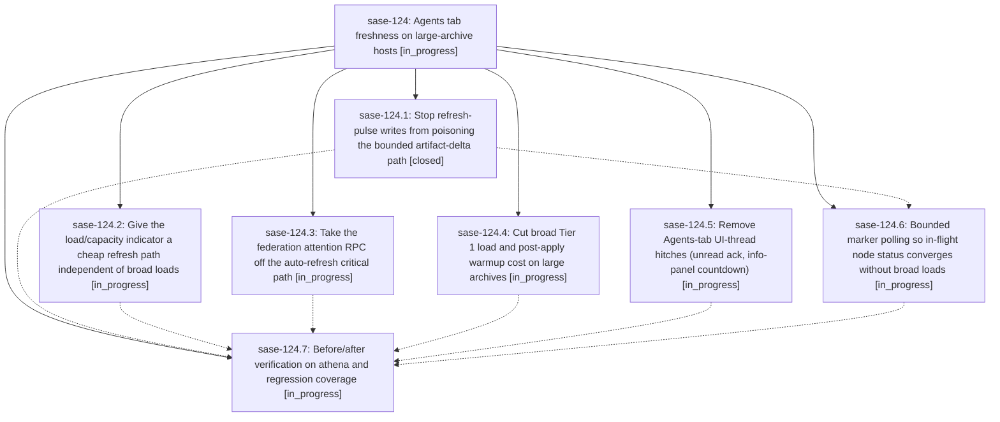

# Bead: sase-124 — Agents tab freshness on large-archive hosts

[Bead Pages](../README.md) / sase-124

**Status:** ◐ in_progress · **Type:** ▸ plan · **Tier:** epic
**Owner:** `bryanbugyi34@gmail.com` · **Created by:** [bbugyi200.athena.0mc](https://github.com/sase-org/sase--agents/blob/main/families/bbugyi200.athena.0mc.md) · **Assignee:** `sase-124.land`
**Created:** 2026-09-17 10:59:40 EDT
**Plan:** [202609/agents\_tab\_freshness.md](https://github.com/sase-org/sase--plans/blob/main/202609/agents_tab_freshness.md)

## Description

The Agents tab reflects load/capacity, unread notification, and node status changes within seconds on hosts with tens of thousands of stored agents, without adding per-tick TUI cost.

## Phases

| Bead | Title | Status | Size | Created | Agents | Commits |
|---|---|---|---|---|---:|---:|
| [sase-124.1](sase-124.1.md) | Stop refresh-pulse writes from poisoning the bounded artifact-delta path | ✓ closed | medium | 2026-09-17 | 1 | 1 |
| [sase-124.2](sase-124.2.md) | Give the load/capacity indicator a cheap refresh path independent of broad loads | ◐ in_progress | medium | 2026-09-17 | 1 | 0 |
| [sase-124.3](sase-124.3.md) | Take the federation attention RPC off the auto-refresh critical path | ◐ in_progress | medium | 2026-09-17 | 1 | 0 |
| [sase-124.4](sase-124.4.md) | Cut broad Tier 1 load and post-apply warmup cost on large archives | ◐ in_progress | large | 2026-09-17 | 1 | 0 |
| [sase-124.5](sase-124.5.md) | Remove Agents-tab UI-thread hitches (unread ack, info-panel countdown) | ◐ in_progress | medium | 2026-09-17 | 1 | 0 |
| [sase-124.6](sase-124.6.md) | Bounded marker polling so in-flight node status converges without broad loads | ◐ in_progress | medium | 2026-09-17 | 1 | 0 |
| [sase-124.7](sase-124.7.md) | Before/after verification on athena and regression coverage | ◐ in_progress | medium | 2026-09-17 | 1 | 0 |

## Lineage

## Agents

| Agent | Bead | Commits |
|---|---|---:|
| [bbugyi200.athena.sase-124.1](https://github.com/sase-org/sase--agents/blob/main/agents/bbugyi200.athena.sase-124.1/README.md) | [sase-124.1](sase-124.1.md) | 1 |
| [bbugyi200.athena.sase-124.2](https://github.com/sase-org/sase--agents/blob/main/agents/bbugyi200.athena.sase-124.2/README.md) | [sase-124.2](sase-124.2.md) | 0 |
| [bbugyi200.athena.sase-124.3](https://github.com/sase-org/sase--agents/blob/main/agents/bbugyi200.athena.sase-124.3/README.md) | [sase-124.3](sase-124.3.md) | 0 |
| [bbugyi200.athena.sase-124.4](https://github.com/sase-org/sase--agents/blob/main/families/bbugyi200.athena.sase-124.4.md) | [sase-124.4](sase-124.4.md) | 0 |
| [bbugyi200.athena.sase-124.5](https://github.com/sase-org/sase--agents/blob/main/agents/bbugyi200.athena.sase-124.5/README.md) | [sase-124.5](sase-124.5.md) | 0 |
| [bbugyi200.athena.sase-124.6](https://github.com/sase-org/sase--agents/blob/main/agents/bbugyi200.athena.sase-124.6/README.md) | [sase-124.6](sase-124.6.md) | 0 |
| [bbugyi200.athena.sase-124.7](https://github.com/sase-org/sase--agents/blob/main/agents/bbugyi200.athena.sase-124.7/README.md) | [sase-124.7](sase-124.7.md) | 0 |
| [bbugyi200.athena.sase-124.land](https://github.com/sase-org/sase--agents/blob/main/agents/bbugyi200.athena.sase-124.land/README.md) | [sase-124](README.md) | 0 |

## Commits

| Repo | Commit | Subject | Bead | Committed |
|---|---|---|---|---|
| sase | [`43ddcf1`](https://github.com/sase-org/sase/commit/43ddcf15f5a72a8bdbcb708692b8d9fe2ab106d1) | fix(tui): keep refresh pulses out of broad fallback | [sase-124.1](sase-124.1.md) | 2026-09-17 12:37:30 EDT |
