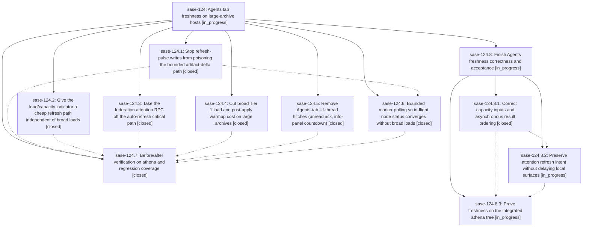

# Bead: sase-124 — Agents tab freshness on large-archive hosts

[Bead Pages](../README.md) / sase-124

**Status:** ◐ in_progress · **Type:** ▸ plan · **Tier:** epic
**Owner:** `bryanbugyi34@gmail.com` · **Created by:** [bbugyi200.athena.0mc](https://github.com/sase-org/sase--agents/blob/main/families/bbugyi200.athena.0mc.md) · **Assignee:** `sase-124.land`
**Created:** 2026-09-17 10:59:40 EDT
**Plan:** [202609/agents\_tab\_freshness.md](https://github.com/sase-org/sase--plans/blob/main/202609/agents_tab_freshness.md)

## Description

The Agents tab reflects load/capacity, unread notification, and node status changes within seconds on hosts with tens of thousands of stored agents, without adding per-tick TUI cost.

## Notes

[2026-09-17T20:58:03Z · sase-124.7] sase-124.7 verification on athena at 739caf01ff (2026-09-17): sase-zr.7.3 and sase-zr.7.5 were still in_progress, so gate-refresh overlap was not credited here. Repeatable regression evidence: just test-slow tests/perf/bench_tui_trace.py passed 5 tests in 492.58s; just bench-agent-load-tiering --sase-home ~/.sase --runs 3 --warmup 1 --session-refreshes 5 wrote ~/.sase/perf/agent_load_tiering_sase-124.7_athena_real_20260917.json against 11,516 artifacts (source_scan p50/p95 11148/11162 ms, production_bounded p50/p95 1421/1693 ms, production_full_history p50/p95 2232/2561 ms, unchanged refresh p50/p95 249/952 ms); just _lint-symvision passed after re-keying the unrelated render_svg_to_png whitelist from closed sase-123.3 to open sase-123.4; just check passed, with scoped tests escalating to the full suite because Justfile changed. Mixed live acceptance: recent athena telemetry still missed the no-full-load, hitch, and trace-target goals; proposed follow-ups are recorded on phase sase-124.7.

[2026-09-17T21:40:05Z · sase-124.land] LANDING AUDIT 2026-09-17 at 155aeee2ef: intentionally leaving this epic open and its plan unchanged. Reviewed the epic note, all seven closed children and all eleven child notes, the full accepted plan, the six matching implementation commits, actual source/tests, and concurrent history since creation. Fetched origin/master matches HEAD; no parent bead. Detailed audit: file:explicit:12bc47aaa562488f61e61ce6. Deterministic reproducer: file:explicit:7149138b09eabe6ff5ba5226. Artifact snapshot creation succeeded; attaching the script ref was rejected because the host hidden plans clone has dirty files. No foreign checkout was changed.

CONFIRMED REMAINING EPIC WORK: (1) capacity refresh uses displayed _agents_with_children instead of retained canonical _agents_capacity_with_children, so a hidden runner is omitted (1 occupied instead of 2); (2) an empty roster skips limit/hold refresh; (3) a delayed cached-roster result overwrites a newer roster at the same capacity-input generation (2 slots becomes 1); (4) stale-capacity apply recomputes prepare_loaded_agents_apply_boundary, including hold-store work, on MainThread; (5) network attention refresh requested during a cache-only poll is lost, producing [cache, cache] instead of a subsequent network fetch; (6) a blocked cache-only attention poll still delays local agents refresh. Its IPC/start/reconcile path is not guaranteed cheap. Duration counters requested by the original plan are also absent. All are source-backed or reproduced in isolated harnesses without live state mutation.

DELIVERED: project/legacy-month pulse classification and both writer fixes; capacity/token/status memo mechanisms (with gaps above); 60-second detached attention network cadence (with gaps above); bounded artifact/claims caches, batched bead lookup and coalesced warmups; optimistic off-thread unread persistence/rollback and countdown splicing; capped stat-only in-flight exact-delta polling. The phase-7 saved benchmark numbers match the actual JSON (11,516 artifacts; bounded 1421/1693 ms, full-history 2232/2561 ms, unchanged 249/952 ms p50/p95), but that five-refresh sample and stale live trace are not the missing controlled acceptance proof.

INTEGRATION: preserve typed launch holds ff08843798, grouping/layout controls 73e4318edf/5e4c866eb5, core floor and hydration/notification improvements 02fc83e11a/1f2d2ff99a (sase-126), and stable-search incremental display 155aeee2ef (sase-127.2). sase-127.1/.3/.4 remain active and own visible-set/no-op fleet repaint work. Gate failure commit 934be032dd stores outcomes in gate-bundle journal.jsonl/errors, not a new top-level agent marker; do not invent a polling filename. sase-zr.7.3/.5 remain active; recheck their exact pulse/receipt contracts on resume.

ALL FIVE PROPOSAL OUTCOMES: sase-124.1 #1 is existing sase-zc, fixed and covered by passing flat/sharded writer tests; no duplicate, resolve at eventual successful landing as proposed. sase-124.7 #1 slow broad loads needs a controlled idle window and attribution; retained as acceptance work rather than a speculative catch-all task (sase-zn already owns the specific lock-busy fallback mechanism). #2 residual runtime/live-hint/fleet hitches needs fresh revision/stack attribution; sase-127 owns no-op fleet repaint, but other stacks are not assumed the same cause. #3 selected-tribe 54.03/43.91 ms corroboration was recorded explicitly as inherited evidence on existing sase-lx; corrected its budget to 40 ms, not 16 ms. AXE/Fleet excursions remain for fresh measurement and separate causal classification; no new common-cause task inferred. #4 stale trace coverage is missing evidence, not a diagnosed trace defect; retained in acceptance work. Used sase_new_task, searched all-status candidates, swept the 68 last-week tasks, and inspected plausible active epic scopes. No duplicate or speculative tasks created.

CHECKS: 166 focused implementation regressions passed in 7.67 s; 139 writer/token/integration regressions passed in 20.15 s (305 total). Six isolated additional checks reproduced the gaps above. No --epic-symbol entries for sase-124. No production files edited and no full-suite/landing pass claimed. Validated the remaining-only three-phase plan sase_plan_finish_agents_freshness.md (capacity ordering, attention scheduling, fresh acceptance), parent_bead=sase-124; preparing to submit via sase_plan. The child must not include this epic close, symvision pass, or original-plan done update as phases. On return, re-read every descendant/note/linked plan and post-child drift, finish any epic-caused residual, run governed just check-full, recheck symbols, and close normally only when ready. Carry all proposal dispositions into the eventual close note.

[2026-09-17T21:41:10Z · sase-124.land] ADDITIONAL AUDIT OUTCOME: the failed artifact-ref attachment is an independent recurrence of existing ready task sase-10y; corroborated it with sase bead +1, preserving the exact command/error and distinguishing successful snapshot creation/read from failed link attachment. No new task was created. The remaining-work plan passed validate --explain and two subsequent revalidations with zero warnings.

## Phases

| Bead | Title | Status | Size | Created | Agents | Commits |
|---|---|---|---|---|---:|---:|
| [sase-124.1](sase-124.1.md) | Stop refresh-pulse writes from poisoning the bounded artifact-delta path | ✓ closed | medium | 2026-09-17 | 1 | 1 |
| [sase-124.2](sase-124.2.md) | Give the load/capacity indicator a cheap refresh path independent of broad loads | ✓ closed | medium | 2026-09-17 | 1 | 1 |
| [sase-124.3](sase-124.3.md) | Take the federation attention RPC off the auto-refresh critical path | ✓ closed | medium | 2026-09-17 | 1 | 1 |
| [sase-124.4](sase-124.4.md) | Cut broad Tier 1 load and post-apply warmup cost on large archives | ✓ closed | large | 2026-09-17 | 1 | 1 |
| [sase-124.5](sase-124.5.md) | Remove Agents-tab UI-thread hitches (unread ack, info-panel countdown) | ✓ closed | medium | 2026-09-17 | 1 | 1 |
| [sase-124.6](sase-124.6.md) | Bounded marker polling so in-flight node status converges without broad loads | ✓ closed | medium | 2026-09-17 | 1 | 1 |
| [sase-124.7](sase-124.7.md) | Before/after verification on athena and regression coverage | ✓ closed | medium | 2026-09-17 | 1 | 0 |

## Lineage

## Agents

| Agent | Bead | Commits |
|---|---|---:|
| [bbugyi200.athena.sase-124.1](https://github.com/sase-org/sase--agents/blob/main/agents/bbugyi200.athena.sase-124.1/README.md) | [sase-124.1](sase-124.1.md) | 1 |
| [bbugyi200.athena.sase-124.2](https://github.com/sase-org/sase--agents/blob/main/agents/bbugyi200.athena.sase-124.2/README.md) | [sase-124.2](sase-124.2.md) | 1 |
| [bbugyi200.athena.sase-124.3](https://github.com/sase-org/sase--agents/blob/main/agents/bbugyi200.athena.sase-124.3/README.md) | [sase-124.3](sase-124.3.md) | 1 |
| [bbugyi200.athena.sase-124.4](https://github.com/sase-org/sase--agents/blob/main/families/bbugyi200.athena.sase-124.4.md) | [sase-124.4](sase-124.4.md) | 1 |
| [bbugyi200.athena.sase-124.5](https://github.com/sase-org/sase--agents/blob/main/families/bbugyi200.athena.sase-124.5.md) | [sase-124.5](sase-124.5.md) | 1 |
| [bbugyi200.athena.sase-124.6](https://github.com/sase-org/sase--agents/blob/main/agents/bbugyi200.athena.sase-124.6/README.md) | [sase-124.6](sase-124.6.md) | 1 |
| [bbugyi200.athena.sase-124.7](https://github.com/sase-org/sase--agents/blob/main/agents/bbugyi200.athena.sase-124.7/README.md) | [sase-124.7](sase-124.7.md) | 0 |
| [bbugyi200.athena.sase-124.8.1](https://github.com/sase-org/sase--agents/blob/main/agents/bbugyi200.athena.sase-124.8.1/README.md) | [sase-124.8.1](sase-124.8.1.md) | 1 |
| [bbugyi200.athena.sase-124.8.2](https://github.com/sase-org/sase--agents/blob/main/agents/bbugyi200.athena.sase-124.8.2/README.md) | [sase-124.8.2](sase-124.8.2.md) | 0 |
| [bbugyi200.athena.sase-124.8.3](https://github.com/sase-org/sase--agents/blob/main/agents/bbugyi200.athena.sase-124.8.3/README.md) | [sase-124.8.3](sase-124.8.3.md) | 0 |
| [bbugyi200.athena.sase-124.8.land](https://github.com/sase-org/sase--agents/blob/main/agents/bbugyi200.athena.sase-124.8.land/README.md) | [sase-124.8](sase-124.8.md) | 0 |
| [bbugyi200.athena.sase-124.land](https://github.com/sase-org/sase--agents/blob/main/families/bbugyi200.athena.sase-124.land.md) | [sase-124](README.md) | 0 |

## Commits

| Repo | Commit | Subject | Bead | Committed |
|---|---|---|---|---|
| sase | [`43ddcf1`](https://github.com/sase-org/sase/commit/43ddcf15f5a72a8bdbcb708692b8d9fe2ab106d1) | fix(tui): keep refresh pulses out of broad fallback | [sase-124.1](sase-124.1.md) | 2026-09-17 12:37:30 EDT |
| sase | [`14403c1`](https://github.com/sase-org/sase/commit/14403c1594b63deac2d9dceec2adbb6c3d7eb79a) | feat(agents): poll in-flight markers for status deltas | [sase-124.6](sase-124.6.md) | 2026-09-17 14:06:19 EDT |
| sase | [`980de14`](https://github.com/sase-org/sase/commit/980de1487a7d6a38cf360155327d664011081cbf) | fix(tui): remove agents tab read ack hitches | [sase-124.5](sase-124.5.md) | 2026-09-17 14:19:26 EDT |
| sase | [`0af5b08`](https://github.com/sase-org/sase/commit/0af5b08151ac275b81cc1d2e790b29d1d43df53d) | perf(tui): cache fleet attention auto-refresh | [sase-124.3](sase-124.3.md) | 2026-09-17 14:46:35 EDT |
| sase | [`26a43d2`](https://github.com/sase-org/sase/commit/26a43d29f47f59011b44128505bef4500010fbe9) | perf(tui): narrow agent-loading refreshes with artifact/claims caches | [sase-124.4](sase-124.4.md) | 2026-09-17 15:23:04 EDT |
| sase | [`739caf0`](https://github.com/sase-org/sase/commit/739caf01ffd491cf3bac5589e72c221d8e1f8e56) | feat(agents): refresh runner capacity from cached roster | [sase-124.2](sase-124.2.md) | 2026-09-17 15:36:59 EDT |
| sase | [`f1616c5`](https://github.com/sase-org/sase/commit/f1616c505e3581cea78f3ac9c21efb4361312a79) | fix(tui): correct agents capacity ordering | [sase-124.8.1](sase-124.8.1.md) | 2026-09-17 18:37:58 EDT |
