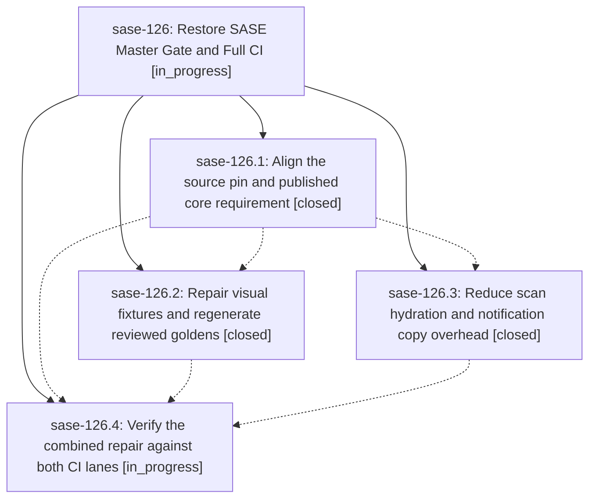

# Bead: sase-126 — Restore SASE Master Gate and Full CI

[Bead Pages](../README.md) / sase-126

**Status:** ◐ in_progress · **Type:** ▸ plan · **Tier:** epic
**Owner:** `bryanbugyi34@gmail.com` · **Created by:** [bbugyi200.athena.0mh](https://github.com/sase-org/sase--agents/blob/main/families/bbugyi200.athena.0mh.md) · **Assignee:** `sase-126.land`
**Created:** 2026-09-17 15:12:09 EDT
**Plan:** [202609/restore\_actions\_ci.md](https://github.com/sase-org/sase--plans/blob/main/202609/restore_actions_ci.md)

## Description

Align the required Rust core with the Python source, repair stale visual tests, and restore the performance floors so Master Gate and Full CI pass without weakening their checks.

## Phases

| Bead | Title | Status | Size | Created | Agents | Commits |
|---|---|---|---|---|---:|---:|
| [sase-126.1](sase-126.1.md) | Align the source pin and published core requirement | ✓ closed | small | 2026-09-17 | 1 | 1 |
| [sase-126.2](sase-126.2.md) | Repair visual fixtures and regenerate reviewed goldens | ✓ closed | medium | 2026-09-17 | 1 | 1 |
| [sase-126.3](sase-126.3.md) | Reduce scan hydration and notification copy overhead | ✓ closed | medium | 2026-09-17 | 1 | 1 |
| [sase-126.4](sase-126.4.md) | Verify the combined repair against both CI lanes | ◐ in_progress | medium | 2026-09-17 | 1 | 0 |

## Lineage

## Agents

| Agent | Bead | Commits |
|---|---|---:|
| [bbugyi200.athena.sase-126.1](https://github.com/sase-org/sase--agents/blob/main/families/bbugyi200.athena.sase-126.1.md) | [sase-126.1](sase-126.1.md) | 1 |
| [bbugyi200.athena.sase-126.2](https://github.com/sase-org/sase--agents/blob/main/agents/bbugyi200.athena.sase-126.2/README.md) | [sase-126.2](sase-126.2.md) | 1 |
| [bbugyi200.athena.sase-126.3](https://github.com/sase-org/sase--agents/blob/main/agents/bbugyi200.athena.sase-126.3/README.md) | [sase-126.3](sase-126.3.md) | 1 |
| [bbugyi200.athena.sase-126.4](https://github.com/sase-org/sase--agents/blob/main/agents/bbugyi200.athena.sase-126.4/README.md) | [sase-126.4](sase-126.4.md) | 0 |
| [bbugyi200.athena.sase-126.land](https://github.com/sase-org/sase--agents/blob/main/agents/bbugyi200.athena.sase-126.land/README.md) | [sase-126](README.md) | 0 |

## Commits

| Repo | Commit | Subject | Bead | Committed |
|---|---|---|---|---|
| sase | [`02fc83e`](https://github.com/sase-org/sase/commit/02fc83e11ad3268bc29b0910ed2caaf921e3bb7f) | chore(core): ratchet core dependency floor | [sase-126.1](sase-126.1.md) | 2026-09-17 16:07:25 EDT |
| sase | [`1f2d2ff`](https://github.com/sase-org/sase/commit/1f2d2ff99aee759199493d423992d88041941899) | perf: reduce scan and notification hydration overhead | [sase-126.3](sase-126.3.md) | 2026-09-17 16:55:40 EDT |
| sase | [`fd626ec`](https://github.com/sase-org/sase/commit/fd626ec222fd24dc4869d7012d96363426762c21) | test(visual): repair snapshot contracts | [sase-126.2](sase-126.2.md) | 2026-09-17 19:16:08 EDT |
