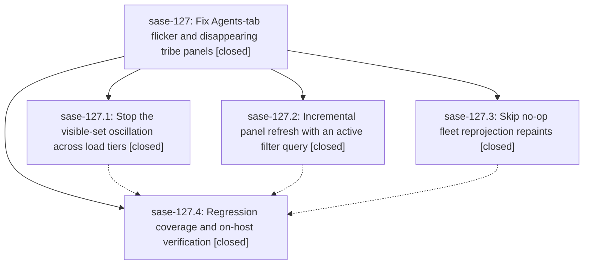

# Bead: sase-127 — Fix Agents-tab flicker and disappearing tribe panels

[Bead Pages](../README.md) / sase-127

**Status:** ✓ closed · **Resolution:** done · **Type:** ▸ plan · **Tier:** epic
**Owner:** `bryanbugyi34@gmail.com` · **Created by:** [bbugyi200.athena.0ml](https://github.com/sase-org/sase--agents/blob/main/families/bbugyi200.athena.0ml.md) · **Assignee:** `sase-127.land`
**Created:** 2026-09-17 16:26:24 EDT · **Closed:** 2026-09-17 21:43:41 EDT
**Plan:** [202609/agents\_tab\_flicker.md](https://github.com/sase-org/sase--plans/blob/main/202609/agents_tab_flicker.md)

## Description

The Agents tab stops flickering under an active filter query and live agent churn: unchanged-data refreshes patch instead of full-rebuilding, no-op fleet reprojections stop repainting, consecutive load tiers converge on one stable visible agent set, and tribe panels such as @epic stay mounted.

## Notes

[2026-09-18T01:43:41Z · sase-127.land--1] Verified every child and note against the approved plan, current source, and epic commits 155aeee2 (stable-query incremental display), 7058f16c (bounded-load convergence), 5b7c4553 (no-op fleet projection skip), and 677ed7d8 (perf guard). The current code preserves the incremental path for an unchanged active query while retaining search_query_changed fallback, patches bounded partial loads over the cached universe while retaining the complete-history query latch and stable panel keys, skips unchanged fleet_refresh finalization while preserving forced and genuine-change repaints, and includes the performance regression guard. Phase verification recorded a 30-minute athena trace soak with @epic continuously mounted, no active_search fallback, stable 26/22/24/24/24 agent counts, one Tier-2 reconcile, apply counts 606-625 instead of the pre-fix 171/484 swing, and about 0.25 cores versus about 54% CPU. Reviewed post-start commits and all overlap with epic-touched files: 9a1d5d67 adds independent remote-attention polling state beside the epic state and needs no adaptation; later grouping/detail, screenshot, service, visual, release, sudo, and gate work neither duplicates nor conflicts with the Agents-tab fix. The integrated focused 63-test regression set passed. The governed full lane then exposed three unrelated gate-decision failures after linked sase-core v0.34.50 began rejecting empty current_failure attempt_id values; recorded that causal drift on active epic sase-zr.7.1.1.5 with monitor b6txt1a5eswt rather than changing it here. Disposed both PROPOSED FOLLOW-UP notes: corroborated existing memory task sase-109 with the active-search and load-tier invariants, and created ready feature task sase-128 for Status-grouping incremental refresh because unsupported_grouping is pre-existing and outside this epic acceptance. sase bead epic-symbols sase-127 reported no entries.

## Phases

| Bead | Title | Status | Size | Created | Agents | Commits |
|---|---|---|---|---|---:|---:|
| [sase-127.1](sase-127.1.md) | Stop the visible-set oscillation across load tiers | ✓ closed | large | 2026-09-17 | 1 | 1 |
| [sase-127.2](sase-127.2.md) | Incremental panel refresh with an active filter query | ✓ closed | medium | 2026-09-17 | 1 | 1 |
| [sase-127.3](sase-127.3.md) | Skip no-op fleet reprojection repaints | ✓ closed | small | 2026-09-17 | 1 | 1 |
| [sase-127.4](sase-127.4.md) | Regression coverage and on-host verification | ✓ closed | medium | 2026-09-17 | 1 | 1 |

## Lineage

## Agents

| Agent | Bead | Commits |
|---|---|---:|
| [bbugyi200.athena.sase-127.1](https://github.com/sase-org/sase--agents/blob/main/families/bbugyi200.athena.sase-127.1.md) | [sase-127.1](sase-127.1.md) | 1 |
| [bbugyi200.athena.sase-127.2](https://github.com/sase-org/sase--agents/blob/main/agents/bbugyi200.athena.sase-127.2/README.md) | [sase-127.2](sase-127.2.md) | 1 |
| [bbugyi200.athena.sase-127.3](https://github.com/sase-org/sase--agents/blob/main/agents/bbugyi200.athena.sase-127.3/README.md) | [sase-127.3](sase-127.3.md) | 1 |
| [bbugyi200.athena.sase-127.4](https://github.com/sase-org/sase--agents/blob/main/agents/bbugyi200.athena.sase-127.4/README.md) | [sase-127.4](sase-127.4.md) | 1 |
| [bbugyi200.athena.sase-127.land](https://github.com/sase-org/sase--agents/blob/main/families/bbugyi200.athena.sase-127.land.md) | [sase-127](README.md) | 1 |

## Commits

| Repo | Commit | Subject | Bead | Committed |
|---|---|---|---|---|
| sase | [`155aeee`](https://github.com/sase-org/sase/commit/155aeee2efe67b653c4c715888716a116401fdaa) | fix(tui): allow incremental agent refresh under stable search | [sase-127.2](sase-127.2.md) | 2026-09-17 17:20:00 EDT |
| sase | [`7058f16`](https://github.com/sase-org/sase/commit/7058f16ceb867bd5ea3f3d865c9fb24300cdd5dd) | fix(agents): stabilize bounded load convergence | [sase-127.1](sase-127.1.md) | 2026-09-17 18:55:27 EDT |
| sase | [`5b7c455`](https://github.com/sase-org/sase/commit/5b7c4553ccc7ce862535435735785ebb440ed02b) | fix(tui): skip unchanged fleet reprojections | [sase-127.3](sase-127.3.md) | 2026-09-17 19:30:36 EDT |
| sase | [`677ed7d`](https://github.com/sase-org/sase/commit/677ed7d8e496fd7085615d679e82e752be41df46) | test(tui): guard active-search display rebuilds | [sase-127.4](sase-127.4.md) | 2026-09-17 20:45:33 EDT |
| sase--plans | [`sase--plans@1b817a0`](https://github.com/sase-org/sase--plans/commit/1b817a02c57e2d24483d2aa4b2a8d0e932e2c2eb) | docs(plan): mark sase-127 done | [sase-127](README.md) | 2026-09-17 22:13:26 EDT |
