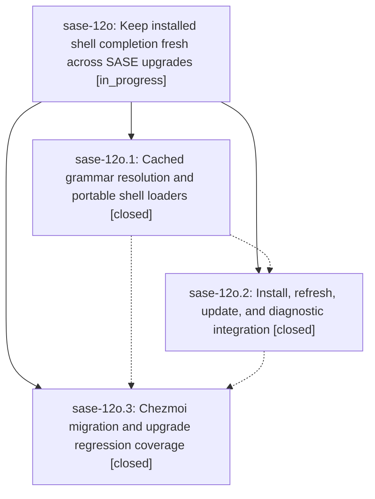

# Bead: sase-12o — Keep installed shell completion fresh across SASE upgrades

[Bead Pages](../README.md) / sase-12o

**Status:** ◐ in_progress · **Type:** ▸ plan · **Tier:** epic
**Owner:** `bryanbugyi34@gmail.com` · **Created by:** [bbugyi200.apollo.0f](https://github.com/sase-org/sase--agents/blob/main/families/bbugyi200.apollo.0f.md) · **Assignee:** `sase-12o.land`
**Created:** 2026-09-18 06:05:19 EDT
**Plan:** [202609/completion\_freshness.md](https://github.com/sase-org/sase--plans/blob/main/202609/completion_freshness.md)

<!-- sase:links:start -->

## Links

| Relation | Artifact | Why |
| --- | --- | --- |
| implemented-by | [plan:202609/completion_freshness.md][1] | derived from the plan's `bead_id:` frontmatter field |

[1]: https://github.com/sase-org/sase--plans/blob/main/202609/completion_freshness.md

<!-- sase:links:end -->

## Description

Bash, fish, and zsh completion follow the installed SASE command tree after upgrades, including screenshot, with the same behavior on machines with and without chezmoi and without rebuilding the parser on every completion.

## Notes

[2026-09-18T19:17:57Z · bryanbugyi34@gmail.com] See the ~/tmp/sase_12o_error.txt file for the error I'm now seeing when trying to complete with <tab>. Fix this before landing.

## Phases

| Bead | Title | Status | Size | Created | Agents | Commits |
|---|---|---|---|---|---:|---:|
| [sase-12o.1](sase-12o.1.md) | Cached grammar resolution and portable shell loaders | ✓ closed | medium | 2026-09-18 | 1 | 1 |
| [sase-12o.2](sase-12o.2.md) | Install, refresh, update, and diagnostic integration | ✓ closed | medium | 2026-09-18 | 1 | 1 |
| [sase-12o.3](sase-12o.3.md) | Chezmoi migration and upgrade regression coverage | ✓ closed | medium | 2026-09-18 | 1 | 2 |

## Lineage

## Agents

| Agent | Bead | Commits |
|---|---|---:|
| [bbugyi200.apollo.sase-12o.1](https://github.com/sase-org/sase--agents/blob/main/agents/bbugyi200.apollo.sase-12o.1/README.md) | [sase-12o.1](sase-12o.1.md) | 1 |
| [bbugyi200.apollo.sase-12o.2](https://github.com/sase-org/sase--agents/blob/main/agents/bbugyi200.apollo.sase-12o.2/README.md) | [sase-12o.2](sase-12o.2.md) | 1 |
| [bbugyi200.apollo.sase-12o.3](https://github.com/sase-org/sase--agents/blob/main/agents/bbugyi200.apollo.sase-12o.3/README.md) | [sase-12o.3](sase-12o.3.md) | 2 |
| [bbugyi200.apollo.sase-12o.land](https://github.com/sase-org/sase--agents/blob/main/families/bbugyi200.apollo.sase-12o.land.md) | [sase-12o](README.md) | 1 |

## Commits

| Repo | Commit | Subject | Bead | Committed |
|---|---|---|---|---|
| sase | [`22c6659`](https://github.com/sase-org/sase/commit/22c66592f715eadcebc45973361c5f24c7cfcae0) | feat(completion): cache runtime grammars and loaders | [sase-12o.1](sase-12o.1.md) | 2026-09-18 09:00:32 EDT |
| sase | [`f28c666`](https://github.com/sase-org/sase/commit/f28c666bdbcad3d9c7f86f85b82c5370cfad620a) | feat(completion): refresh stamped installs as loaders | [sase-12o.2](sase-12o.2.md) | 2026-09-18 09:53:31 EDT |
| sase | [`0320dae`](https://github.com/sase-org/sase/commit/0320daed701fe0b6b8b23a35667d56ca557190c4) | feat(completion): migrate chezmoi to portable loaders | [sase-12o.3](sase-12o.3.md) | 2026-09-18 15:04:15 EDT |
| chezmoi | [`chezmoi@13bb585`](https://github.com/bbugyi200/dotfiles/commit/13bb5851a904dd80acdf05245266beb2243d2957) | chore(completion): use sase completion loaders | [sase-12o.3](sase-12o.3.md) | 2026-09-18 15:07:04 EDT |
| sase | [`b6183a1`](https://github.com/sase-org/sase/commit/b6183a14cd26f0910ff1570f264d20f10aa62aaa) | fix(completion): publish grammar cache as one recoverable generation | [sase-12o](README.md) | 2026-09-18 16:16:53 EDT |
