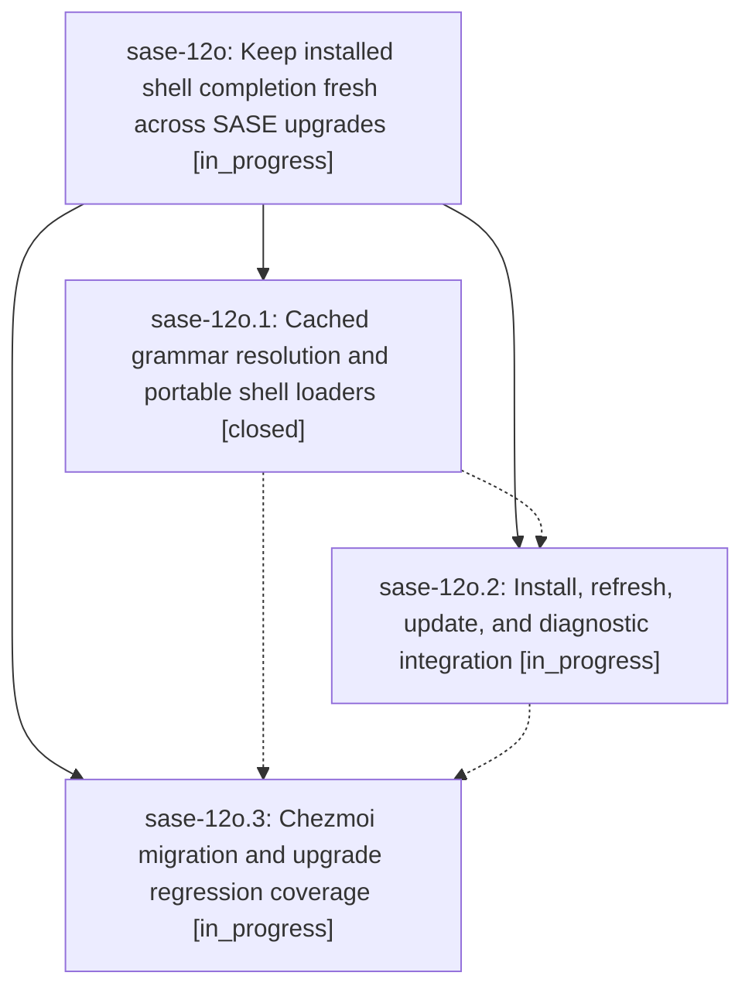

# Bead: sase-12o — Keep installed shell completion fresh across SASE upgrades

[Bead Pages](../README.md) / sase-12o

**Status:** ◐ in_progress · **Type:** ▸ plan · **Tier:** epic
**Owner:** `bryanbugyi34@gmail.com` · **Created by:** [bbugyi200.apollo.0f](https://github.com/sase-org/sase--agents/blob/main/families/bbugyi200.apollo.0f.md) · **Assignee:** `sase-12o.land`
**Created:** 2026-09-18 06:05:19 EDT
**Plan:** [202609/completion\_freshness.md](https://github.com/sase-org/sase--plans/blob/main/202609/completion_freshness.md)

## Description

Bash, fish, and zsh completion follow the installed SASE command tree after upgrades, including screenshot, with the same behavior on machines with and without chezmoi and without rebuilding the parser on every completion.

## Phases

| Bead | Title | Status | Size | Created | Agents | Commits |
|---|---|---|---|---|---:|---:|
| [sase-12o.1](sase-12o.1.md) | Cached grammar resolution and portable shell loaders | ✓ closed | medium | 2026-09-18 | 1 | 1 |
| [sase-12o.2](sase-12o.2.md) | Install, refresh, update, and diagnostic integration | ◐ in_progress | medium | 2026-09-18 | 1 | 0 |
| [sase-12o.3](sase-12o.3.md) | Chezmoi migration and upgrade regression coverage | ◐ in_progress | medium | 2026-09-18 | 1 | 0 |

## Lineage

## Agents

| Agent | Bead | Commits |
|---|---|---:|
| [bbugyi200.apollo.sase-12o.1](https://github.com/sase-org/sase--agents/blob/main/agents/bbugyi200.apollo.sase-12o.1/README.md) | [sase-12o.1](sase-12o.1.md) | 1 |
| [bbugyi200.apollo.sase-12o.2](https://github.com/sase-org/sase--agents/blob/main/agents/bbugyi200.apollo.sase-12o.2/README.md) | [sase-12o.2](sase-12o.2.md) | 0 |
| [bbugyi200.apollo.sase-12o.3](https://github.com/sase-org/sase--agents/blob/main/agents/bbugyi200.apollo.sase-12o.3/README.md) | [sase-12o.3](sase-12o.3.md) | 0 |
| [bbugyi200.apollo.sase-12o.land](https://github.com/sase-org/sase--agents/blob/main/agents/bbugyi200.apollo.sase-12o.land/README.md) | [sase-12o](README.md) | 0 |

## Commits

| Repo | Commit | Subject | Bead | Committed |
|---|---|---|---|---|
| sase | [`22c6659`](https://github.com/sase-org/sase/commit/22c66592f715eadcebc45973361c5f24c7cfcae0) | feat(completion): cache runtime grammars and loaders | [sase-12o.1](sase-12o.1.md) | 2026-09-18 09:00:32 EDT |
