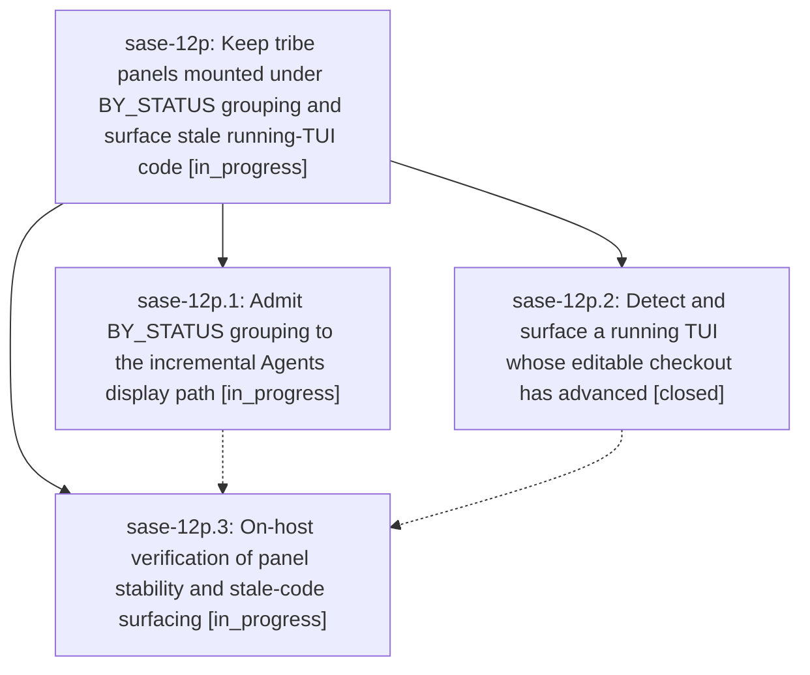

# Bead: sase-12p — Keep tribe panels mounted under BY\_STATUS grouping and surface stale running-TUI code

[Bead Pages](../README.md) / sase-12p

**Status:** ◐ in_progress · **Type:** ▸ plan · **Tier:** epic
**Owner:** `bryanbugyi34@gmail.com` · **Created by:** [bbugyi200.athena.0mq](https://github.com/sase-org/sase--agents/blob/main/families/bbugyi200.athena.0mq.md) · **Assignee:** `sase-12p.land`
**Created:** 2026-09-18 06:26:38 EDT
**Plan:** [202609/by\_status\_panels\_and\_stale\_tui.md](https://github.com/sase-org/sase--plans/blob/main/202609/by_status_panels_and_stale_tui.md)

## Description

The Agents tab stops tearing down and remounting tribe panels (for example `@epic`) under BY_STATUS grouping with live agent churn, and a long-running TUI whose editable checkout has advanced past the code it imported detects that staleness, tells the user, and offers the existing restart-when-ready flow — so landed fixes actually reach the screen instead of silently sitting on disk.

## Phases

| Bead | Title | Status | Size | Created | Agents | Commits |
|---|---|---|---|---|---:|---:|
| [sase-12p.1](sase-12p.1.md) | Admit BY\_STATUS grouping to the incremental Agents display path | ◐ in_progress | medium | 2026-09-18 | 1 | 0 |
| [sase-12p.2](sase-12p.2.md) | Detect and surface a running TUI whose editable checkout has advanced | ✓ closed | medium | 2026-09-18 | 1 | 1 |
| [sase-12p.3](sase-12p.3.md) | On-host verification of panel stability and stale-code surfacing | ◐ in_progress | medium | 2026-09-18 | 1 | 0 |

## Lineage

## Agents

| Agent | Bead | Commits |
|---|---|---:|
| [bbugyi200.athena.sase-12p.1](https://github.com/sase-org/sase--agents/blob/main/agents/bbugyi200.athena.sase-12p.1/README.md) | [sase-12p.1](sase-12p.1.md) | 0 |
| [bbugyi200.athena.sase-12p.2](https://github.com/sase-org/sase--agents/blob/main/agents/bbugyi200.athena.sase-12p.2/README.md) | [sase-12p.2](sase-12p.2.md) | 1 |
| [bbugyi200.athena.sase-12p.3](https://github.com/sase-org/sase--agents/blob/main/agents/bbugyi200.athena.sase-12p.3/README.md) | [sase-12p.3](sase-12p.3.md) | 0 |
| [bbugyi200.athena.sase-12p.land](https://github.com/sase-org/sase--agents/blob/main/agents/bbugyi200.athena.sase-12p.land/README.md) | [sase-12p](README.md) | 0 |

## Commits

| Repo | Commit | Subject | Bead | Committed |
|---|---|---|---|---|
| sase | [`3a6b072`](https://github.com/sase-org/sase/commit/3a6b072dd49c7e057a3b44009852c1f5ed31c318) | feat(tui): surface stale editable runtime code | [sase-12p.2](sase-12p.2.md) | 2026-09-18 07:45:47 EDT |
