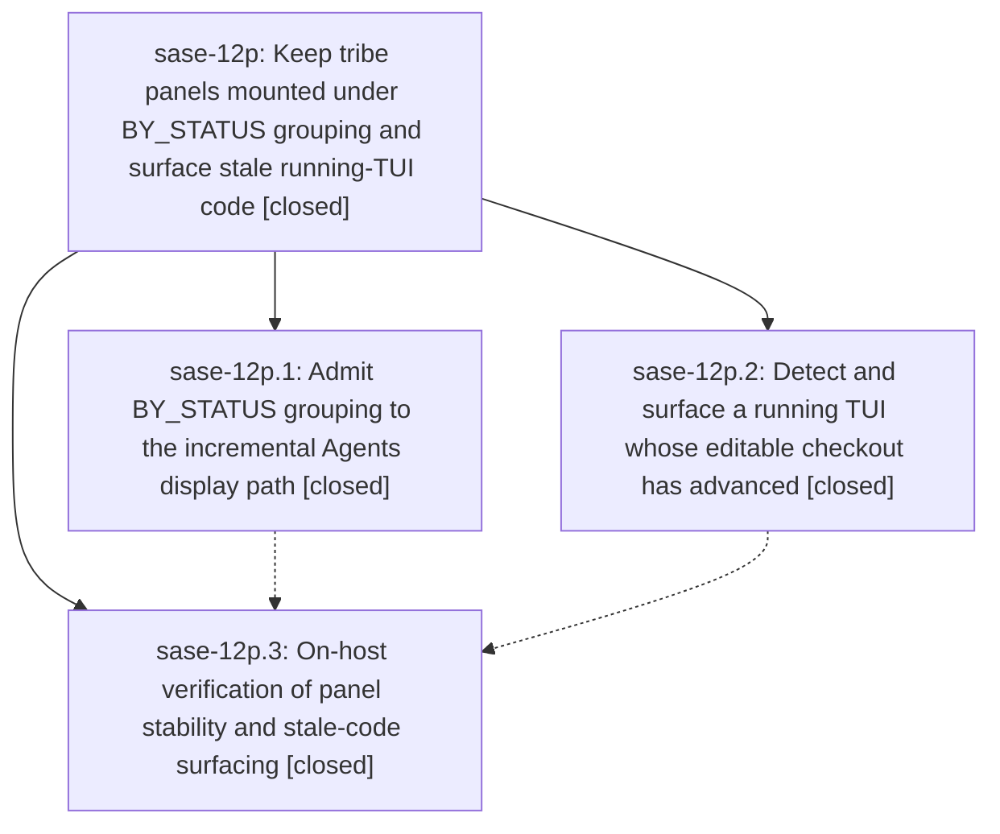

# Bead: sase-12p — Keep tribe panels mounted under BY\_STATUS grouping and surface stale running-TUI code

[Bead Pages](../README.md) / sase-12p

**Status:** ✓ closed · **Resolution:** done · **Type:** ▸ plan · **Tier:** epic
**Owner:** `bryanbugyi34@gmail.com` · **Created by:** [bbugyi200.athena.0mq](https://github.com/sase-org/sase--agents/blob/main/families/bbugyi200.athena.0mq.md) · **Assignee:** `sase-12p.land`
**Created:** 2026-09-18 06:26:38 EDT · **Closed:** 2026-09-18 10:29:52 EDT
**Plan:** [202609/by\_status\_panels\_and\_stale\_tui.md](https://github.com/sase-org/sase--plans/blob/main/202609/by_status_panels_and_stale_tui.md)

## Description

The Agents tab stops tearing down and remounting tribe panels (for example `@epic`) under BY_STATUS grouping with live agent churn, and a long-running TUI whose editable checkout has advanced past the code it imported detects that staleness, tells the user, and offers the existing restart-when-ready flow — so landed fixes actually reach the screen instead of silently sitting on disk.

## Notes

[2026-09-18T14:29:52Z · sase-12p.land--1] Verified all three phases, every child note, the linked plan, implementation commits, current source, and post-start integration. sase-12p.1 / 1fa7e5fc3a admits stable BY_STATUS refresh, row patch, and removal paths while preserving status_membership_change fallbacks with focused and perf coverage; sase-12p.2 / 3a6b072dd4 captures editable runtime revisions off startup, stat-gates revalidation, surfaces one notification and an Update-panel restart row, and reuses restart-when-ready; sase-12p.3 / 1af9c0b7b2 adds the live-churn regression and records a 30-minute athena soak with @epic mounted, zero steady-state unsupported_grouping/active_search fallbacks after warmup, plus stale-row/notification/restart/clear smoke evidence. Reviewed every commit after the first epic commit: the only related overlap was e92e6c91c1 changing shared restart draining for the service-host migration, and the stale-code affordance already calls that shared helper, so it inherits the integrated behavior; the other mobile, completion, baseline, prompt-search, artifact-link, screenshot, service-platform, and renderer changes neither duplicate nor conflict with this epic. Closed implemented task sase-128 with evidence. Routed sase-12p.3 note 2 to existing memory task sase-109 as a +1 (no duplicate task). sase bead epic-symbols reported none. Integrated-tree just check passed via monitor xmbwyqm34e0k (exit 0).

## Phases

| Bead | Title | Status | Size | Created | Agents | Commits |
|---|---|---|---|---|---:|---:|
| [sase-12p.1](sase-12p.1.md) | Admit BY\_STATUS grouping to the incremental Agents display path | ✓ closed | medium | 2026-09-18 | 1 | 1 |
| [sase-12p.2](sase-12p.2.md) | Detect and surface a running TUI whose editable checkout has advanced | ✓ closed | medium | 2026-09-18 | 1 | 1 |
| [sase-12p.3](sase-12p.3.md) | On-host verification of panel stability and stale-code surfacing | ✓ closed | medium | 2026-09-18 | 1 | 1 |

## Lineage

## Agents

| Agent | Bead | Commits |
|---|---|---:|
| [bbugyi200.athena.sase-12p.1](https://github.com/sase-org/sase--agents/blob/main/agents/bbugyi200.athena.sase-12p.1/README.md) | [sase-12p.1](sase-12p.1.md) | 1 |
| [bbugyi200.athena.sase-12p.2](https://github.com/sase-org/sase--agents/blob/main/agents/bbugyi200.athena.sase-12p.2/README.md) | [sase-12p.2](sase-12p.2.md) | 1 |
| [bbugyi200.athena.sase-12p.3](https://github.com/sase-org/sase--agents/blob/main/families/bbugyi200.athena.sase-12p.3.md) | [sase-12p.3](sase-12p.3.md) | 1 |
| [bbugyi200.athena.sase-12p.land](https://github.com/sase-org/sase--agents/blob/main/families/bbugyi200.athena.sase-12p.land.md) | [sase-12p](README.md) | 1 |

## Commits

| Repo | Commit | Subject | Bead | Committed |
|---|---|---|---|---|
| sase | [`3a6b072`](https://github.com/sase-org/sase/commit/3a6b072dd49c7e057a3b44009852c1f5ed31c318) | feat(tui): surface stale editable runtime code | [sase-12p.2](sase-12p.2.md) | 2026-09-18 07:45:47 EDT |
| sase | [`1fa7e5f`](https://github.com/sase-org/sase/commit/1fa7e5fc3ac6abed3ac62de65d038c631da167e8) | feat(tui): admit by-status incremental agent refresh | [sase-12p.1](sase-12p.1.md) | 2026-09-18 07:46:39 EDT |
| sase | [`1af9c0b`](https://github.com/sase-org/sase/commit/1af9c0b7b24e37624bc62efac1fcd6f23a1813bb) | test(tui): guard by-status live churn display path | [sase-12p.3](sase-12p.3.md) | 2026-09-18 09:34:45 EDT |
| sase--plans | [`sase--plans@d5385dd`](https://github.com/sase-org/sase--plans/commit/d5385dd22c0658f1c4dc7053b719b026935d29a5) | docs(plan): mark sase-12p done | [sase-12p](README.md) | 2026-09-18 10:34:27 EDT |
