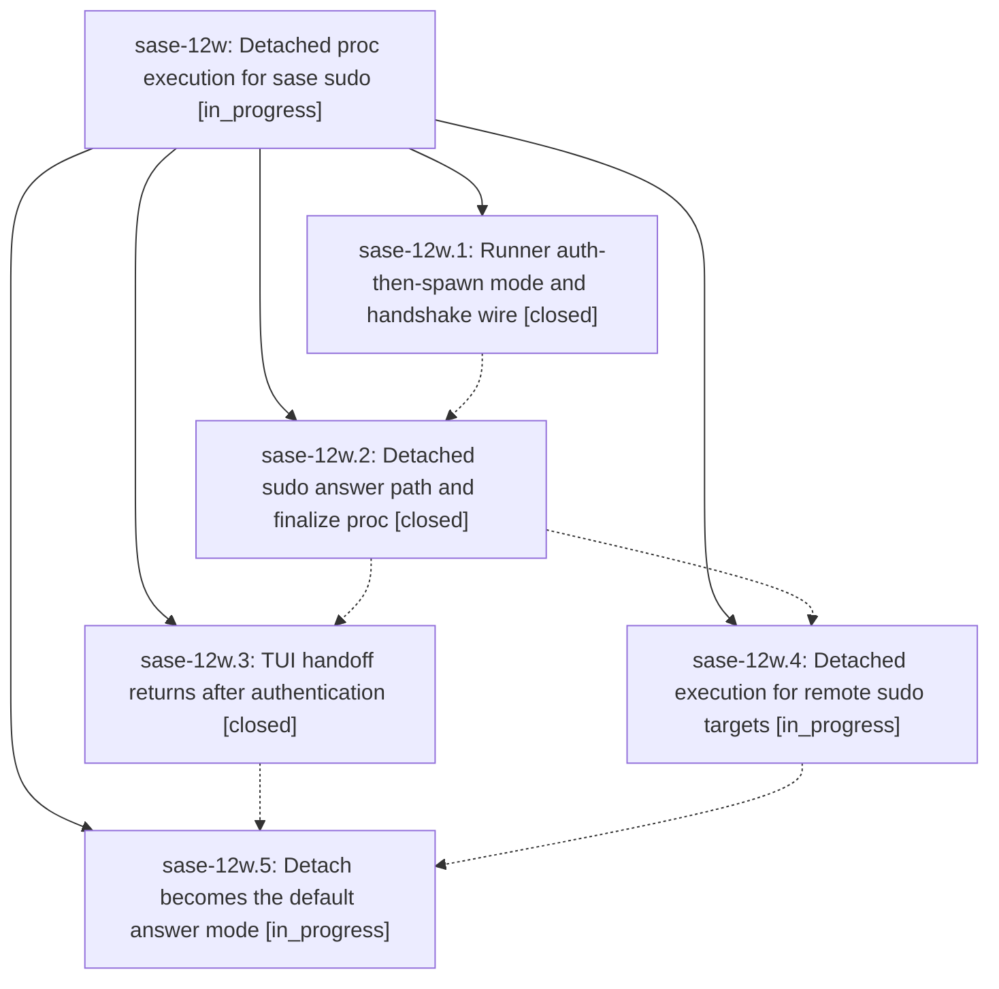

# Bead: sase-12w — Detached proc execution for sase sudo

[Bead Pages](../README.md) / sase-12w

**Status:** ◐ in_progress · **Type:** ▸ plan · **Tier:** epic
**Owner:** `bryanbugyi34@gmail.com` · **Created by:** [bbugyi200.athena.0ms](https://github.com/sase-org/sase--agents/blob/main/families/bbugyi200.athena.0ms.md) · **Assignee:** `sase-12w.land`
**Created:** 2026-09-18 08:50:37 EDT
**Plan:** [202609/sudo\_proc\_execution.md](https://github.com/sase-org/sase--plans/blob/main/202609/sudo_proc_execution.md)

## Description

Approving a sudo gate takes over the terminal only long enough to authenticate; the reviewed commands then run under a detached, supervised proc so the TUI is usable again immediately, and the gate still settles with a validated ledger when execution finishes.

## Phases

| Bead | Title | Status | Size | Created | Agents | Commits |
|---|---|---|---|---|---:|---:|
| [sase-12w.1](sase-12w.1.md) | Runner auth-then-spawn mode and handshake wire | ✓ closed | large | 2026-09-18 | 1 | 1 |
| [sase-12w.2](sase-12w.2.md) | Detached sudo answer path and finalize proc | ✓ closed | large | 2026-09-18 | 1 | 1 |
| [sase-12w.3](sase-12w.3.md) | TUI handoff returns after authentication | ✓ closed | medium | 2026-09-18 | 1 | 1 |
| [sase-12w.4](sase-12w.4.md) | Detached execution for remote sudo targets | ◐ in_progress | medium | 2026-09-18 | 1 | 0 |
| [sase-12w.5](sase-12w.5.md) | Detach becomes the default answer mode | ◐ in_progress | small | 2026-09-18 | 1 | 0 |

## Lineage

## Agents

| Agent | Bead | Commits |
|---|---|---:|
| [bbugyi200.athena.sase-12w.1](https://github.com/sase-org/sase--agents/blob/main/families/bbugyi200.athena.sase-12w.1.md) | [sase-12w.1](sase-12w.1.md) | 1 |
| [bbugyi200.athena.sase-12w.2](https://github.com/sase-org/sase--agents/blob/main/families/bbugyi200.athena.sase-12w.2.md) | [sase-12w.2](sase-12w.2.md) | 1 |
| [bbugyi200.athena.sase-12w.3](https://github.com/sase-org/sase--agents/blob/main/agents/bbugyi200.athena.sase-12w.3/README.md) | [sase-12w.3](sase-12w.3.md) | 1 |
| [bbugyi200.athena.sase-12w.4](https://github.com/sase-org/sase--agents/blob/main/agents/bbugyi200.athena.sase-12w.4/README.md) | [sase-12w.4](sase-12w.4.md) | 0 |
| [bbugyi200.athena.sase-12w.5](https://github.com/sase-org/sase--agents/blob/main/agents/bbugyi200.athena.sase-12w.5/README.md) | [sase-12w.5](sase-12w.5.md) | 0 |
| [bbugyi200.athena.sase-12w.land](https://github.com/sase-org/sase--agents/blob/main/agents/bbugyi200.athena.sase-12w.land/README.md) | [sase-12w](README.md) | 0 |

## Commits

| Repo | Commit | Subject | Bead | Committed |
|---|---|---|---|---|
| sase-core | [`sase-core@b70e64d`](https://github.com/sase-org/sase-core/commit/b70e64d84902e5638dee62cb1512d0d853418747) | feat(sudo): add detached runner execution | [sase-12w.1](sase-12w.1.md) | 2026-09-18 09:36:13 EDT |
| sase | [`af8b7ec`](https://github.com/sase-org/sase/commit/af8b7ec14009c34ccac57c7879ec52329d53f4fa) | feat(sudo): add local detached answer path and finalize proc | [sase-12w.2](sase-12w.2.md) | 2026-09-18 11:35:39 EDT |
| sase | [`e98ef5b`](https://github.com/sase-org/sase/commit/e98ef5b1ce3c5fdb70db2890fa1ec0dd79b77478) | feat(tui): detach sudo handoff execution | [sase-12w.3](sase-12w.3.md) | 2026-09-18 12:32:40 EDT |
