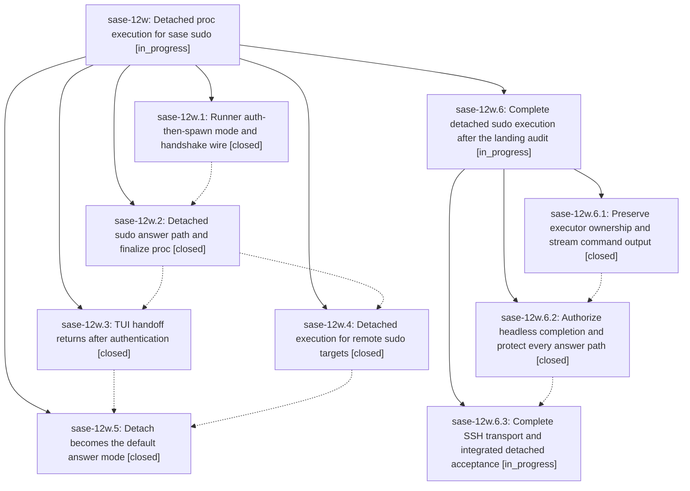

# Bead: sase-12w — Detached proc execution for sase sudo

[Bead Pages](../README.md) / sase-12w

**Status:** ◐ in_progress · **Type:** ▸ plan · **Tier:** epic
**Owner:** `bryanbugyi34@gmail.com` · **Created by:** [bbugyi200.athena.0ms](https://github.com/sase-org/sase--agents/blob/main/families/bbugyi200.athena.0ms.md) · **Assignee:** `sase-12w.land`
**Created:** 2026-09-18 08:50:37 EDT
**Plan:** [202609/sudo\_proc\_execution.md](https://github.com/sase-org/sase--plans/blob/main/202609/sudo_proc_execution.md)

<!-- sase:links:start -->

## Links

| Relation | Artifact | Why |
| --- | --- | --- |
| implemented-by | [plan:202609/sudo_proc_execution.md][1] | derived from the plan's `bead_id:` frontmatter field |

[1]: https://github.com/sase-org/sase--plans/blob/main/202609/sudo_proc_execution.md

<!-- sase:links:end -->

## Description

Approving a sudo gate takes over the terminal only long enough to authenticate; the reviewed commands then run under a detached, supervised proc so the TUI is usable again immediately, and the gate still settles with a validated ledger when execution finishes.

## Notes

[2026-09-18T17:52:03Z · sase-12w.land] LANDING AUDIT: Not ready to close. Reviewed original plan plan:202609/sudo_proc_execution.md, epic (initially no notes/no parent), every phase and all seven child notes, Python commits af8b7ec140/e98ef5b1ce/e0f1a8d43a/a26bfc839d, and Rust b70e64d through 8d5341a. Fresh origin/master equals primary 9243c0bdd7. Installed runner and binding expose detach capability/handshake. Focused sudo/TUI/parser/completion suite: 115 passed. Unprivileged probes nevertheless confirm: headless validated receipt finalization fails tty_required (positive acceptance test masks this with a TTY mock); --no-detach reaches a runner despite a live detached execution record; recovery compares remote identity to local /proc and deletes the handoff; OpenSSH shell-string semantics break manifest staging/liveness; even correctly quoted liveness misclassifies a live root PID on EPERM. Source audit also found buffered-until-exit command logs, no remote output streaming, and post-spawn failure paths that can lose executor ownership. These remain epic work; a child repair plan with parent_bead sase-12w is being proposed, covering runner ownership/streaming, authorized headless completion/duplicate guards, and remote transport/recovery acceptance. Concurrent changes reviewed: hood waits, completion loaders, screenshot capture/maintenance, equal detail layout, sidecar cloning, and finalizer conflict repair; no new sudo consumer needs migration. Phase 2 old agent_holds lint report is resolved by a602105016. FOLLOW-UP OUTCOMES: sase-12w.4 note 1 and sase-12w.5 note 1 are duplicate proposals for the unrelated cd7b9f9fd8 atomic-sidecar regression; independently reran their four targets, 14 failed/1 passed (13 empty-remote HEAD rejections before seeding, one obsolete staging-path assertion). Searched CI tasks and all task types, swept last-week tasks, inspected active epics: no matching task or causally related active epic. Created one large CI task sase-130 identifying both proposing beads; declined creating a second task because root change/remediation are shared. No other PROPOSED FOLLOW-UP entries. sase bead epic-symbols sase-12w is clear. No close or original plan status update performed; full combined landing verification remains due after repairs.

[2026-09-18T17:52:44Z · sase-12w.land] AUDIT EVIDENCE: file:explicit:d53fcb4482373f40e163990f contains source findings, reproduction conditions, focused test results, commit/drift review, and the two proposal attributions. Independent follow-up sase-130 is ready; the proposed remaining-work plan links directly back to this epic.

## Phases

| Bead | Title | Status | Size | Created | Agents | Commits |
|---|---|---|---|---|---:|---:|
| [sase-12w.1](sase-12w.1.md) | Runner auth-then-spawn mode and handshake wire | ✓ closed | large | 2026-09-18 | 1 | 1 |
| [sase-12w.2](sase-12w.2.md) | Detached sudo answer path and finalize proc | ✓ closed | large | 2026-09-18 | 1 | 1 |
| [sase-12w.3](sase-12w.3.md) | TUI handoff returns after authentication | ✓ closed | medium | 2026-09-18 | 1 | 1 |
| [sase-12w.4](sase-12w.4.md) | Detached execution for remote sudo targets | ✓ closed | medium | 2026-09-18 | 1 | 1 |
| [sase-12w.5](sase-12w.5.md) | Detach becomes the default answer mode | ✓ closed | small | 2026-09-18 | 1 | 1 |

## Lineage

## Agents

| Agent | Bead | Commits |
|---|---|---:|
| [bbugyi200.athena.sase-12w.1](https://github.com/sase-org/sase--agents/blob/main/families/bbugyi200.athena.sase-12w.1.md) | [sase-12w.1](sase-12w.1.md) | 1 |
| [bbugyi200.athena.sase-12w.2](https://github.com/sase-org/sase--agents/blob/main/families/bbugyi200.athena.sase-12w.2.md) | [sase-12w.2](sase-12w.2.md) | 1 |
| [bbugyi200.athena.sase-12w.3](https://github.com/sase-org/sase--agents/blob/main/agents/bbugyi200.athena.sase-12w.3/README.md) | [sase-12w.3](sase-12w.3.md) | 1 |
| [bbugyi200.athena.sase-12w.4](https://github.com/sase-org/sase--agents/blob/main/agents/bbugyi200.athena.sase-12w.4/README.md) | [sase-12w.4](sase-12w.4.md) | 1 |
| [bbugyi200.athena.sase-12w.5](https://github.com/sase-org/sase--agents/blob/main/agents/bbugyi200.athena.sase-12w.5/README.md) | [sase-12w.5](sase-12w.5.md) | 1 |
| [bbugyi200.athena.sase-12w.6.1](https://github.com/sase-org/sase--agents/blob/main/families/bbugyi200.athena.sase-12w.6.1.md) | [sase-12w.6.1](sase-12w.6.1.md) | 1 |
| [bbugyi200.athena.sase-12w.6.2](https://github.com/sase-org/sase--agents/blob/main/families/bbugyi200.athena.sase-12w.6.2.md) | [sase-12w.6.2](sase-12w.6.2.md) | 1 |
| [bbugyi200.athena.sase-12w.6.3](https://github.com/sase-org/sase--agents/blob/main/agents/bbugyi200.athena.sase-12w.6.3/README.md) | [sase-12w.6.3](sase-12w.6.3.md) | 0 |
| [bbugyi200.athena.sase-12w.6.land](https://github.com/sase-org/sase--agents/blob/main/agents/bbugyi200.athena.sase-12w.6.land/README.md) | [sase-12w.6](sase-12w.6.md) | 0 |
| [bbugyi200.athena.sase-12w.land](https://github.com/sase-org/sase--agents/blob/main/families/bbugyi200.athena.sase-12w.land.md) | [sase-12w](README.md) | 0 |

## Commits

| Repo | Commit | Subject | Bead | Committed |
|---|---|---|---|---|
| sase-core | [`sase-core@b70e64d`](https://github.com/sase-org/sase-core/commit/b70e64d84902e5638dee62cb1512d0d853418747) | feat(sudo): add detached runner execution | [sase-12w.1](sase-12w.1.md) | 2026-09-18 09:36:13 EDT |
| sase | [`af8b7ec`](https://github.com/sase-org/sase/commit/af8b7ec14009c34ccac57c7879ec52329d53f4fa) | feat(sudo): add local detached answer path and finalize proc | [sase-12w.2](sase-12w.2.md) | 2026-09-18 11:35:39 EDT |
| sase | [`e98ef5b`](https://github.com/sase-org/sase/commit/e98ef5b1ce3c5fdb70db2890fa1ec0dd79b77478) | feat(tui): detach sudo handoff execution | [sase-12w.3](sase-12w.3.md) | 2026-09-18 12:32:40 EDT |
| sase | [`e0f1a8d`](https://github.com/sase-org/sase/commit/e0f1a8d43ad803f64477f73609426409b0c426a7) | feat(sudo): detach remote sudo execution | [sase-12w.4](sase-12w.4.md) | 2026-09-18 12:48:39 EDT |
| sase | [`a26bfc8`](https://github.com/sase-org/sase/commit/a26bfc839d51664baaa629522483234d60aa3d33) | feat(sudo): default approvals to detached execution | [sase-12w.5](sase-12w.5.md) | 2026-09-18 13:33:19 EDT |
| sase-core | [`sase-core@9bf272e`](https://github.com/sase-org/sase-core/commit/9bf272e832c85dc612a203a69d25458472e16165) | feat(sudo): preserve detached runner ownership and live output | [sase-12w.6.1](sase-12w.6.1.md) | 2026-09-18 14:51:03 EDT |
| sase | [`7179ec2`](https://github.com/sase-org/sase/commit/7179ec2e23ad5ac9470fec9da8b8f37cc0c3bd8b) | feat(sudo): authorize durable completion ownership | [sase-12w.6.2](sase-12w.6.2.md) | 2026-09-18 16:20:04 EDT |
