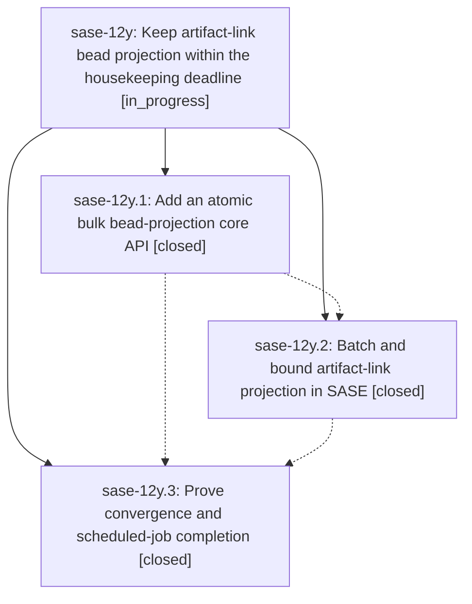

# Bead: sase-12y — Keep artifact-link bead projection within the housekeeping deadline

[Bead Pages](../README.md) / sase-12y

**Status:** ◐ in_progress · **Type:** ▸ plan · **Tier:** epic
**Owner:** `bryanbugyi34@gmail.com` · **Created by:** [bbugyi200.apollo.0k](https://github.com/sase-org/sase--agents/blob/main/families/bbugyi200.apollo.0k.md) · **Assignee:** `sase-12y.land`
**Created:** 2026-09-18 09:47:57 EDT
**Plan:** [202609/artifact\_link\_projection\_timeout.md](https://github.com/sase-org/sase--plans/blob/main/202609/artifact_link_projection_timeout.md)

<!-- sase:links:start -->

## Links

| Relation | Artifact | Why |
| --- | --- | --- |
| implemented-by | [plan:202609/artifact_link_projection_timeout.md][1] | derived from the plan's `bead_id:` frontmatter field |

[1]: https://github.com/sase-org/sase--plans/blob/main/202609/artifact_link_projection_timeout.md

<!-- sase:links:end -->

## Description

The artifact_link_backfill chop projects complete event truth into beads through bounded bulk mutations, preserves durable receipts and hidden-clone safety, and exits normally before Axe's 300-second timeout.

## Phases

| Bead | Title | Status | Size | Created | Agents | Commits |
|---|---|---|---|---|---:|---:|
| [sase-12y.1](sase-12y.1.md) | Add an atomic bulk bead-projection core API | ✓ closed | medium | 2026-09-18 | 1 | 1 |
| [sase-12y.2](sase-12y.2.md) | Batch and bound artifact-link projection in SASE | ✓ closed | medium | 2026-09-18 | 1 | 1 |
| [sase-12y.3](sase-12y.3.md) | Prove convergence and scheduled-job completion | ✓ closed | small | 2026-09-18 | 1 | 1 |

## Lineage

## Agents

| Agent | Bead | Commits |
|---|---|---:|
| [bbugyi200.apollo.sase-12y.1](https://github.com/sase-org/sase--agents/blob/main/agents/bbugyi200.apollo.sase-12y.1/README.md) | [sase-12y.1](sase-12y.1.md) | 1 |
| [bbugyi200.apollo.sase-12y.2](https://github.com/sase-org/sase--agents/blob/main/families/bbugyi200.apollo.sase-12y.2.md) | [sase-12y.2](sase-12y.2.md) | 1 |
| [bbugyi200.apollo.sase-12y.3](https://github.com/sase-org/sase--agents/blob/main/families/bbugyi200.apollo.sase-12y.3.md) | [sase-12y.3](sase-12y.3.md) | 1 |
| [bbugyi200.apollo.sase-12y.land](https://github.com/sase-org/sase--agents/blob/main/agents/bbugyi200.apollo.sase-12y.land/README.md) | [sase-12y](README.md) | 0 |

## Commits

| Repo | Commit | Subject | Bead | Committed |
|---|---|---|---|---|
| sase-core | [`sase-core@d32591f`](https://github.com/sase-org/sase-core/commit/d32591f6963247b81664772e55a8543c5912ec6a) | feat(bead): add atomic bulk link-projection mutation | [sase-12y.1](sase-12y.1.md) | 2026-09-18 10:29:48 EDT |
| sase | [`2d46e2c`](https://github.com/sase-org/sase/commit/2d46e2cf40344859990dab39b094cad78b24640d) | feat(sdd): bound artifact-link projection with deadline-aware batches | [sase-12y.2](sase-12y.2.md) | 2026-09-18 14:35:31 EDT |
| sase | [`01f5cb9`](https://github.com/sase-org/sase/commit/01f5cb9e3e0f231cd29440dc10fa1017fac2c04c) | fix(sdd): accept unborn clones of empty remotes | [sase-12y.3](sase-12y.3.md) | 2026-09-18 18:11:07 EDT |
