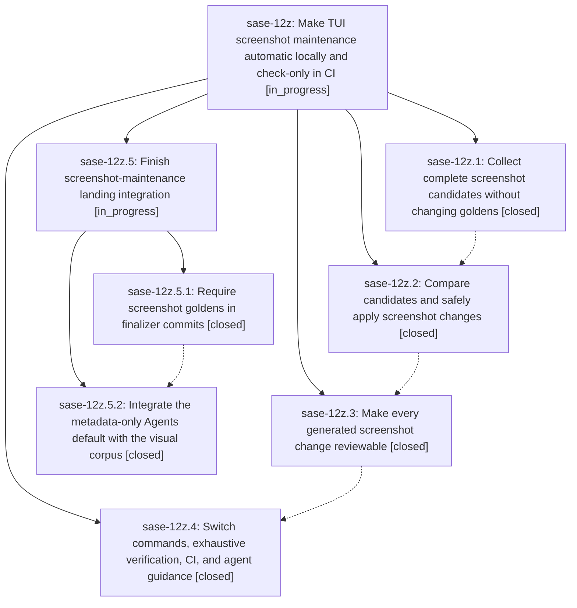

# Bead: sase-12z — Make TUI screenshot maintenance automatic locally and check-only in CI

[Bead Pages](../README.md) / sase-12z

**Status:** ◐ in_progress · **Type:** ▸ plan · **Tier:** epic
**Owner:** `bryanbugyi34@gmail.com` · **Created by:** [bbugyi200.athena.0mx](https://github.com/sase-org/sase--agents/blob/main/families/bbugyi200.athena.0mx.md) · **Assignee:** `sase-12z.land`
**Created:** 2026-09-18 10:39:49 EDT
**Plan:** [202609/fix\_tui\_screenshots.md](https://github.com/sase-org/sase--plans/blob/main/202609/fix_tui_screenshots.md)

<!-- sase:links:start -->

## Links

| Relation | Artifact | Why |
| --- | --- | --- |
| implemented-by | [plan:202609/fix_tui_screenshots.md][1] | derived from the plan's `bead_id:` frontmatter field |

[1]: https://github.com/sase-org/sase--plans/blob/main/202609/fix_tui_screenshots.md

<!-- sase:links:end -->

## Description

Replace the manual visual snapshot workflow with a reviewable, staged fix-tui-screenshots command that updates goldens during local check-full and explicit agent calls, while CI checks the complete corpus without accepting it.

## Notes

[2026-09-18T22:09:53Z · bryanbugyi34@gmail.com] The epic lander agent should make sure that agents are instructed to always include these in their finalizer commits. Sase agents should even include these screenshots when the changes they show do not correspond with the changes that the agent made, but in this case the agent should leave an 'UNRELATED_SCREENSHOT_UPDATES=<reason_why_these_seem_unrelated>' tag at the bottom of the git commit message.

[2026-09-19T11:54:33Z · sase-zr.7.1.1.5.4.land] DISCOVERED ISSUE: Proposed by sase-zr.7.1.1.5.4.1 note #2 and independently reproduced 2026-09-19: just _lint-pyscripts fails Rule 2 closer-dir because tests/ace/tui/tools/ exists while screenshot-maintenance tests under tests/ace/tui/visual/ reference top-level tools/fix_tui_screenshots, tools/run_pytest, and tools/render_visual_snapshot_failure_report. Corroborated ready task sase-12n. This screenshot-maintenance epic owns those visual-tool references; just check cannot pass until the closer-dir rule is satisfied (move, pragma, or restructure).

## Phases

| Bead | Title | Status | Size | Created | Agents | Commits |
|---|---|---|---|---|---:|---:|
| [sase-12z.1](sase-12z.1.md) | Collect complete screenshot candidates without changing goldens | ✓ closed | medium | 2026-09-18 | 1 | 1 |
| [sase-12z.2](sase-12z.2.md) | Compare candidates and safely apply screenshot changes | ✓ closed | medium | 2026-09-18 | 1 | 1 |
| [sase-12z.3](sase-12z.3.md) | Make every generated screenshot change reviewable | ✓ closed | medium | 2026-09-18 | 1 | 1 |
| [sase-12z.4](sase-12z.4.md) | Switch commands, exhaustive verification, CI, and agent guidance | ✓ closed | medium | 2026-09-18 | 1 | 1 |

## Lineage

## Agents

| Agent | Bead | Commits |
|---|---|---:|
| [bbugyi200.athena.sase-12z.1](https://github.com/sase-org/sase--agents/blob/main/agents/bbugyi200.athena.sase-12z.1/README.md) | [sase-12z.1](sase-12z.1.md) | 1 |
| [bbugyi200.athena.sase-12z.2](https://github.com/sase-org/sase--agents/blob/main/families/bbugyi200.athena.sase-12z.2.md) | [sase-12z.2](sase-12z.2.md) | 1 |
| [bbugyi200.athena.sase-12z.3](https://github.com/sase-org/sase--agents/blob/main/agents/bbugyi200.athena.sase-12z.3/README.md) | [sase-12z.3](sase-12z.3.md) | 1 |
| [bbugyi200.athena.sase-12z.4](https://github.com/sase-org/sase--agents/blob/main/families/bbugyi200.athena.sase-12z.4.md) | [sase-12z.4](sase-12z.4.md) | 1 |
| [bbugyi200.athena.sase-12z.5.1](https://github.com/sase-org/sase--agents/blob/main/agents/bbugyi200.athena.sase-12z.5.1/README.md) | [sase-12z.5.1](sase-12z.5.1.md) | 1 |
| [bbugyi200.athena.sase-12z.5.2](https://github.com/sase-org/sase--agents/blob/main/agents/bbugyi200.athena.sase-12z.5.2/README.md) | [sase-12z.5.2](sase-12z.5.2.md) | 1 |
| [bbugyi200.athena.sase-12z.5.land](https://github.com/sase-org/sase--agents/blob/main/agents/bbugyi200.athena.sase-12z.5.land/README.md) | [sase-12z.5](sase-12z.5.md) | 0 |
| [bbugyi200.athena.sase-12z.land](https://github.com/sase-org/sase--agents/blob/main/families/bbugyi200.athena.sase-12z.land.md) | [sase-12z](README.md) | 0 |

## Commits

| Repo | Commit | Subject | Bead | Committed |
|---|---|---|---|---|
| sase | [`da4caa9`](https://github.com/sase-org/sase/commit/da4caa94cff22a9319c76f82f9fd440ec52523d7) | test(visual): add isolated screenshot candidate-capture protocol | [sase-12z.1](sase-12z.1.md) | 2026-09-18 11:44:59 EDT |
| sase | [`9243c0b`](https://github.com/sase-org/sase/commit/9243c0bdd7563d2271de57833084e721fec4958e) | feat(visual): add screenshot golden maintenance runner | [sase-12z.2](sase-12z.2.md) | 2026-09-18 13:34:39 EDT |
| sase | [`3fc37d5`](https://github.com/sase-org/sase/commit/3fc37d5ffb24043ec95a1f7015f7baef1de819af) | feat(visual): report screenshot maintenance manifests | [sase-12z.3](sase-12z.3.md) | 2026-09-18 13:59:13 EDT |
| sase | [`1c246dc`](https://github.com/sase-org/sase/commit/1c246dc748f687e057b7d22493b5aefc80f4dced) | feat(visual): land screenshot maintenance recipe, CI check, and refreshed goldens | [sase-12z.4](sase-12z.4.md) | 2026-09-18 18:52:38 EDT |
| sase | [`3538713`](https://github.com/sase-org/sase/commit/3538713c0d285883a67abb415c07aa00a02ab5a7) | docs(finalizer): require screenshot golden commits | [sase-12z.5.1](sase-12z.5.1.md) | 2026-09-18 21:19:00 EDT |
| sase | [`9a56fc1`](https://github.com/sase-org/sase/commit/9a56fc1294652b518c05fdfb28a56a72c9dc4f61) | fix(visual): integrate the metadata-only Agents default with the screenshot corpus | [sase-12z.5.2](sase-12z.5.2.md) | 2026-09-20 10:46:29 EDT |
