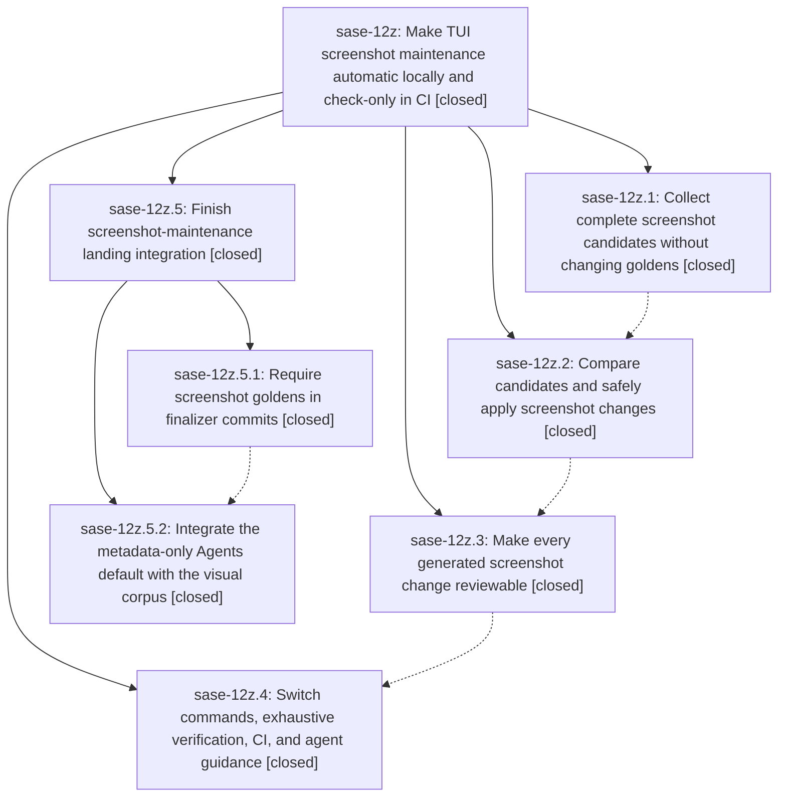

# Bead: sase-12z — Make TUI screenshot maintenance automatic locally and check-only in CI

[Bead Pages](../README.md) / sase-12z

**Status:** ✓ closed · **Resolution:** done · **Type:** ▸ plan · **Tier:** epic
**Owner:** `bryanbugyi34@gmail.com` · **Created by:** [bbugyi200.athena.0mx](https://github.com/sase-org/sase--agents/blob/main/families/bbugyi200.athena.0mx.md) · **Assignee:** `sase-12z.land`
**Created:** 2026-09-18 10:39:49 EDT · **Closed:** 2026-09-20 12:39:21 EDT
**Plan:** [202609/fix\_tui\_screenshots.md](https://github.com/sase-org/sase--plans/blob/main/202609/fix_tui_screenshots.md)

<!-- sase:links:start -->

## Links

| Relation | Artifact | Why |
| --- | --- | --- |
| implemented-by | [plan:202609/fix_tui_screenshots.md][1] | derived from the plan's `bead_id:` frontmatter field |

[1]: https://github.com/sase-org/sase--plans/blob/main/202609/fix_tui_screenshots.md

<!-- sase:links:end -->

## Description

Replace the manual visual snapshot workflow with a reviewable, staged fix-tui-screenshots command that updates goldens during local check-full and explicit agent calls, while CI checks the complete corpus without accepting it.

## Notes

[2026-09-18T22:09:53Z · bryanbugyi34@gmail.com] The epic lander agent should make sure that agents are instructed to always include these in their finalizer commits. Sase agents should even include these screenshots when the changes they show do not correspond with the changes that the agent made, but in this case the agent should leave an 'UNRELATED_SCREENSHOT_UPDATES=<reason_why_these_seem_unrelated>' tag at the bottom of the git commit message.

[2026-09-19T11:54:33Z · sase-zr.7.1.1.5.4.land] DISCOVERED ISSUE: Proposed by sase-zr.7.1.1.5.4.1 note #2 and independently reproduced 2026-09-19: just _lint-pyscripts fails Rule 2 closer-dir because tests/ace/tui/tools/ exists while screenshot-maintenance tests under tests/ace/tui/visual/ reference top-level tools/fix_tui_screenshots, tools/run_pytest, and tools/render_visual_snapshot_failure_report. Corroborated ready task sase-12n. This screenshot-maintenance epic owns those visual-tool references; just check cannot pass until the closer-dir rule is satisfied (move, pragma, or restructure).

[2026-09-20T16:39:21Z · sase-12z.5.land] Rechecked the whole epic after its child epic sase-12z.5 landed, and every descendant,
the linked plan, and both of this bead's own notes are satisfied at master 624a29ea7.

DESCENDANTS
All four original phases are closed with evidence I re-read: sase-12z.1 (isolated,
versioned candidate-capture protocol with xdist-safe records and execution-completeness
evidence), sase-12z.2 (tools/fix_tui_screenshots with explicit check mode, governed
pytest, exact pixel comparison, bounded verification, conservative stale handling and a
recoverable apply journal), sase-12z.3 (manifest-backed reports published before apply,
latest-report pointer, update grouping, contact sheets, created/updated/stale artifacts),
sase-12z.4 (Just/CI/docs switchover plus the full golden refresh). Child epic sase-12z.5
is now closed; see its close note for the phase-level verification and the landing
integration it performed.

LINKED PLAN ACCEPTANCE, RE-VERIFIED IN THE TREE
- `just fix-tui-screenshots` is the canonical recipe (Justfile:497) with `just test-visual`
  as the check-only alias (Justfile:504).
- Local `just check-full` ends with `@just fix-tui-screenshots`, the update form, outside
  run_silent so the report stays visible (Justfile:733).
- CI's visual job runs `just fix-tui-screenshots --check` and never writes goldens
  (.github/workflows/ci.yml:283); a direct CI invocation refuses at the update stage.
- It is deliberately absent from `just fix`, `just lint` and ordinary `just check`.
- The reference memory is current: lint_and_test.md documents the recipe, both aliases,
  the report locations under .pytest_cache/sase-visual/, the exact-pixel rule, and that
  `--sase-update-visual-snapshots` is retired.
- End-to-end proof at HEAD: a complete `just test-visual` is 972 passed / 1 skipped,
  mode/status check/clean, created=0 updated=0 unchanged=709 stale=0, complete inventory,
  golden tree unchanged.

THIS BEAD'S OWN NOTES
- The user's note asking that agents always commit screenshot goldens, and tag genuinely
  unrelated ones with UNRELATED_SCREENSHOT_UPDATES=<reason>, is implemented: phase
  sase-12z.5.1 (commit 3538713c0) put the rule and the exact trailer in the canonical
  finalizer source src/sase/xprompts/skills/sase_final.md, pinned by both the direct-source
  and the packaged-skill tests, and `sase skill init --diff` is empty so the deployed
  provider copies already carry it. Commit 9a56fc129 is the first commit to use it.
- The DISCOVERED ISSUE note from sase-zr.7.1.1.5.4.land (pyscripts Rule 2 closer-dir on
  tools/fix_tui_screenshots, tools/run_pytest and tools/render_visual_snapshot_failure_report)
  is resolved: tests/ace/tui/tools/ no longer exists, `just _lint-pyscripts` prints
  "All scripts/ and tools/ directories are valid!", and `just check` shows a green
  lint (pyscripts) stage. I recorded the same non-reproduction on the corroborated task
  sase-12n.

POST-CHILD DRIFT
The only commit on master after the child's phase commit is 624a29ea7 (service ssh-agent
and gate preflight), which touches no TUI rendering; I confirmed that separately by the
clean full visual run above. Two rendering changes that landed during the child's run had
left goldens stale (sase-11y.7's Services tab accent, 18 goldens); the child's land pass
reviewed and refreshed them and noted the cause on sase-11y. One remaining visual drift,
agents_fleet_remote_tribe_families_120x40, was proven load-dependent and not caused by
this epic, filed as sase-14b and noted on sase-133.5; its golden was deliberately left
untouched.

VERIFICATION STATE
`sase bead epic-symbols sase-12z` reports no entries, and `just symvision` shows a clean
whitelist: the only --epic-symbol lines in the Justfile are keyed to sase-11y, which is
still open. `sase tool run check` at HEAD passes every gate except lint (symvision), which
fails on 26 unused public symbols from four unrelated module-split commits; that failure
is byte-identical on an unmodified tree and is tracked as sase-13s (corroborated with a
+1). `just check-full` was not run; the land prompt did not instruct it.

## Phases

| Bead | Title | Status | Size | Created | Agents | Commits |
|---|---|---|---|---|---:|---:|
| [sase-12z.1](sase-12z.1.md) | Collect complete screenshot candidates without changing goldens | ✓ closed | medium | 2026-09-18 | 1 | 1 |
| [sase-12z.2](sase-12z.2.md) | Compare candidates and safely apply screenshot changes | ✓ closed | medium | 2026-09-18 | 1 | 1 |
| [sase-12z.3](sase-12z.3.md) | Make every generated screenshot change reviewable | ✓ closed | medium | 2026-09-18 | 1 | 1 |
| [sase-12z.4](sase-12z.4.md) | Switch commands, exhaustive verification, CI, and agent guidance | ✓ closed | medium | 2026-09-18 | 1 | 1 |

## Lineage

## Agents

| Agent | Bead | Commits |
|---|---|---:|
| [bbugyi200.athena.sase-12z.1](https://github.com/sase-org/sase--agents/blob/main/agents/bbugyi200.athena.sase-12z.1/README.md) | [sase-12z.1](sase-12z.1.md) | 1 |
| [bbugyi200.athena.sase-12z.2](https://github.com/sase-org/sase--agents/blob/main/families/bbugyi200.athena.sase-12z.2.md) | [sase-12z.2](sase-12z.2.md) | 1 |
| [bbugyi200.athena.sase-12z.3](https://github.com/sase-org/sase--agents/blob/main/agents/bbugyi200.athena.sase-12z.3/README.md) | [sase-12z.3](sase-12z.3.md) | 1 |
| [bbugyi200.athena.sase-12z.4](https://github.com/sase-org/sase--agents/blob/main/families/bbugyi200.athena.sase-12z.4.md) | [sase-12z.4](sase-12z.4.md) | 1 |
| [bbugyi200.athena.sase-12z.5.1](https://github.com/sase-org/sase--agents/blob/main/agents/bbugyi200.athena.sase-12z.5.1/README.md) | [sase-12z.5.1](sase-12z.5.1.md) | 1 |
| [bbugyi200.athena.sase-12z.5.2](https://github.com/sase-org/sase--agents/blob/main/agents/bbugyi200.athena.sase-12z.5.2/README.md) | [sase-12z.5.2](sase-12z.5.2.md) | 1 |
| [bbugyi200.athena.sase-12z.5.land](https://github.com/sase-org/sase--agents/blob/main/agents/bbugyi200.athena.sase-12z.5.land/README.md) | [sase-12z.5](sase-12z.5.md) | 1 |
| [bbugyi200.athena.sase-12z.land](https://github.com/sase-org/sase--agents/blob/main/families/bbugyi200.athena.sase-12z.land.md) | [sase-12z](README.md) | 0 |

## Commits

| Repo | Commit | Subject | Bead | Committed |
|---|---|---|---|---|
| sase | [`da4caa9`](https://github.com/sase-org/sase/commit/da4caa94cff22a9319c76f82f9fd440ec52523d7) | test(visual): add isolated screenshot candidate-capture protocol | [sase-12z.1](sase-12z.1.md) | 2026-09-18 11:44:59 EDT |
| sase | [`9243c0b`](https://github.com/sase-org/sase/commit/9243c0bdd7563d2271de57833084e721fec4958e) | feat(visual): add screenshot golden maintenance runner | [sase-12z.2](sase-12z.2.md) | 2026-09-18 13:34:39 EDT |
| sase | [`3fc37d5`](https://github.com/sase-org/sase/commit/3fc37d5ffb24043ec95a1f7015f7baef1de819af) | feat(visual): report screenshot maintenance manifests | [sase-12z.3](sase-12z.3.md) | 2026-09-18 13:59:13 EDT |
| sase | [`1c246dc`](https://github.com/sase-org/sase/commit/1c246dc748f687e057b7d22493b5aefc80f4dced) | feat(visual): land screenshot maintenance recipe, CI check, and refreshed goldens | [sase-12z.4](sase-12z.4.md) | 2026-09-18 18:52:38 EDT |
| sase | [`3538713`](https://github.com/sase-org/sase/commit/3538713c0d285883a67abb415c07aa00a02ab5a7) | docs(finalizer): require screenshot golden commits | [sase-12z.5.1](sase-12z.5.1.md) | 2026-09-18 21:19:00 EDT |
| sase | [`9a56fc1`](https://github.com/sase-org/sase/commit/9a56fc1294652b518c05fdfb28a56a72c9dc4f61) | fix(visual): integrate the metadata-only Agents default with the screenshot corpus | [sase-12z.5.2](sase-12z.5.2.md) | 2026-09-20 10:46:29 EDT |
| sase | [`1d3bef8`](https://github.com/sase-org/sase/commit/1d3bef89414d940fee072b4d7d81318f5109715d) | fix(visual): refresh the Services-tab goldens left stale during sase-12z.5 | [sase-12z.5](sase-12z.5.md) | 2026-09-20 12:42:28 EDT |
